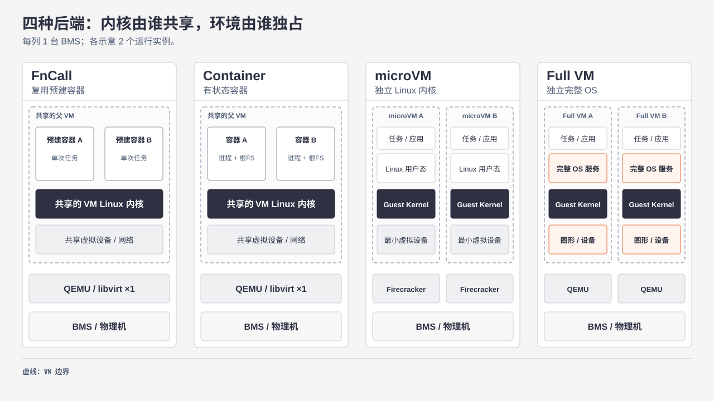
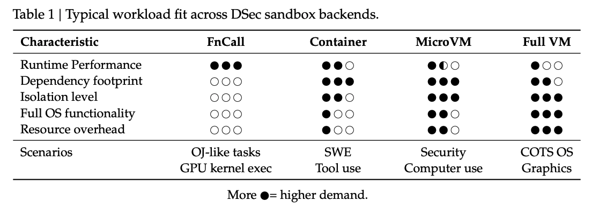

# 01｜为什么 DSec 需要四种沙箱后端？

**核心逻辑：**Agent 训练会批量创建沙箱，并在多轮交互中保留状态；任务对执行效率、隔离和操作系统功能的要求又不同。DSec 以 `libdsec` 提供统一入口，**由调用方选择后端**。

| 后端 | 优先用于 | 关键取舍 |
| --- | --- | --- |
| FnCall | OJ、短代码或 GPU kernel 执行 | 复用预建容器；适合无状态短任务 |
| 容器 | 仓库修复、通用工具调用 | 保留会话状态、密度高；共享父 VM 内核 |
| microVM | 不可信代码、安全 Linux 任务 | 独立客体内核；启动和内存开销更高 |
| 完整 VM | Android、图形界面、特定 OS API | 完整系统与图形能力；资源开销最高 |

FnCall 和容器后端在生产部署中运行于父 VM 内，多个容器共享该 VM 的内核；microVM 与完整 VM 则各自拥有 Guest Kernel。完整 VM 进一步提供更完整的 OS 服务与图形、设备能力。

## 表 1｜典型任务如何匹配后端

- **按行读圆点，不把点数相加。** 它是定性任务画像，不是实测速度或内存数据；资源开销一行表示成本。
- **FnCall → 容器：**前者复用预建容器执行短任务，单次任务的增量开销较低；后者保留多轮交互状态，适合仓库开发。FnCall 的隔离栏为空圈，不代表实现中没有隔离。
- **microVM → 完整 VM：**两者都有独立客体内核；安全敏感的 Linux 任务通常选 microVM，需要完整 OS 或图形功能时选完整 VM，并承担更高资源开销。
- **依赖规模**描述典型任务，不意味着完整 VM 的镜像一定比容器镜像小。

来源：[论文](https://arxiv.org/pdf/2609.22978v1) §1–2.2（PDF 第 1–5 页）；父 VM 的部署关系见 §3.3（PDF 第 8 页）。

[下一篇：沙箱架构与运行环境](02-sandbox-architecture-and-lifecycle.md)
