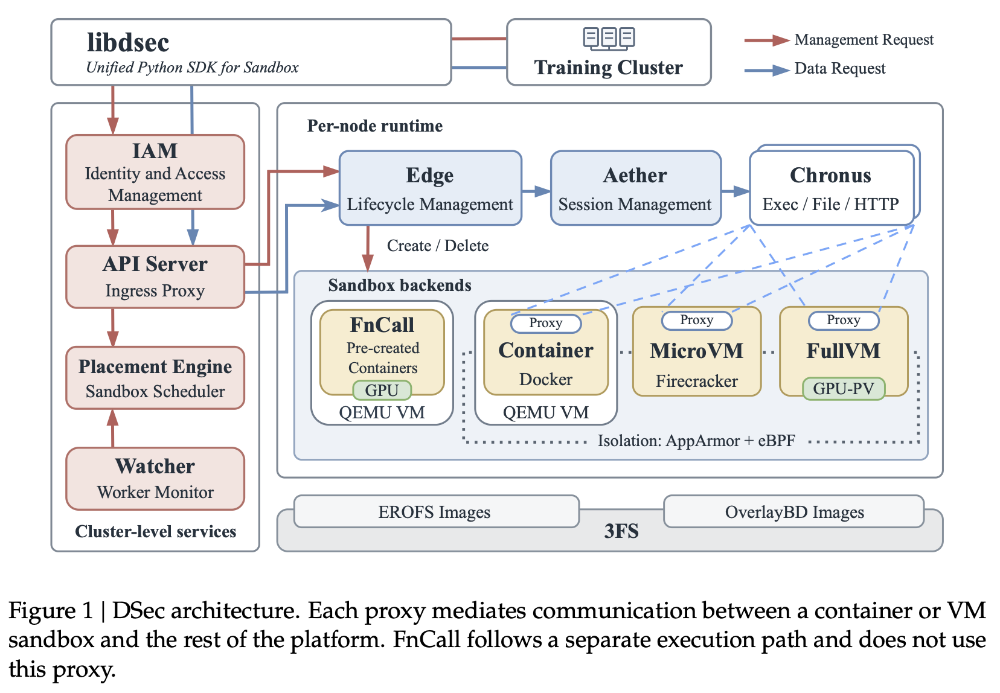

# 02｜沙箱如何创建、执行并获得运行环境？

**背景：**训练端与运行不可信代码的沙箱网络隔离；沙箱创建峰值超过 5,000 个/秒，必须选节点、确认实时容量并快速取得环境。调用方希望只用一套接口：**选择后端与环境、资源/网络/TTL → 创建 → 多轮操作（文件与服务状态保留）→ 删除或到期回收**。DSec 因此分开处理集群调度、节点生命周期、沙箱内会话和镜像存储。

*图 1｜论文 PDF 第 6 页。红线是管理请求，蓝线是数据请求；图底部的 3FS 为镜像提供共享存储。*

## 先认图 1 的组件

| 组件 | 在这条链上的职责 |
| --- | --- |
| Training Cluster / `libdsec` | 训练、评估程序通过统一 SDK 发起请求。 |
| IAM | 校验管理操作的身份、权限与项目配额。 |
| API Server | 训练端与沙箱间唯一入口；无单沙箱状态，按沙箱 ID 定位所属 Edge。 |
| Watcher | 周期收集节点健康与负载，供调度参考。 |
| Placement Engine | 按后端/硬件条件筛节点、按负载选节点；**不转发管理请求**。 |
| Edge | 每节点一个；本地容量接纳、创建/删除、快照、策略、健康与 TTL 回收。 |
| Aether / Proxy | 每个交互式沙箱一个代理；维持 Edge 通道，按会话 ID 转发给 Chronus。 |
| Chronus | 每个实例是一段独立 Shell 会话；执行命令、文件、HTTP 和流式 I/O。 |
| 沙箱后端 | FnCall/容器使用父 QEMU VM；microVM 使用 Firecracker；完整 VM 使用 QEMU。 |
| 3FS + 两类镜像 | 共享镜像后端；EROFS 供只读文件层，OverlayBD 供 microVM 块盘。 |

图中的 AppArmor 与 eBPF 负责隔离和网络策略；完整 VM 的 GPU-PV 提供虚拟化图形能力。

## ① 创建路径：先选节点，再本地接纳

`libdsec → IAM → API Server → 目标 Edge → 沙箱后端`

`API Server` 向 `Placement Engine` 询问目标节点；后者使用 `Watcher` 的状态。**实际管理请求由 API Server 直接发往 Edge**。由于 Watcher 按周期更新，Edge 还须复核实时容量，再准备存储、应用 eBPF 网络策略并启动后端；镜像可从 3FS 按需读取。已有沙箱的删除无需重新选址。

*图 1 未画出的扩容分支：*本地利用率超过 80% 时，Placement Engine 可把符合镜像依赖条件的新容器请求分流到云 VM。

## ② 执行路径：同一接口落到沙箱内会话

`libdsec → API Server → Edge → Aether/Proxy → Chronus → 操作`

已有沙箱的 ID 已编码所属 Edge，因此 API Server **直接路由，不再询问 Placement Engine**。Edge 经沙箱内的 Aether/Proxy 转发；Aether 按会话 ID 找到或创建 Chronus，多个 Chronus 可并行。容器的 Edge–Aether 通道可用 Unix socket，VM 可用 vsock；通道断开时 Edge 判定沙箱失败。会话结束时 Aether 清理对应进程树，操作结果沿原路返回。

**FnCall 是例外：**任务直接在预建容器中执行，不经过 Aether/Chronus；平台尽力清理任务状态。

## ③ 图 1 底部：为什么并列两类镜像？

图 1 底部的 3FS 是共享镜像存储：**EROFS Images** 提供可复用的只读环境层，**OverlayBD Images** 支持 microVM 的磁盘镜像。它们用途不同，并非上下相叠的两层；图 1 在这里仅说明镜像从哪里来，不展开文件系统内部结构。

Container 与 microVM 如何选择 Base、Workspace、Toolkit，并把只读环境与各实例的写入组合起来，见[第 4 篇：可组合环境层](04-composable-environment-layers.md)。镜像数据如何按需从 3FS 读取，留待第 5 篇。

**串起来看：**全局服务决定“去哪台节点”，Edge 决定“能否接”，Aether/Chronus 负责“如何执行”；3FS 提供创建与运行所需的环境数据。

[上一篇：四种后端](01-why-dsec-needs-four-backends.md) · [下一篇：生产负载与三类难题](03-workload-to-platform-challenges.md) · [返回目录](README.md)

来源：[论文](https://arxiv.org/pdf/2609.22978v1) §2.3、§3.1–3.4、§5.1、§5.3（PDF 第 5–8、14–17 页）。
