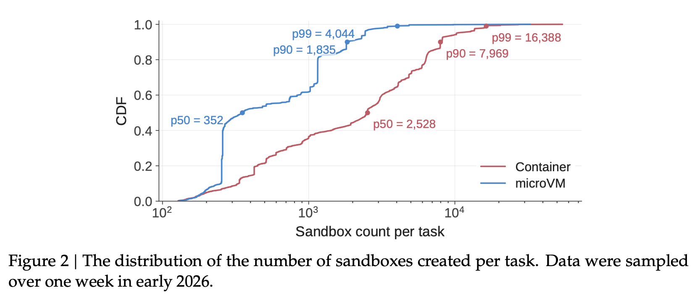
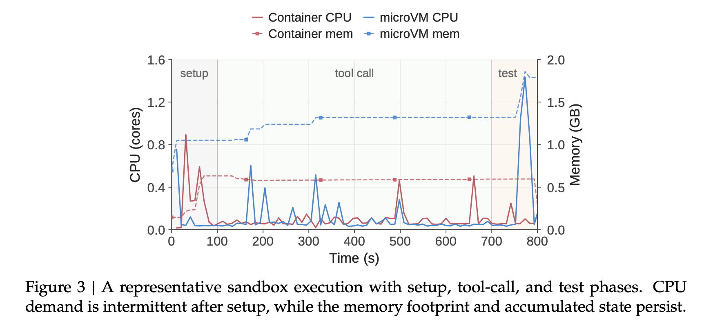
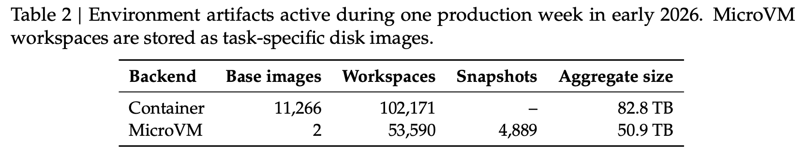
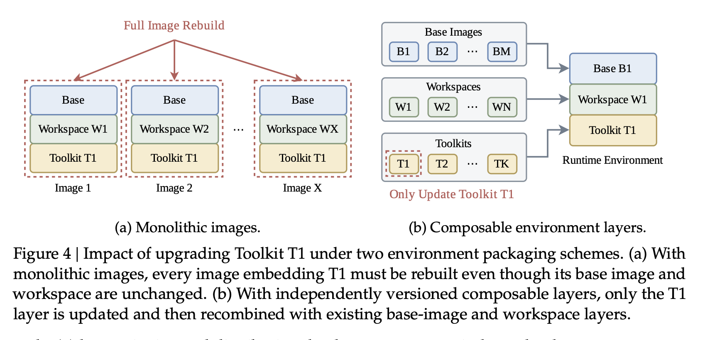
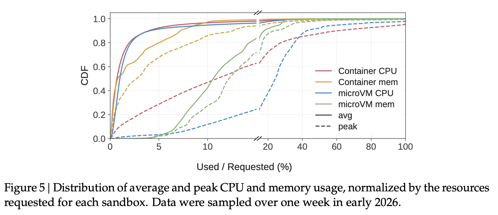
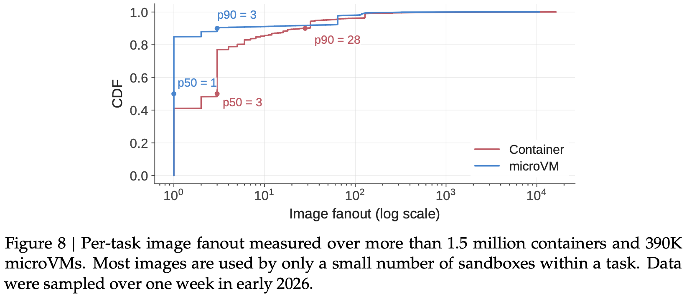
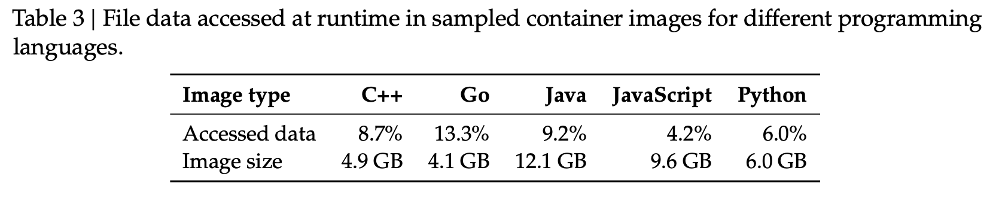
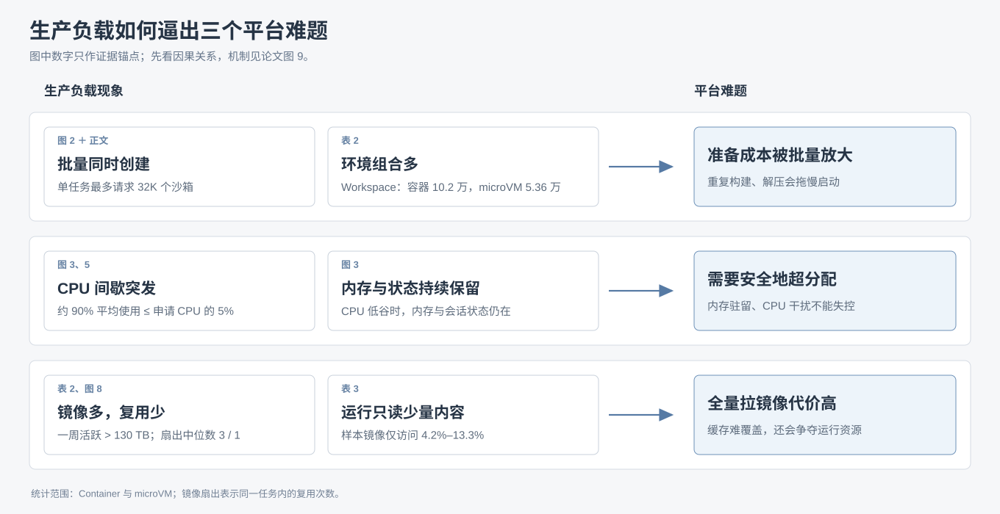

# 03｜生产负载为什么带来三类平台难题？

DSec 的主要生产负载同时具有三个特点：**成批创建、运行时 CPU 间歇使用、环境种类繁多**。先读懂论文中的观测，再看它们如何分别变成环境准备、高密度运行和镜像分发难题。本篇统计聚焦 Container 与 microVM；[上一篇](02-sandbox-architecture-and-lifecycle.md)已说明沙箱的创建和执行路径。

## ① 环境准备：大量沙箱要迅速获得不同环境

*图 2｜PDF 第 9 页。**读法：**横轴是单任务创建的沙箱数（对数刻度），纵轴 CDF 是“不超过该数量的任务占比”；红色 Container，蓝色 microVM。**结论：**Container 的 p50/p90/p99 为 **2,528/7,969/16,388**，microVM 为 **352/1,835/4,044**，单任务创建规模很大。正文补充：请求成批到达，最大生产任务可请求 32K 个。*

*图 3｜PDF 第 10 页。**读法：**沿时间看 setup → tool call → test；实线读左轴 CPU 核数，虚线读右轴内存 GB，红/蓝分别代表 Container/microVM。**结论：**setup 要准备依赖和工具；之后 CPU 只在操作时短暂升高，内存与已产生的状态仍保留。*

*表 2｜PDF 第 10 页。**读法：**逐行看后端，再横向比较构件数。**结论：**Container 有 **11,266** 个 Base、**102,171** 个 Workspace；microVM 只有 **2** 个共享 Base，却有 **53,590** 个任务专属 Workspace 和 **4,889** 个快照。环境的多样性主要来自大量 Workspace；正文还指出 **67.8%** 的沙箱需要 Base 之外的 Workspace 或 Toolkit。*

*图 4｜PDF 第 11 页。**读法：**比较 Toolkit T1 更新后的左右两种方案。左边将 Base、Workspace、T1 做成整体镜像，所有包含 T1 的组合都得重建；右边只更新独立的 T1 层，再与原有层组合。**结论：**分层能避免因一个构件变化而重复重建许多完整镜像。*

**推导出的难题：**图 2 的创建规模使图 3 的 setup 成本成批放大；表 2 的大量环境组合又让“预先制作完整镜像”难以维护。若启动时逐个解包 Workspace、Toolkit，集中请求会消耗大量 CPU 和 I/O，甚至拖慢沙箱启动。平台需要**可复用、能快速组合的环境准备方式**；图 4 已画出其基本思路。

## ② 高密度运行：CPU 常空闲，状态却持续占资源

*图 5｜PDF 第 11 页。**读法：**横轴是实际使用量／申请量，纵轴是 CDF；颜色区分后端与 CPU/内存，实线为平均、虚线为峰值。横轴约 20% 处有断轴，按刻度读数。**结论：**两种后端约 **90%** 的沙箱平均只用到申请 CPU 的 **5%** 以内，但 CPU 峰值仍可能明显升高。*

[图 3](#challenge-1)给出时间上的原因：模型思考或等待下一次操作时，沙箱的 CPU 暂时空闲，但内存与会话状态还在。图 5 则说明，这种低平均 CPU 使用率在大量沙箱中都存在。

**推导出的难题：**让更多沙箱共享机器，可以利用空闲 CPU；但突发计算仍要及时运行。microVM 还可能在 Guest 与宿主之间重复缓存数据，Guest 空闲页也不会自动归还宿主；同一物理核上的其他工作可能干扰延迟敏感任务。平台因此需要**提高部署密度，同时回收无用内存并保护关键任务的延迟**。

## ③ 镜像分发：镜像集合很大，单个镜像却很少复用

[表 2](#challenge-1)还有一列要看：一周活跃环境的总大小，Container 为 **82.8 TB**、microVM 为 **50.9 TB**，合计 **133.7 TB**。这意味着工作节点无法预存全部环境构件。

*图 8｜PDF 第 13 页。**读法：**横轴是任务内镜像扇出，即一个镜像在同一任务中被多少个沙箱使用（对数刻度）；纵轴 CDF 是扇出不超过该值的比例。**结论：**Container 的 p50/p90 为 **3/28**，microVM 为 **1/3**；多数镜像只被少量沙箱复用。*

*表 3｜PDF 第 13 页。**读法：**每列是一类语言镜像，对照“Image size”和“Accessed data”两行。**结论：**例如 **9.6 GB** 的 JavaScript 镜像，运行中只访问 **4.2%** 的文件数据；五类样本的访问比例为 **4.2%–13.3%**，完整镜像的大部分数据用不上。*

**推导出的难题：**表 2 显示镜像集合太大，图 8 显示单个镜像复用有限，本地缓存难以覆盖突发请求；表 3 又显示完整镜像中的大部分数据不会被本次运行读取。若每次都先拉取并准备完整镜像，会放大传输、存储及 CPU/I/O 开销，还会与正在运行的沙箱争资源。平台需要**只在访问发生时取得所需镜像数据**。

## 三类难题合起来看

*因果总览｜对应论文 §4（PDF 第 9–13 页）。下一篇从论文图 9 看 DSec 把相应机制放在何处。*

[上一篇：沙箱架构与生命周期](02-sandbox-architecture-and-lifecycle.md) · [下一篇：可组合环境层](04-composable-environment-layers.md) · [返回目录](README.md)

来源：[DeepSeek Elastic Compute (DSec)](https://arxiv.org/pdf/2609.22978v1) §4.1–4.4（PDF 第 9–13 页）。
