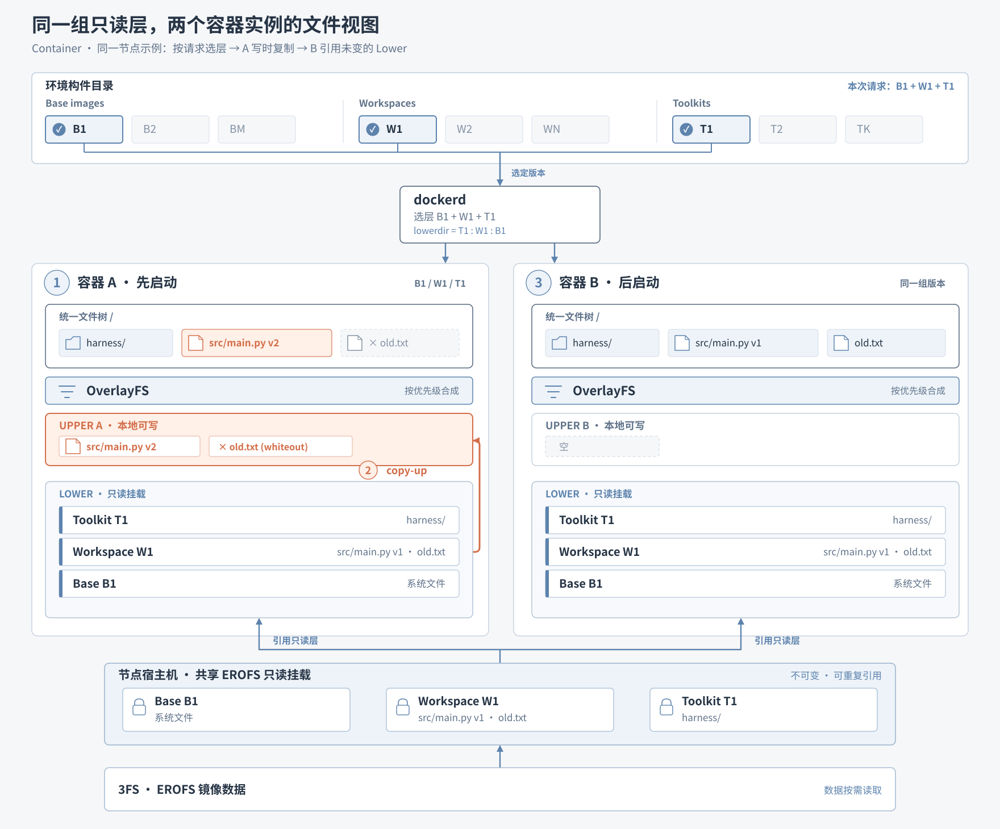
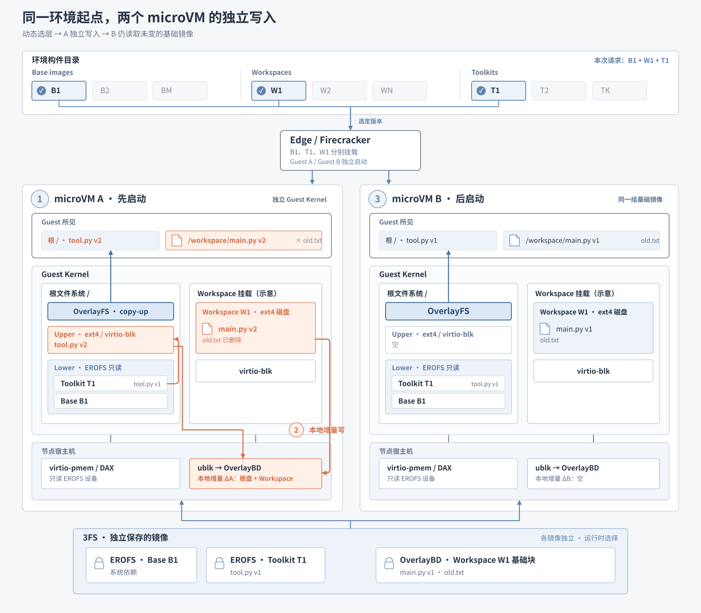
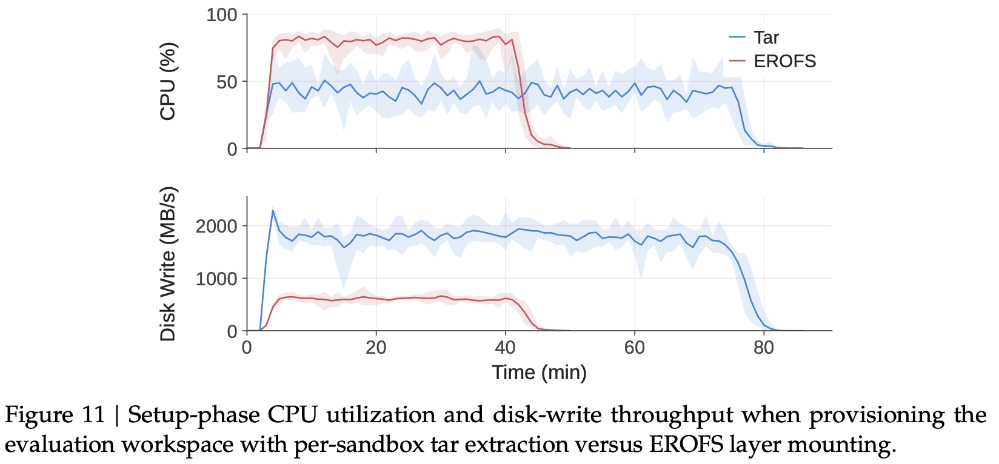

# 04｜DSec 如何在启动时组合沙箱环境？

[上一篇](03-workload-to-platform-challenges.md#challenge-1)看到：沙箱会成批创建，任务环境却各不相同。若把每种 Base、Workspace、Toolkit 组合预制成完整镜像，更新其中一个构件就要重建许多镜像；若启动时逐个解包，又会在请求高峰重复消耗 CPU 和 I/O。DSec 的办法是**分别保存构件，创建沙箱时才选版本、组合文件视图**。

| 构件 | 主要内容 | 变化范围 |
| --- | --- | --- |
| Base | 操作系统级依赖，如 Ubuntu、Python 3.10 或 Java 8 环境 | 多个任务复用的运行底座 |
| Workspace | 任务代码仓库及其专属依赖 | 随任务变化；microVM 中保存为任务专属磁盘镜像 |
| Toolkit | 可独立更新的工具，如 DeepSeek Harness | 更新后与既有 Base、Workspace 重新组合 |

## 图 9 的绿色区域：组合发生在启动时

*图 9｜PDF 第 14 页。看中间绿色的 Composable Layers：Workspace、Toolkit 独立保存，运行时参与环境组合。图 9 只定位机制；Container 与 microVM 的具体文件系统路径分别看下面两图。*

## Container：把三类只读层合成一棵文件树

图中的 A/B 是 **Container 后端创建的容器实例**；DSec 从统一接口、受控生命周期和访问策略的角度称它们为“沙箱”。这些容器在父 QEMU VM 内运行，共享该 VM 的内核；AppArmor 和 eBPF 进一步约束文件、Socket 与网络访问。下图的 OverlayFS 负责环境组合和写入私有化，不能单独代表全部安全隔离。

*Container 原理图｜依据论文 §5.1（PDF 第 14 页）；蓝色是共享只读层，橙色是 A 的本地写入。按 ① 选层、② 修改、③ B 再启动的顺序读。*

1. **选版本。** 请求选中 B1、W1、T1；它们是分别保存的 [EROFS 只读镜像](appendix-erofs-and-ext4.md)。`dockerd` 在创建容器实例时动态设置 `lowerdir = T1:W1:B1`，A 另有自己的可写 Upper。
2. **合成视图。** OverlayFS 将 Lower 按优先级叠放，再把 Upper 放在最上面。A 看到的是一棵文件树；文件来自哪一层，由优先级决定。这也让 Workspace、Toolkit 的文件加入原目录，而不遮住目录中其他文件。
3. **A 修改。** A 修改 W1 中的 `src/main.py` 时，OverlayFS 先将文件复制到 A 的 Upper，再写成 v2；删除 `old.txt` 时，Upper 留下隐藏下层文件的 whiteout。W1 中的原文件保持不变。
4. **B 复用。** B 随后选用同一组只读层，却有自己的空 Upper，因此仍看到 `main.py v1` 和 `old.txt`。更新 T1 时也只需发布新版 Toolkit，再在后续请求中选用它。

## microVM：根目录组合相同，Workspace 走独立块盘

Container 的文件系统路径不能直接覆盖所有 Guest 场景：例如 microVM 内 Docker 的 `overlay2` 不能把 OverlayFS 目录作为数据根，而 Firecracker 不支持文中讨论的 `virtio-fs` 替代路径。DSec 让 Base、Toolkit 继续作为只读 EROFS 层；需要可写 ext4 语义的磁盘则由 OverlayBD 提供。论文明确举出的独立挂盘位置是 Docker-in-microVM 的 Docker 数据根；下图的 `/workspace` 仅作示意。

*microVM 原理图｜依据论文表 2、§5.1–5.3（PDF 第 10、15–17 页）。3FS 底部的 Base B1 与 Toolkit T1 是**两张独立镜像**；它们在 Guest 内经 OverlayFS 合成根文件视图，并未预先合并成一张镜像。*

1. **选版本并启动。** Edge 用 B1、W1、T1 启动 microVM A。B1、T1 分别作为只读 EROFS 设备进入独立的 Guest Kernel；W1 是任务专属磁盘镜像。
2. **合成根目录。** Guest 中蓝色的 OverlayFS 将 B1、T1 作为不同的 Lower，将 A 的 ext4 可写目录作为 Upper，向上提供根文件视图。Workspace 是另一个 ext4 磁盘，不在根目录的 Lower 栈中。
3. **A 改根文件。** 修改 T1 中的 `tool.py` 时，Guest OverlayFS 执行 copy-up：从只读 T1 读取 v1，在 A 的根 Upper（ext4）创建可写文件并改成 v2。创建、修改 Upper 文件产生的磁盘写入，经 `virtio-blk → ublk → OverlayBD` 落到 A 的本地增量；共享的 T1 仍保留 v1。
4. **A 改 Workspace。** 修改 `main.py` 或删除 `old.txt` 时，写入直接发生在 A 的 Workspace ext4 文件系统，不经过根 Upper；这些磁盘写入也由 OverlayBD 留在本地。**Upper／Workspace 是文件所在的文件系统；本地增量是其磁盘块的存储位置，不是另存一份文件。**
5. **B 复用。** B 有自己的 Guest Kernel、根 Upper 与磁盘增量。它仍从未改动的 B1、T1、W1 基础镜像读取，因此看到 `tool.py v1`、`main.py v1` 和 `old.txt`。

## 图 11：直接挂载环境层减少重复解包

**实验目标与设定。**论文在相同的评估 Workspace、Toolkit 上比较两种准备方式：每个沙箱各自解压 `tar.gz`，或直接挂载共享的 EROFS 层。实验用预录制的固定工具调用序列代替模型生成，使主要差别落在环境准备方式上。

*图 11｜PDF 第 22 页。横轴是经过时间；上图看 CPU 使用率，下图看磁盘写入吞吐量。蓝色是逐沙箱 Tar 解包，红色是 EROFS 挂载。曲线降至零时，这批任务已完成。*

**读图与结论。**蓝色写入吞吐量长期高于红色：Tar 要为每个沙箱解压并写入全部环境文件，累计磁盘写入约为 EROFS 的 **5.5 倍**，峰值吞吐量约为 **3.4 倍**。红色约 **45 分钟**结束，蓝色约 **79 分钟**结束，EROFS 的任务完成速度提高 **1.76 倍**。红色 CPU 峰值反而更高，是因为更多沙箱更早进入工具调用并发执行，并不表示挂载环境层比解包更费 CPU。实验支持的关键点是：**省去逐沙箱解包，让任务更早开始实际工作，同时减少磁盘写入。**

**结果：**Container 与 microVM 都让已发布的环境构件独立复用、按请求组合，运行时写入只改变当前实例。下一篇再解释：3FS 中的镜像数据如何做到**用到时才读取**。

[上一篇：生产负载与三类难题](03-workload-to-platform-challenges.md) · [下一篇：镜像按需加载](05-on-demand-image-loading.md) · [返回目录](README.md)

来源：[论文](https://arxiv.org/pdf/2609.22978v1) §2.1–2.3、§3.3、§4.2、§5.1、§5.3、§6.5、§8.3（PDF 第 4–5、8、10、14–17、19、22–23 页）；图 4 的更新成本对比见[上一篇](03-workload-to-platform-challenges.md#challenge-1)。
