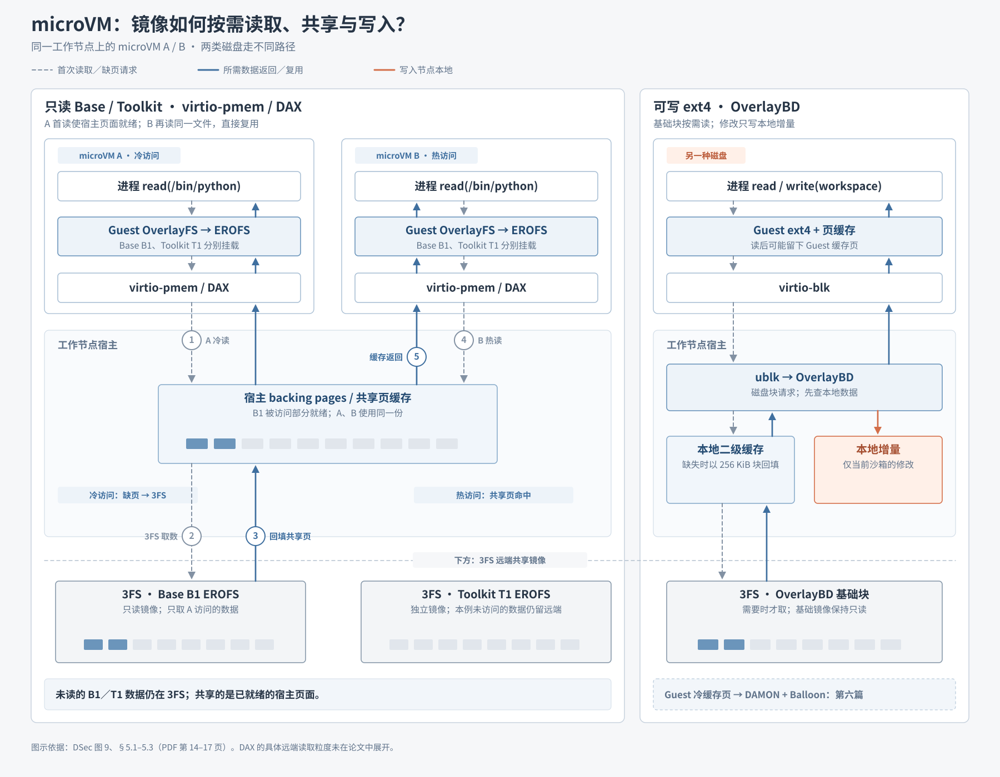
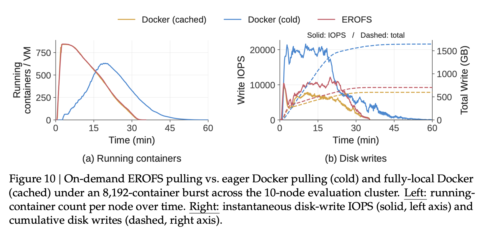

# 05｜镜像按需加载减少启动前的数据搬运

[第四篇](04-composable-environment-layers.md)解释了创建时怎样选择、组合环境层。本篇接着问：**选中的镜像，是否必须在沙箱运行前完整搬到工作节点？**

[第三篇](03-workload-to-platform-challenges.md)看到：镜像集合超过 130 TB，单个镜像复用有限；抽样容器任务只访问镜像文件数据的 **4.2%–13.3%**。完整拉取会把大量不会使用的数据也下载、解包到节点，集中启动时拖慢沙箱创建。这里讨论的是镜像数据从 **3FS 到工作节点** 的移动，与上一篇的 OverlayFS 写时复制不同。

## 图 9：只在访问时取得镜像数据

*图 9｜PDF 第 14 页。本篇看灰色的按需加载区域；绿色环境组合已在第四篇说明。*

**Container 看左侧灰框。**Multi-device EROFS 将元数据与文件数据分开：元数据先到工作节点，使路径查找在本地完成；文件数据留在 3FS，访问时再经 buffered I/O 和内核预读取回。写入留在节点本地 Upper。这样既避免完整拉取，也减少对 3FS 的零散小 I/O。

**microVM 要分两类盘看。**只读 Base、Toolkit 用 EROFS 和 virtio-pmem／DAX；可写 ext4 磁盘用 virtio-blk、ublk 与 OverlayBD。图 9 把按需加载与内存优化画在一起，下面用补图展开两类盘的数据路径。

## microVM 补图：冷读、共享与可写块读取

*原理补图｜依据论文 §5.1–5.3，PDF 第 14–17 页。左侧按箭头上的 ①→⑤ 读；灰色为读取请求，蓝色为数据返回，橙色为本地写入。*

### 按图走一次

1. **挂盘，不搬全盘。**Base B1 与 Toolkit T1 是 3FS 中两张独立的只读 EROFS 镜像。宿主为它们提供 virtio-pmem 设备后端；同一节点上的 Guest A、B 分别挂载这两张盘。右侧可写 ext4 则经 virtio-blk 接到宿主 ublk／OverlayBD。
2. **A 首读只读文件。**A 访问 Base 中的 `/bin/python`，Guest EROFS 定位所需内容；DAX 冷访问可能同步缺页。宿主使所需 backing data 就绪，需要时才从 3FS 取对应镜像数据。其余 Base／Toolkit 数据继续留在 3FS。论文没有细化这条 DAX 路径的 3FS 读取粒度。
3. **B 复用宿主页面。**B 随后读到相同的 Base 内容时，使用宿主已就绪的页面；DAX 不必为 B 再复制一份 Guest 页缓存，也无需为这部分数据再次访问 3FS。这是图中“共享缓存”的含义。
4. **可写 ext4 走另一条块路径。**Guest 的读取经 virtio-blk 到宿主 ublk／OverlayBD。若本地二级缓存未命中，OverlayBD 从 3FS 以 256 KiB 块读取并回填；写入只落到当前沙箱的本地增量，远端基础镜像不变。ext4 文件被读取后也可能占用 Guest 页缓存。

**留给第六篇：**不走 DAX 的较大可写磁盘可能积累 Guest 冷缓存页；DAMON 与 virtio-balloon 如何把这些内存还给宿主，属于高密度部署的内存管理问题。这里先标出这份内存从哪里来。

## 图 10：按需加载接近预缓存速度，并减少磁盘写入

**实验目标。**突发创建大量容器时，按需 EROFS 能否像“镜像已经在节点本地”一样迅速运行？它能否减少完整冷拉取造成的磁盘写入，而不只是把这笔开销推迟？

**实验设定。**同一真实 RL 评测负载，在 10 个节点上突发启动 **8,192 个容器**，使用多种数 GB 镜像。橙色 Docker cached 的镜像已预存在节点，作为运行速度参照；蓝色 Docker cold 要先完整下载、解包；红色 EROFS 按实际访问取数。

*图 10｜PDF 第 21 页。左图看每台工作节点 VM 正在运行的容器数：上升表示容器陆续运行，随后下降表示任务完成。右图的**实线读左轴**瞬时写 IOPS，**虚线读右轴**累计磁盘写入量。*

**先检验启动速度。**左图中，红色几乎与橙色同时迅速升至高并发，并都在约 **35 分钟**降至零，表示整批任务完成。蓝色在前约 20 分钟缓慢爬升，任务结束超过 **60 分钟**。原因是冷拉取把“下载并解包所有镜像层”放在容器运行之前；按需 EROFS 可以先启动，再读取任务碰到的文件。因此，第一个目标得到验证：**不预存完整镜像，也能接近预缓存的运行进度。**

**再检验是否真的减少工作量。**右图中，蓝色实线的写入峰值接近红色的两倍；蓝色虚线最终超过 **1,600 GB／节点**，红色约 **700 GB／节点**，橙色约 **600 GB／节点**。完整冷拉取会把未被任务访问的镜像内容也下载、解包并写到节点。若按需方案只是把同样的工作延后，红色累计写入最终仍会接近蓝色，任务也可能比橙色结束得更晚；图中两者都没有发生。红色比蓝色少约 **57%** 的磁盘写入，同时保持约 35 分钟的完成时间。因此，第二个目标也得到验证：**按需加载减少了实际的数据物化量。**

图 10 直接评估的是 **Container 的 EROFS 路径**。microVM 的只读页共享与 OverlayBD 块路径由前面的机制图解释；其内存回收留到第六篇。

[上一篇：可组合环境层](04-composable-environment-layers.md) · [下一篇：microVM 内存共享与回收](06-microvm-memory-sharing-and-reclamation.md) · [返回目录](README.md)

来源：[DeepSeek Elastic Compute (DSec)](https://arxiv.org/pdf/2609.22978v1) §4.4、§5.1–5.3、§8.2（PDF 第 13–17、21 页）。
