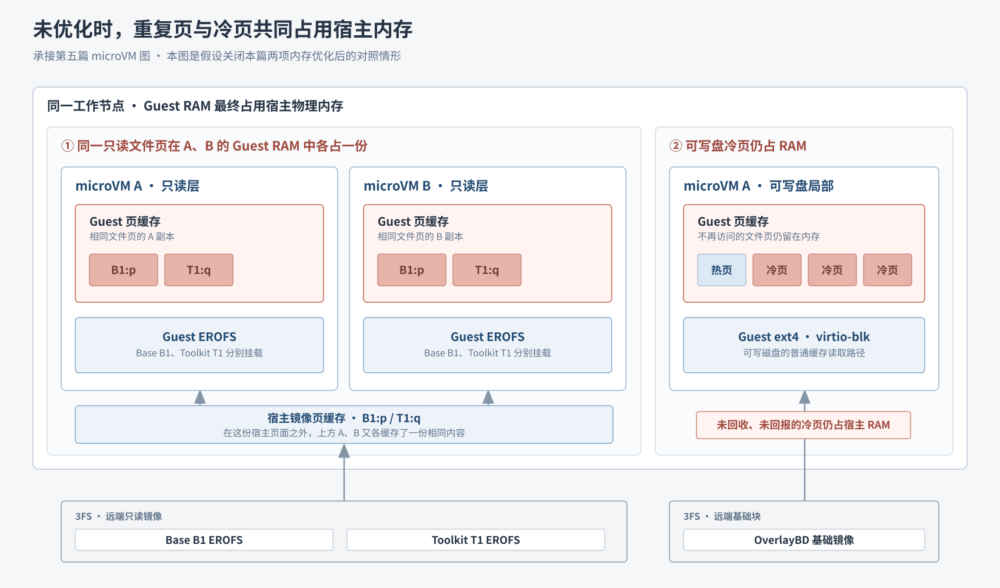
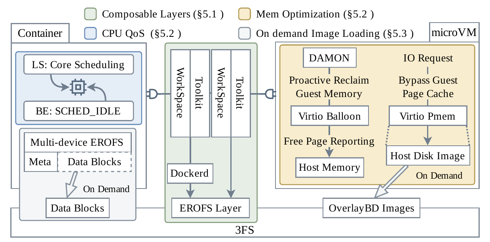
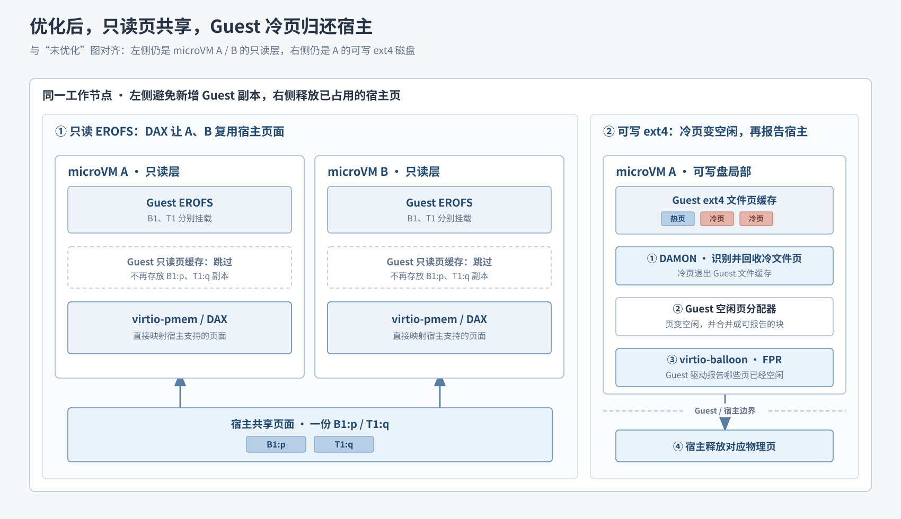
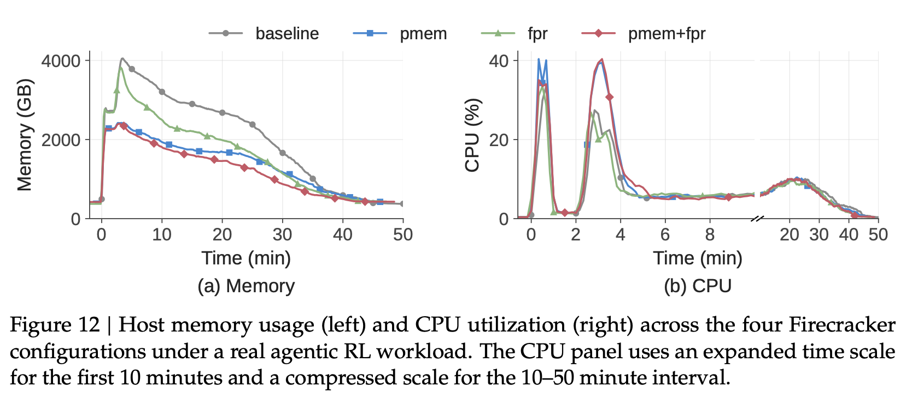

# 06｜页共享与冷页回收降低 microVM 内存占用

[第三篇](03-workload-to-platform-challenges.md)指出：沙箱的 CPU 常有空闲，内存与运行状态却持续占资源。[第五篇](05-on-demand-image-loading.md)解决镜像数据何时读入；本篇接着看**读入之后，microVM 如何少占宿主内存**。对应论文图 9 的黄色区域。

## 重复的只读页与滞留的冷页抬高内存占用

*对照图｜沿用第五篇的 A／B 与两类磁盘布局，展示关闭本篇内存优化时的情形；右侧是 A 的可写盘局部。*

左侧，宿主缓存了读到的 Base／Toolkit 页面，A、B 的 Guest 页缓存又各留下相同文件内容，形成重复副本。右侧，可写 ext4 的文件内容进入 A 的 Guest 页缓存；即使后来不再访问，冷页仍占用由宿主物理内存支撑的 Guest RAM。**右侧的一张 Guest 缓存页与支撑它的宿主页不是两份数据。**

## 图 9：只读层共享页面，可写盘回收冷页

*图 9｜PDF 第 14 页。看 microVM 黄色区域。右支用于只读 Base／Toolkit EROFS；左支在生产配置中主要处理不走 pmem 的较大可写磁盘。*

**右支避免产生重复副本。**`virtio-pmem` 把宿主支持的只读镜像页面作为设备提供给 Guest；`DAX` 让 Guest 绕过自己的文件页缓存，直接使用宿主支持的页面。A、B 读同一内容时复用一份宿主页面，而不再各缓存一份。

**左支释放已经占用的内存。**

1. `DAMON` 识别长期少用的 Guest 文件页，并促使 Guest 将其从页缓存中回收。
2. 这些页进入 Guest 的空闲页分配器，合并成可报告的空闲块。此时 **Guest 认为页面空闲，宿主的物理内存占用尚未随之下降**。
3. `FPR` 是 `virtio-balloon` 设备的空闲页回报功能。Guest 用它向宿主报告空闲块，宿主释放对应物理页。Guest 可用的逻辑内存范围不变，宿主实际占用下降。

DSec 将 pmem／DAX 用于只读 Base、Toolkit；可写 ext4 保留普通块设备读取并使用 DAMON＋FPR。pmem 不适合覆盖所有磁盘：DAX 冷访问可能需要同步缺页处理，pmem 设备范围也需要 Guest 页面元数据。

## 优化后的两条路径分别消除两类开销

*与前一张对照图按左右两侧比较：A／B 的只读页副本消失，只留宿主共享页面；A 的可写盘冷页经过“回收为 Guest 空闲页 → 跨边界报告 → 宿主释放”。*

## 图 12：两项机制互补，pmem 带来瞬时 CPU 代价

**实验目标与设定。**论文用真实 agentic RL 负载比较四种 Firecracker 配置：灰色 `baseline` 两项都不开；蓝色 `pmem` 启用只读页共享；绿色 `fpr` 启用 DAMON＋balloon 空闲页回报；红色 `pmem+fpr` 两项都启用。

*图 12｜PDF 第 23 页。左图看宿主内存 GB；右图看 CPU 使用率。右图前 10 分钟的横轴被放大，10–50 分钟被压缩。*

左图先看峰值：蓝线明显低于灰线，pmem 将峰值降低 **40.2%**，对应避免重复缓存。绿线的峰值变化不大，但随后更快下降；论文统计整个运行期间的内存消耗降低 **21.2%**，对应逐步归还冷页。红线结合两者，整体占用最低。

右图显示代价：pmem 使瞬时 CPU 峰值从 **26.5%** 升至 **41.4%**，论文认为这可能部分与 DAX 冷访问的同步缺页有关。因此，**pmem 主要压低重复缓存造成的峰值，DAMON＋FPR 主要释放运行中积累的冷页；组合效果最好，但需考虑 CPU 余量。**

[上一篇：镜像按需加载](05-on-demand-image-loading.md) · [下一篇：CPU 超分配与服务质量](07-cpu-overcommit-and-qos.md) · [返回目录](README.md)

来源：[DeepSeek Elastic Compute (DSec)](https://arxiv.org/pdf/2609.22978v1) §5.2、§8.4（PDF 第 15、23 页）。
