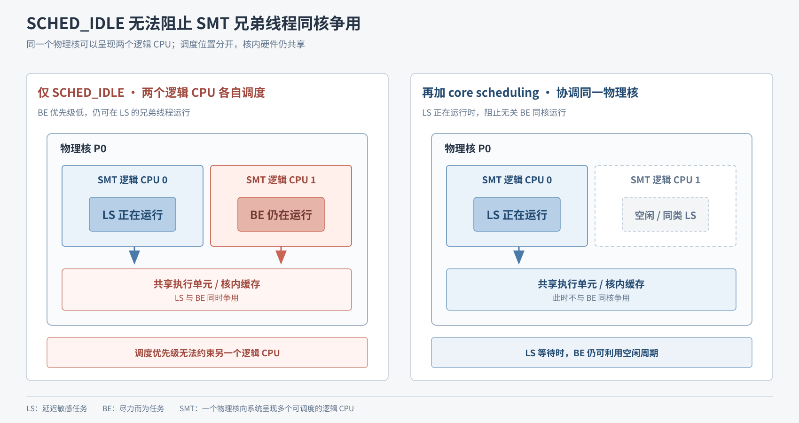
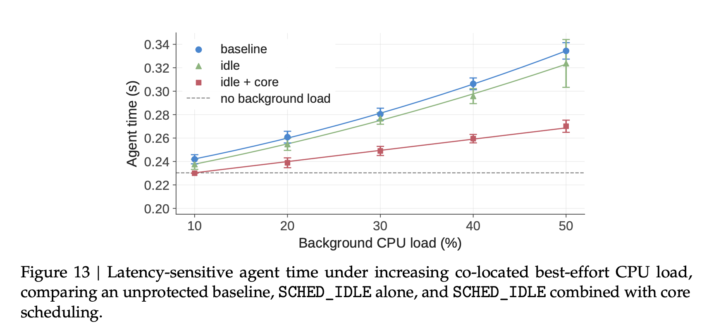

# 07｜两级 CPU 调度保护延迟敏感任务

[第三篇](03-workload-to-platform-challenges.md)的图 5 显示，多数沙箱平均只使用少量申请的 CPU，因此可以让更多沙箱共享节点。但部分任务有严格的单步时限，例如棋类 Agent 必须及时完成每次落子。DSec 将沙箱分为延迟敏感的 **LS** 和可利用空闲算力的 **BE**：提高 CPU 利用率时，仍要保护 LS 的单步时间。

## 图 9：低优先级与同核协调组成两级保护

*图 9｜PDF 第 14 页。本篇看蓝色 CPU QoS 区域：BE 使用 `SCHED_IDLE`，LS 使用 core scheduling。*

`SCHED_IDLE` 降低 BE 在**同一个逻辑 CPU** 上与 LS 竞争时的优先级；它不会让同一物理核上的所有 BE 一起停下。一个物理核可以通过 **SMT** 呈现两个可分别调度的逻辑 CPU：它们能同时运行任务，却共享核内执行资源。仅降低 BE 优先级，不能阻止它在 LS 的另一个逻辑 CPU 上运行。DSec 因此再按 QoS 类协调同一物理核上的任务，不让无关 BE 与 LS 同核运行。

## SMT 同核争用解释了第二级调度的必要性

*原理补图｜依据论文 §4.3、§5.2，PDF 第 12、15 页。左右各是一个物理核，内部的两个 SMT 逻辑 CPU 共享执行单元与缓存。图中比较的是 **LS 已开始运行** 时，两种调度方式如何安排 BE。*

按一次任务唤醒的过程看图：

1. **LS 等待时**，BE 可以分别运行在逻辑 CPU 0 和 1 上。
2. **LS 醒来并被安排到逻辑 CPU 0 时**，CPU 0 选择 LS，原先在这里运行的 BE 让位。逻辑 CPU 1 上没有被安排的 LS；对它来说，BE 仍是可运行的任务，所以可能继续执行。`SCHED_IDLE` 不会因为兄弟逻辑 CPU 0 出现 LS，就自动停掉 CPU 1 的 BE。两者仍在同一个物理核内争用资源——这就是左图。
3. **增加 core scheduling 后**，调度器协调两个 SMT 逻辑 CPU：LS 运行时，兄弟线程不运行无关 BE，可以空闲或运行允许同核运行的任务。LS 再次等待时，BE 仍可使用空闲周期——这就是右图。

两级机制分别解决**逻辑 CPU 上的任务优先级**和**物理核内部的同时运行组合**。

## 图 13：两级调度显著降低 LS 的单步延迟

**实验目标与设定。**论文用真实评测负载中的棋类应用作为 LS 任务，在同一节点加入 BE 计算工作，并将其负载从节点 CPU 容量的 **10%** 增至 **50%**。这里的“背景负载”就是这些与 LS 共置的 BE 工作，**不是 LS 自己的 CPU 使用率**。实验比较无保护、仅 `SCHED_IDLE`、两级调度三种配置。

*图 13｜PDF 第 24 页。横轴是 BE 背景 CPU 负载；纵轴是 LS Agent 每步所用时间，越低越好。灰色虚线是没有 BE 背景负载时的参照；蓝、绿、红依次是无保护、仅 `SCHED_IDLE`、两级调度。*

随着 BE 负载增加，蓝线明显远离虚线。到 **50%** 负载时，无保护的单步时间比无背景负载增加 **45.2%**。绿线仅略低于蓝线；论文统计仅用 `SCHED_IDLE` 最多改善 **3.4%**，符合补图中仍有 SMT 同核争用的情况。红线明显更接近虚线，将 50% 负载下的增幅限制到 **17.3%**。这验证了第二级调度对 LS 延迟的主要保护作用。

红线仍随负载上升。论文将剩余干扰主要归于多核负载下 CPU 加速频率降低，以及内存带宽、共享末级缓存竞争；由于影响已可接受，DSec 没有再加入内存带宽隔离。

[上一篇：microVM 内存共享与回收](06-microvm-memory-sharing-and-reclamation.md) · [下一篇：rollout 与抢占恢复](08-rollout-preemption-and-recovery.md) · [返回目录](README.md)

来源：[DeepSeek Elastic Compute (DSec)](https://arxiv.org/pdf/2609.22978v1) §4.3、§5.2、§8.5（PDF 第 12、15、23–24 页）。
