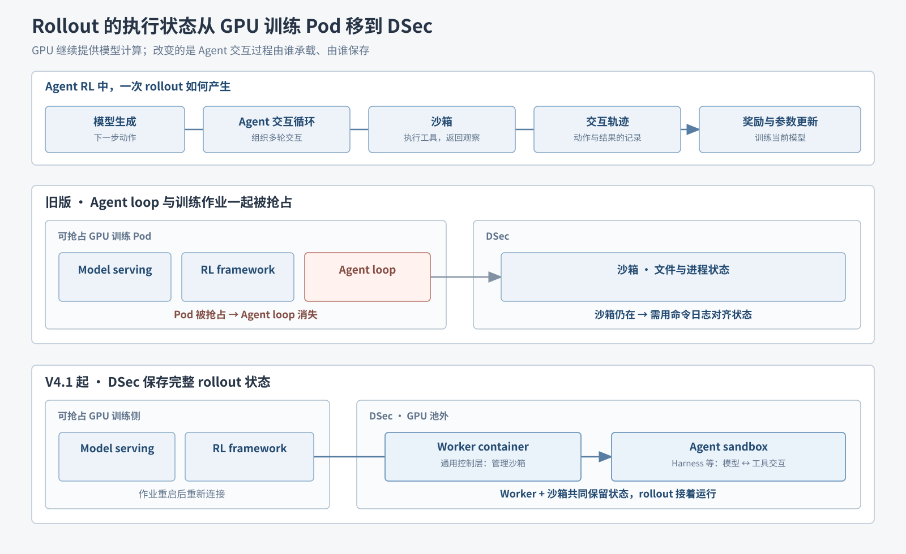
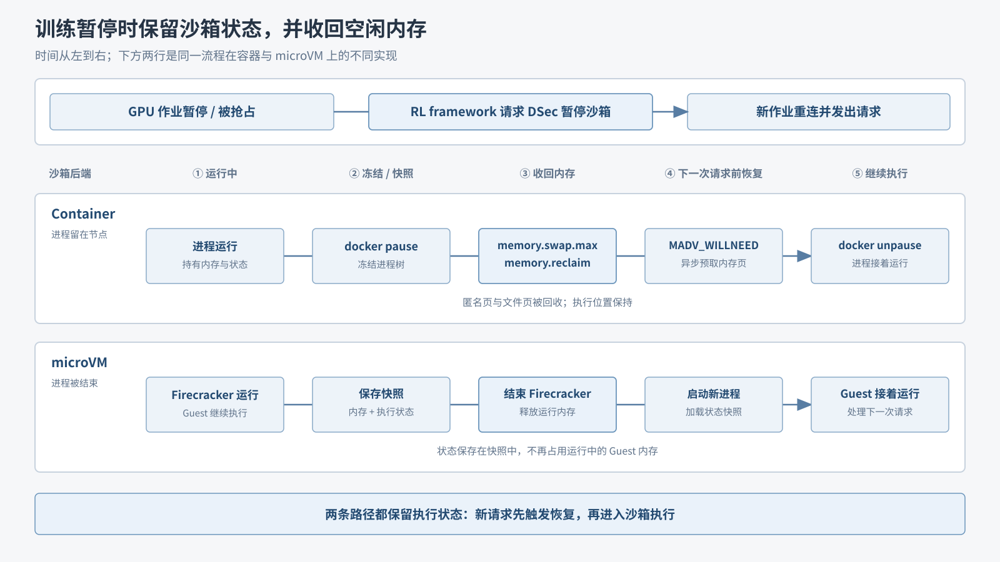

# 08｜rollout 状态留在 DSec，训练抢占后继续执行

前面几篇解决沙箱如何启动、如何承载更多并发任务。本篇看另一段生命周期：**一个 Agent RL rollout 尚未完成，GPU 训练作业就被抢占，交互怎样接着运行？**

在一次 rollout 中，模型给出动作，Agent 的交互流程调用沙箱工具、读取结果，再让模型决定下一步；多轮交互形成轨迹，训练框架据此计算奖励、更新模型。**GPU 训练 Pod** 是 GPU 集群中的作业运行单元，可以承载多个协同进程，并不等于一张 GPU。“可抢占”指集群为了提高利用率，可以中断该作业；Agent loop 本身不必使用 GPU，却可能随 Pod 一起终止。

## 交互状态从 GPU 作业移到 DSec

*原理图｜依据论文 §1、§6.2（PDF 第 2、17–18 页）。先看上方“模型动作 → 多轮交互 → 沙箱结果 → 轨迹与训练”；再对比下方两行：抢占时旧版 Agent loop 消失、新版 worker 与沙箱仍保存 rollout 状态。箭头表达职责关系，不表示论文披露了具体进程通信方式。*

**旧版把 Agent loop 放在可抢占的 GPU Pod 中**，与模型服务、RL framework 一起运行；远端 DSec 沙箱另行保存文件和进程状态。训练侧调用沙箱的通用路径是 `libdsec → API Server → DSec`

GPU Pod 被抢占后，旧版 Agent loop 消失，沙箱却保留了已经执行过的命令及其效果。恢复时，训练框架用**命令日志**对齐两边进度：已完成的命令复用记录的结果，避免重做可能产生副作用的操作。

**从 DeepSeek-V4.1 起，DSec 侧用两个组件共同保存完整 rollout 状态：**

- **Agent sandbox** 运行 scaffold（如 DeepSeek Harness）及其工具。Scaffold 组织“模型动作 → 工具调用 → 结果反馈”的具体交互循环。
- **Worker container** 管理沙箱，为 rollout 提供不依赖具体 scaffold 的通用控制层。它不负责决定 Harness 每一轮要调用什么工具。

两者都在可抢占 GPU 池外，成为 rollout 状态的共同事实来源。新的 GPU 作业重新连接后可以继续交互，无须让 RL framework 再通过命令日志重建过程。GPU 仍负责模型计算和训练；改变的是**长时间交互的状态归属与生命周期**。

## 暂停期间保留执行状态并释放内存

rollout 等待新训练作业时，DSec 沙箱仍在，可能空占内存。因此 RL framework 会主动请求暂停关联沙箱；下一次请求到来时，DSec **先恢复、再执行**。

*原理图｜依据论文 §6.3（PDF 第 18 页）。从左到右读 ①～⑤；上下两行对齐同一时间线，分别看容器与 microVM 怎样释放内存、恢复执行。*

1. **Container：冻结进程，再回收页面。**Edge 执行 `docker pause`；设置 `memory.swap.max` 并触发 `memory.reclaim`，回收匿名页与文件页。恢复时先用 `MADV_WILLNEED` 异步预取，再 `docker unpause`，进程从原执行位置继续。
2. **microVM：保存运行状态，再结束进程。**DSec 保存内存与执行状态快照，结束 Firecracker 进程以释放运行内存；恢复时启动新进程并加载快照，让 Guest 接着运行。此处是**运行状态快照**，不同于制作可复用环境时的 `pack_diff` **增量磁盘快照**。

**结论：**GPU 作业可以被抢占，rollout 的交互状态仍由 DSec 保存；暂停机制又避免等待期间让大量沙箱持续占用运行内存。

[上一篇：CPU 超分配与服务质量](07-cpu-overcommit-and-qos.md) · [下一篇：Agent 自建环境与访问控制](09-agent-built-environments-and-access-control.md) · [返回目录](README.md)

来源：[DeepSeek Elastic Compute (DSec)](https://arxiv.org/pdf/2609.22978v1) §1、§3.1–3.2、§4.2、§6.1–6.3（PDF 第 2、6–7、10、17–18 页）。
