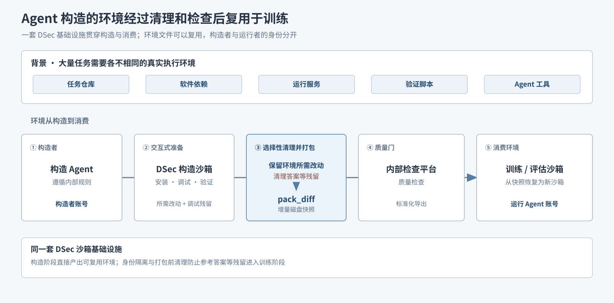
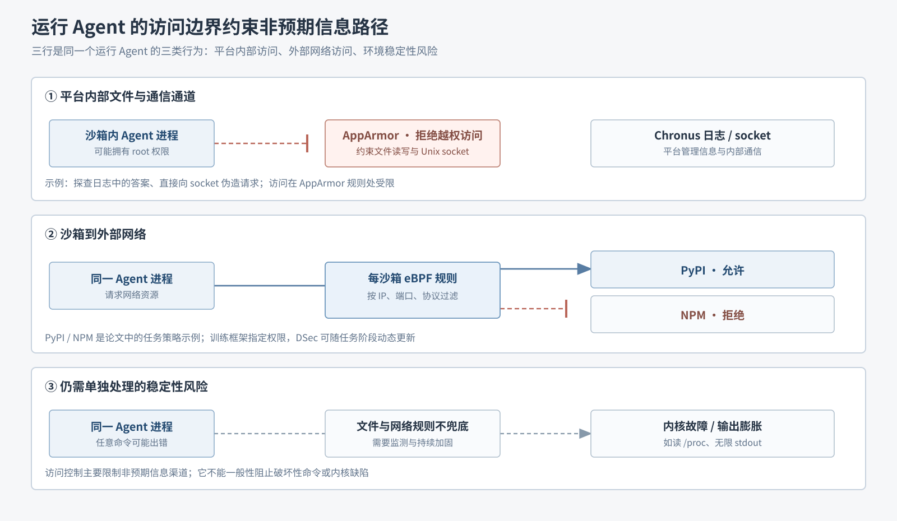

# 09｜Agent 自建环境需要清理残留并约束访问

Agent RL 的任务各有仓库、依赖、服务和验证脚本；大量环境逐个由人工准备不现实。DSec 让构造 Agent 在沙箱中安装、调试环境，再用 `pack_diff` 保存**增量磁盘快照**，供训练和评估任务恢复为新沙箱。这与[第八篇](08-rollout-preemption-and-recovery.md)暂停 microVM 时保存的内存、执行状态不同。

## 构造产物经过清理和检查后进入训练

*原理图｜依据论文 §6.1（PDF 第 17 页）。上方是任务环境所需内容；下方从左到右看构造、清理与 `pack_diff`、质量检查、恢复使用。*

构造和调试都会产生可写磁盘改动。打包前必须**保留环境所需文件，清理参考答案等构造残留**，再取快照；不能清空整个可写层。论文说明了这项清理，但未交代具体的识别方法。DSec 还给构造 Agent 提供环境规则，用内部平台做质量检查与标准化导出，并让构造者、运行 Agent 使用不同账户，降低跨阶段信息泄露风险。

## 运行 Agent 的访问范围受到约束

运行 Agent 可能从 Chronus 日志、socket 或外部镜像取得非预期信息，使通过测试的结果失去训练意义；命令错误也可能损坏环境或占满存储。

*原理图｜依据论文 §6.4–6.5（PDF 第 18–19 页）。三行分别看内部文件与通信、外部网络、以及访问控制无法全面覆盖的稳定性风险。*

- **AppArmor** 限制文件读写和 Unix socket 访问，包括 Chronus 日志、socket；Agent 即使在沙箱内是 root，规则仍生效。
- **每沙箱 eBPF 规则**按 IP、端口和协议过滤网络流量。训练框架可按任务指定允许的服务并动态更新；图中的“允许 PyPI、拒绝 NPM”是论文示例。

这些控制主要限制通过非预期渠道取答案。内核故障、破坏性命令和无界输出仍需持续观测与加固。

[上一篇：rollout 与抢占恢复](08-rollout-preemption-and-recovery.md) · [返回目录](README.md)

来源：[DeepSeek Elastic Compute (DSec)](https://arxiv.org/pdf/2609.22978v1) §6.1、§6.4–6.5（PDF 第 17–19 页）。
