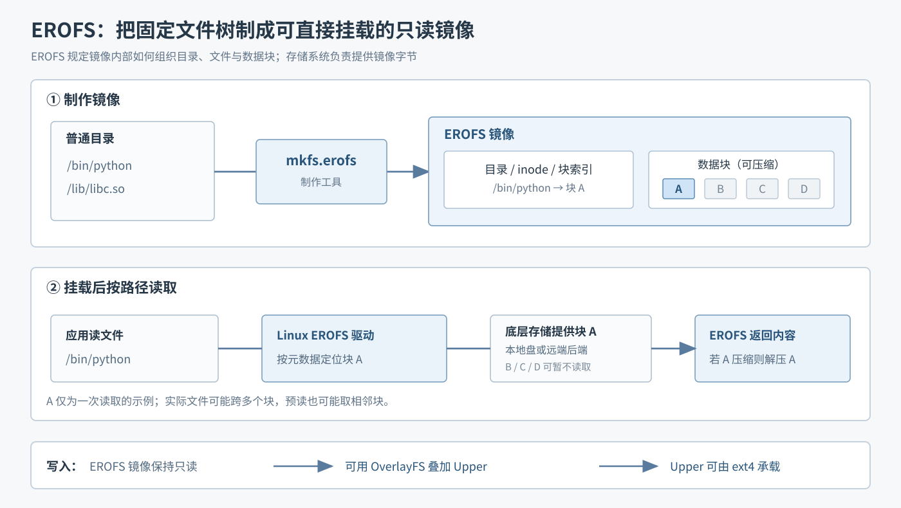

# 附录｜EROFS 将固定文件树制成可直接挂载的只读镜像

一份系统环境或应用文件发布后，如果内容不再修改，就没有必要为每个使用者重新解包一份。**EROFS（Enhanced Read-Only File System）是 Linux 的只读文件系统**：它规定目录、文件元数据和数据块在镜像中如何存放，也由内核驱动负责挂载和读取。因此，“文件存储格式”是它的一部分；它还让程序能像访问普通目录一样使用镜像。

*原理图｜上半部分展示元数据与独立数据块；下半部分以只需块 A 的一次读取为例。实际文件可能跨多个块，内核预读也可能取相邻块。压缩是可选能力；远端取数仍需相应存储与接入机制。*

按图走一次：制作工具 `mkfs.erofs` 将原始目录变成包含**文件元数据和数据块**的镜像。挂载后，程序读取 `/bin/python`；内核通过元数据找到所需数据块，从底层存储取得字节，必要时解压并返回。整个过程不要求先把镜像解包成一棵新目录。EROFS 镜像本身保持只读，更新内容通常意味着制作新版镜像。

## EROFS 与其他方案的关系

| 方案 | 与 EROFS 的区别 |
| --- | --- |
| **SquashFS** | 最接近的同类：同样是可挂载、可压缩的只读文件系统，也能按文件读取。EROFS 的差异在具体镜像布局，以及多设备、直接访问等能力；“免解包”不是 EROFS 独有，也不能认为它总比 SquashFS 快。 |
| **ext4、XFS** | 通用的可读写文件系统，也能随机读取。EROFS 面向固定内容，省去写入相关的管理结构，并提供紧凑布局与可选压缩；代价是不能在原文件系统中直接修改文件。 |
| **`tar.gz`** | 归档包，不是可直接挂载使用的文件系统。若采用“每个实例先解包再运行”的方式，会反复产生解压和磁盘写入；EROFS 可以直接挂载、按所需文件读取。 |

**EROFS 解决的问题：**把不再修改的文件树紧凑地发布给许多使用者，让他们直接挂载和读取，而不必各自物化一整份目录。

## ext4 承接运行时的修改

**ext4 也是 Linux 文件系统，但面向可修改的数据。**它管理文件的创建、修改、删除、磁盘空间分配和相关元数据。因此，EROFS 适合保存共享的只读基础内容；程序运行时产生的文件，需要另一个可写文件系统，例如 ext4。常见组合是由 OverlayFS 把 EROFS 作为只读 Lower、把 ext4 上的目录作为可写 Upper，合成程序看到的文件树。

## DSec 将 EROFS 与 ext4 用在不同位置

论文将已发布的环境层制成 EROFS 镜像，由 3FS 保存镜像数据。**3FS 负责存储和供应字节，EROFS 负责解释镜像中的文件**；DSec 的 Container 路径进一步把元数据放在工作节点本地，文件数据留在 3FS、访问时再取。远程按需读取还依赖 DSec 的存储与接入机制，并非 EROFS 自动完成。

在 microVM 中，Base 和 Toolkit 使用只读 EROFS；Guest 根目录的 OverlayFS Upper 位于可写 ext4 磁盘上。论文还为 microVM 内 Docker 的数据目录使用独立 ext4 磁盘，因为 Docker `overlay2` 不能使用已由 OverlayFS 支撑的数据目录。OverlayBD 负责这些可写磁盘下方的按需块读取与本地增量写入。论文解释了这里**为何需要可写磁盘及 ext4 所承担的角色**，没有比较 ext4 与 XFS 等其他可写文件系统的优劣。

进一步阅读：[环境层如何组合](04-composable-environment-layers.md) · [镜像如何按需加载](05-on-demand-image-loading.md) · [返回目录](README.md)

依据：[Linux EROFS 文档](https://github.com/torvalds/linux/blob/master/Documentation/filesystems/erofs.rst)、[Linux SquashFS 文档](https://github.com/torvalds/linux/blob/master/Documentation/filesystems/squashfs.rst)、[Linux ext4 文档](https://github.com/torvalds/linux/blob/master/Documentation/filesystems/ext4/index.rst)、[DSec 论文](https://arxiv.org/pdf/2609.22978v1) §5.1–5.3（PDF 第 14–17 页）。
