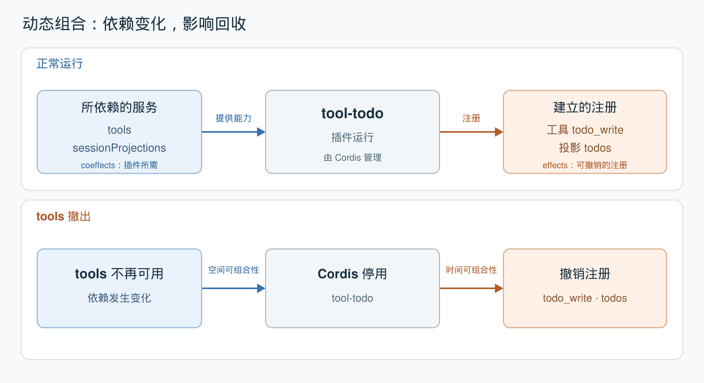

# 第 1 单元｜动态组合需要同时管理依赖与影响

[返回目录](README.md) · [上一篇：论文总览](00-overview.md) · [下一篇：时间可组合性](02-temporal-composability.md)

一个插件既使用系统中的能力，也向系统贡献能力。因此，增删插件会同时改变它的运行条件和它留在系统中的注册。

| 观察方向 | 对应概念 | 动态组合需要解决的问题 |
|---|---|---|
| 插件需要环境提供什么 | **coeffect** | 依赖出现、消失或更换时，协调插件运行，形成空间可组合性 |
| 插件对环境改变了什么 | **effect** | 插件退出时撤销其可逆改变，形成时间可组合性 |

这里的“空间”关注组件之间的关系，“时间”关注组件加入、运行和退出期间的状态变化。



*根据 DSH 的 [tool-todo 源码](https://github.com/deepseek-ai/deepseek-harness/blob/639ed015397290b3745d163aafe02ffee4aa3f84/packages/todo/tool-todo/src/index.ts)绘制的概念图；箭头表达依赖与回收之间的因果关系。它是源码辅助示意，非论文原图。[SVG 原图](assets/dynamic-composition-overview.svg)。*

## 上层：正常运行

1. **声明所需能力。** `tool-todo` 依赖 `tools` 工具服务，以及 `sessionProjections` 服务——后者负责根据会话事件计算当前状态。这些是插件的 coeffects。
2. **建立自己的注册。** 插件注册 `todo_write` 工具，以及用于计算当前待办列表的 `todos` 投影。这两项注册是此例中的 effects。
3. **由 Cordis 协调。** Cordis 跟踪依赖是否满足，并管理这次插件运行及其注册的生命周期。

## 下层：tools 撤出

1. **依赖失效。** `tools` 不再可用，`tool-todo` 的运行条件不再满足。
2. **联动停用。** Cordis 停用 `tool-todo`，体现空间可组合性：依赖变化会影响相关组件的运行。
3. **回收注册。** 停用过程撤销该插件建立的工具和投影注册，体现时间可组合性。`sessionProjections` 服务本身可以继续服务于其他插件。

所以，仅注销 `tools` 还不够：**依赖它的插件也需要调整，并清理属于自己的注册。**

源码中的[依赖声明](https://github.com/deepseek-ai/deepseek-harness/blob/639ed015397290b3745d163aafe02ffee4aa3f84/packages/todo/tool-todo/src/index.ts#L23)直接对应图的左侧：

```ts
export const inject = ['tools', 'sessionProjections']
```

这一行告诉 Cordis 插件运行需要哪些服务；服务变化后的协调由运行时处理。

**回收有明确边界。** Effect 泛指对环境的影响，能够自动回收的是被运行时跟踪、并配有撤销动作的改变。本例撤销的是两项注册；过去调用 `todo_write` [写入的会话事件](https://github.com/deepseek-ai/deepseek-harness/blob/639ed015397290b3745d163aafe02ffee4aa3f84/packages/todo/tool-todo/src/index.ts#L199)仍然保留。插件退出不会自动回滚所有历史动作。

下一单元将沿着“回收注册”这一侧展开：怎样让建立能力与撤销能力对应起来，避免卸载时漏掉清理。

*依据：[论文](assets/dsh-paper.pdf)第 1–2 节（第 4–8 页）；可逆性及其边界补充自第 3.1 节（第 9 页起）与第 6.1 节（第 67–68 页）。源码中两项注册见 tool-todo 第 117–136 行；依赖刷新与停用见 [Cordis Fiber](https://github.com/deepseek-ai/deepseek-harness/blob/639ed015397290b3745d163aafe02ffee4aa3f84/vendor/cordis/src/fiber.ts#L611)；投影注册的清理见 [session-projection](https://github.com/deepseek-ai/deepseek-harness/blob/639ed015397290b3745d163aafe02ffee4aa3f84/packages/session/session-projection/src/index.ts#L273)。*

[返回目录](README.md) · [下一篇：时间可组合性](02-temporal-composability.md)
