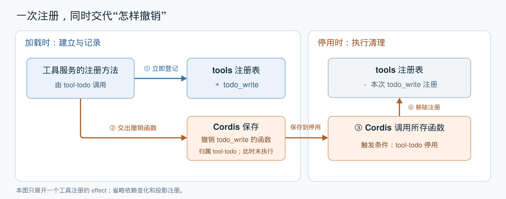
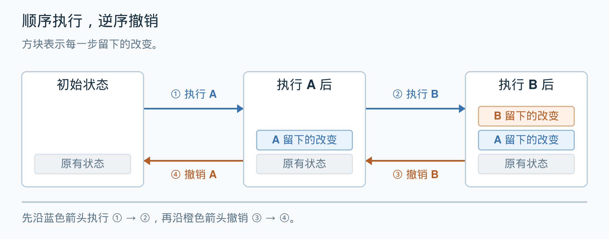
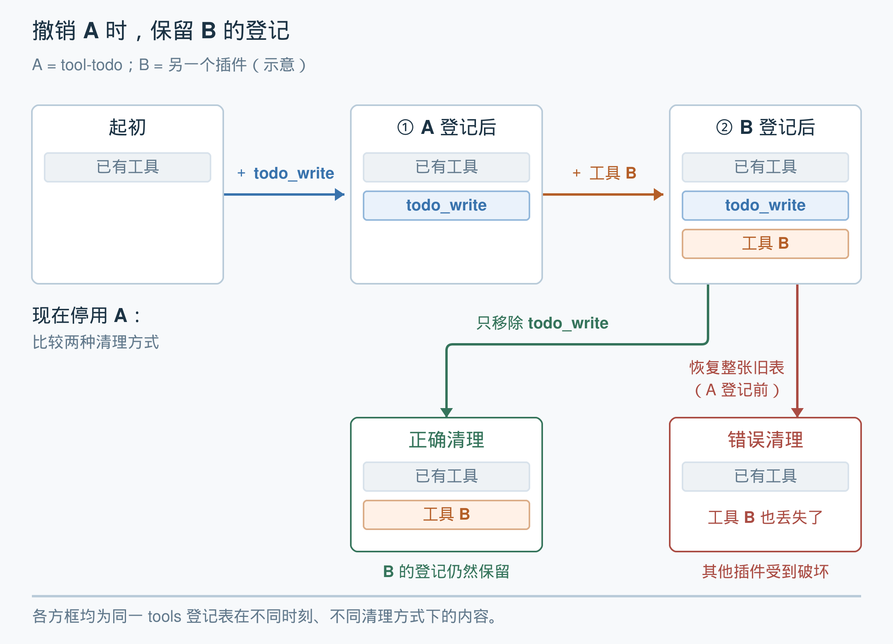

# 第 2 单元｜时间可组合性：建立能力时，同时交代怎样清理

[返回目录](README.md) · [上一篇：动态组合需要同时管理依赖与影响](01-dynamic-composition.md) · [下一篇：空间可组合性](03-spatial-composability.md)

插件运行时，会向系统添加工具、订阅事件或建立其他资源。插件退出时，这些改变也需要得到清理，否则可能留下失效的工具入口、仍在触发的事件处理函数等。

本单元以 DSH 的待办功能为例，理解论文的解决思路：**每项操作提供对应的撤销动作，运行时负责跟踪，并在需要时执行。**

## 1. 待办插件怎样向系统提供工具

DSH 用插件组织功能。插件可以理解为一组能够被系统加载、停用的代码。

其中，`tool-todo` 是负责待办事项功能的插件。它提供 `todo_write` 工具，让模型在执行任务时更新会话中的待办清单。

这里有三个名字：

| 名字 | 含义与作用 |
|---|---|
| `tool-todo` | 待办功能插件，包含这项功能的实现 |
| `todo_write` | 插件提供的工具，供模型调用以更新待办清单 |
| `tools` | 工具管理服务，维护工具的登记信息，供系统查找和调用 |

写好工具代码之后，还需要将它的名称、参数和执行函数交给工具管理服务。这一步就是**注册工具**。

`tool-todo` 通过 `ctx.tools.register(...)` 完成注册。这里，`ctx` 是 Cordis 提供给插件的运行上下文，插件通过它访问服务；`ctx.tools.register` 就是工具服务的注册方法。Cordis 是负责管理插件运行与停用的框架。

整个过程是：**加载待办插件 → 登记 `todo_write` 工具 → 系统可以通过这项登记调用工具。**

## 2. 注册与清理需要成对管理

注册工具改变了系统的运行环境：工具登记表里多了一项能力。这是本例中的 **effect**。

插件停用时，这项登记也需要被撤销。每一项注册因此都需要对应的清理办法。如果建立能力和清理能力分散在不同位置，修改其中一处时，就容易遗漏另一处。

论文第 3.1 节提出：**执行改变时，同时提供撤销这次改变的函数，并把它交给运行时跟踪。**

“撤销函数”就是一段写好了清理步骤、可以稍后调用的代码。例如，添加一条工具登记时，同时提供一个移除这条登记的函数。

在 Cordis 中，`ctx.effect(...)` 承担这种跟踪工作：执行操作，接收其提供的撤销函数，并将清理纳入所属插件的生命周期管理。

## 3. 一次工具注册的建立与回收



*图 1：根据论文第 5.1.1 节和 DSH 源码绘制，只展开一次工具注册。此图为辅助示意，非论文原图。[SVG 原图](assets/revertible-registration.svg)。*

### 左侧：加载时，建立能力并记录清理办法

1. **登记工具。** `tool-todo` 调用工具服务的注册方法，将 `todo_write` 加入工具登记表。
2. **记录撤销函数。** 注册方法内部提供“移除本次登记”的函数，并通过 `ctx.effect` 交给 Cordis 管理。它归属于插件的这次运行，**此时只保存，不执行清理**。

### 右侧：停用时，执行清理

3. **调用撤销函数。** `tool-todo` 停用时，Cordis 执行归属于它的清理动作。
4. **移除本次登记。** 撤销函数从工具登记表中移除这次注册，收回它提供的工具入口。

因此，清理办法在建立能力时就已经确定；插件退出时，Cordis 按照记录执行。

## 4. 插件作者无需重复编写工具卸载逻辑

DSH 的工具注册方法已经封装了添加与撤销的配对逻辑。将内部的几层调用合并，其核心可以简化为：

```ts
// 示意代码：位于工具注册方法内部
// registry 表示工具登记表，省略重复注册检查等细节
ctx.effect(() => {
  registry.set(name, definition)       // 现在：登记工具
  return () => registry.delete(name)   // 返回函数，供以后撤销登记
})
```

`return () => ...` 返回的是清理函数，此时不会执行删除。

这段逻辑由工具注册机制的实现者编写。使用它的插件只需要调用 `ctx.tools.register(...)`，就会连同清理动作一起被管理。

| 参与者 | 负责什么 |
|---|---|
| `tool-todo` 插件开发者 | 编写待办功能，调用注册方法登记工具 |
| DSH 工具服务及其底层登记代码的开发者 | 实现登记与撤销，保证撤销正确 |
| Cordis 框架 | 跟踪清理动作，在插件停用时调用 |

**每次注册仍然有一次对应的清理；这种配对被封装后，插件作者无需另外维护一份工具卸载清单。**

实际源码中，[工具注册方法](https://github.com/deepseek-ai/deepseek-harness/blob/639ed015397290b3745d163aafe02ffee4aa3f84/packages/core/tools/src/index.ts#L1083)通过[公共的 effect 管理方法](https://github.com/deepseek-ai/deepseek-harness/blob/639ed015397290b3745d163aafe02ffee4aa3f84/packages/core/scope/src/store.ts#L226)接入 `ctx.effect`；[底层登记代码](https://github.com/deepseek-ai/deepseek-harness/blob/639ed015397290b3745d163aafe02ffee4aa3f84/packages/core/scope/src/store.ts#L43)负责添加条目，并返回撤销函数。插件中的调用见 [tool-todo](https://github.com/deepseek-ai/deepseek-harness/blob/639ed015397290b3745d163aafe02ffee4aa3f84/packages/todo/tool-todo/src/index.ts#L135)。

## 5. 多个清理动作怎样组合

一个插件通常会建立多项能力。时间可组合性还要求：这些局部操作的撤销动作能够组合起来，完成整个插件的清理。

### 顺序执行，逆序撤销

论文首先考虑一串顺序执行的可逆操作。下图中，A、B 表示两个操作，方块表示它们留下的改变。



*图 2：依据论文第 3.1 节绘制的顺序组合示意，非论文原图。[SVG 原图](assets/effect-reverse-order.svg)。*

1. **沿蓝色箭头执行。** 先执行 A，再执行 B，环境中依次留下两步操作的改变。
2. **沿橙色箭头撤销。** 先撤销 B，回到 A 执行后的状态；再撤销 A，回到初始状态。

这样，每个撤销函数都能面对它原先产生的状态。这是论文组合撤销动作的基本方式，前提是每个撤销函数都正确。

### 清理自己的登记，保留其他插件的登记

多个插件交错运行时，其他插件可能也在修改环境。此时，单独撤出一个插件，需要保留其他插件仍然有效的改变。

下图沿用工具登记表：A 是 `tool-todo`，B 是另一个插件的示意。假设 B 不依赖 A，并且注册了另一个工具。



*图 3：用工具登记解释论文第 3.1.3 节的互不干扰要求。B 为教学示例，非另一个实际 DSH 插件。[SVG 原图](assets/effect-independent-cleanup.svg)。*

1. **先看上排。** A 登记 `todo_write` 后，B 又添加自己的工具，此时登记表同时包含两者。
2. **再比较下方。** 停用 A 时，只移除 `todo_write`，能够保留 B 的登记；如果恢复 A 登记前的整张旧表，B 后来添加的登记也会被抹掉。

论文用 effect 的“独立性”刻画这类互不干扰的条件。**仅仅收集撤销函数，还不足以保证任意交错操作都能安全撤销。**涉及插件之间的依赖和运行顺序时，需要结合后续单元的机制处理。

另外，`ctx.effect` 还会返回可主动调用的清理函数，允许提前撤销一项操作，并防止同一项清理被重复执行。这对应论文第 5.1.1 节的清理管理机制。

## 6. 自动清理的范围

这一机制有明确的适用范围：

- **已经接入管理的操作，可以自动清理。**例如工具注册。插件若直接调用原生 `setInterval(...)` 创建定时器，仍需要提供停止定时器的动作，并将它纳入生命周期管理。
- **清理的正确性由提供清理代码的人保证。**本例中是 DSH 工具注册机制的实现者。Cordis 不会自动推导或验证撤销办法。
- **撤销注册不会回滚历史执行。**移除 `todo_write` 的登记，不会删除它此前已经[写入的 `todo/write` 会话事件](https://github.com/deepseek-ai/deepseek-harness/blob/639ed015397290b3745d163aafe02ffee4aa3f84/packages/todo/tool-todo/src/index.ts#L199)。

由此，时间可组合性让插件能够在运行过程中加入，并在退出时收回它在所管理环境中建立的可逆改变。

> **本单元的核心：建立能力时就带上清理办法，把各项清理交给运行时组合和管理，让插件能够有组织地退出。**

下一单元转向空间可组合性：依赖的服务出现、消失或更换时，插件的运行状态怎样随之调整。

*原文依据：[论文](assets/dsh-paper.pdf)第 3.1 节（第 9–17 页，可逆操作、组合与独立性）、第 5.1.1 节（第 56–57 页，Cordis 的 effect 跟踪）、第 6.1 节（第 67–68 页，恢复的系统边界）。DSH 源码用于辅助说明这些思想。*

[返回目录](README.md) · [上一篇：动态组合需要同时管理依赖与影响](01-dynamic-composition.md) · [下一篇：空间可组合性](03-spatial-composability.md)
