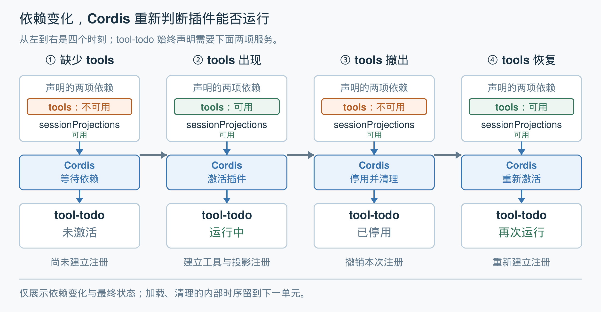
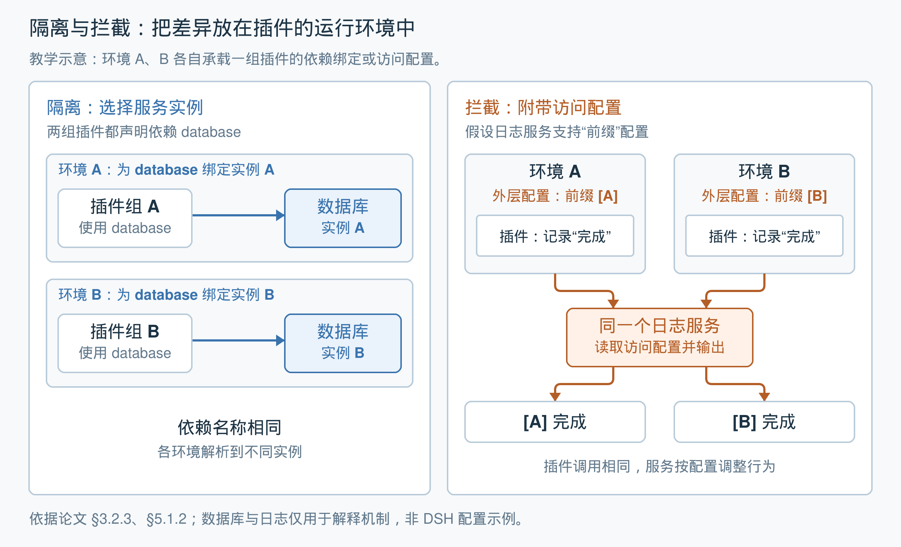

# 第 3 单元｜空间可组合性：依赖变化时，让插件随之调整

[返回目录](README.md) · [上一篇：时间可组合性](02-temporal-composability.md) · [下一篇：用生命周期协调依赖与清理](04-lifecycle-coordination.md)

上一单元解决了插件退出后的清理问题。本单元继续回答：**什么时候应该让插件运行，什么时候应该让它停用？**

插件通常需要其他组件提供能力。运行过程中，这些能力可能尚未出现、暂时撤出，或者换了提供方。系统需要根据这些变化，重新协调插件的运行。

论文把这种围绕组件依赖关系进行动态组合的能力，称为**空间可组合性**。本单元重点理解依赖声明、变化通知与插件启停，再认识隔离和拦截的用途。

## 1. 插件声明需要什么，Cordis 判断何时运行

继续使用 `tool-todo`——DSH 中负责待办事项功能的插件。它需要两个服务：

| 依赖的服务 | 提供什么能力 | 待办插件怎样使用 |
|---|---|---|
| `tools` | 管理工具登记，供系统查找和调用 | 登记 `todo_write` 工具 |
| `sessionProjections` | 根据会话事件计算当前状态 | 登记计算当前待办清单的规则 |

这里，“投影”可以理解为**从一串事件中计算出的当前状态**。例如，会话记录了多次待办更新，投影负责据此得到当前待办清单。本单元只需要知道这项服务的用途。

这两项服务都是待办插件运行的前提，也就是它的 **coeffects：插件需要环境提供的条件。**缺少其中任何一项，插件就无法完整建立自己的功能。

DSH 源码中的[依赖声明](https://github.com/deepseek-ai/deepseek-harness/blob/639ed015397290b3745d163aafe02ffee4aa3f84/packages/todo/tool-todo/src/index.ts#L23)只有一行：

```ts
export const inject = ['tools', 'sessionProjections']
```

`inject` 是 Cordis 识别的依赖声明。它告诉 Cordis：**两项服务都可用时，才能执行这个插件的初始化逻辑。**

Cordis 是管理插件运行与停用的框架。它根据插件所在的运行上下文——承载服务绑定等信息的环境——查找对应的服务提供方，并检查依赖是否满足。**服务提供方就是负责创建并提供该服务的组件。**插件作者通过名称表达需求，无需自己写一套查找、等待和监听提供方的逻辑。

## 2. 服务变化后，插件怎样响应

下面固定 `sessionProjections` 始终可用，只观察 `tools` 的变化。



*图 1：依据论文第 3.2.2 节、第 5.1.2 节和 DSH 源码绘制的辅助示意。四列表示不同时刻，省略加载和清理的内部过渡过程。[SVG 原图](assets/reactive-dependencies.svg)。*

1. **缺少服务：保留插件，等待条件满足。** 系统已接纳 `tool-todo`，但 `tools` 尚不可用。Cordis 暂不执行初始化逻辑，插件留在系统中等待，不必因为这项依赖暂缺就运行失败。
2. **服务出现：激活插件，建立能力。** 两项依赖都可用后，Cordis 执行初始化：向 `tools` 登记 `todo_write`，向 `sessionProjections` 登记待办状态的计算规则。
3. **服务撤出：停用插件，清理本次注册。** `tools` 不再可用，插件的运行条件随之失效。Cordis 让它进入停用过程，执行上一单元介绍的清理动作，撤销本次工具和投影注册。
4. **服务恢复：重新激活，重新建立能力。** 只要待办插件仍保留在系统中，两项依赖再次满足后，Cordis 就可以重新激活它。**重新激活会重新执行初始化逻辑，建立新一轮注册。**

这里的“可用”还与提供方的运行状态有关。提供方开始退出时，Cordis 就会让相关依赖方作出响应；双方清理动作的具体顺序，留到下一单元展开。

## 3. 响应式依赖需要随变化重新检查

如果系统只在启动时检查一次依赖，运行中撤出服务后，原来的检查结果就失效了。

论文的做法是：**服务的提供和撤回通过受管理的操作发生，并通知相关依赖方重新检查。**这种随着环境变化而响应的依赖机制，称为 **reactive coeffects，响应式 coeffects**。

论文第 3.2.2 节先按“依赖是否满足”区分三类变化：

| 满足情况的变化 | 分类 | 对插件的含义 |
|---|---|---|
| 不满足 → 满足 | 激活 | 可以开始运行 |
| 满足 → 不满足 | 停用 | 需要退出并清理 |
| 满足情况未改变 | 中性 | 没有因满足情况变化而产生的启停要求 |

例如，系统增加了一个待办插件完全不使用的服务，其依赖保持原样，就无需重新初始化待办插件。表中只按“是否满足”分类，实际提供方发生更换的情况见下一节。

Cordis 的通知机制会结合依赖声明和服务的作用范围，找到实际受影响的插件：不仅检查插件是否声明了该服务，还检查它是否使用发生变化的那一份绑定。**依赖声明因此既决定运行条件，也帮助限定调整范围。**本地实现可对照 [服务变更通知](https://github.com/deepseek-ai/deepseek-harness/blob/639ed015397290b3745d163aafe02ffee4aa3f84/vendor/cordis/src/reflect.ts#L314)。

提供服务本身也与上一单元相连：**向环境中增加服务绑定是一种 effect，也需要对应的撤回动作。**服务撤回又会触发依赖方响应，两套机制由此连接起来。

## 4. 服务名称相同，也要识别提供方的更换

除了服务“有没有”，还需要关心插件实际使用的是**哪一个提供方**。

例如，`tools` 的旧提供方退出，随后由新提供方接替：

**旧提供方退出 → 待办插件停用并清理 → 新提供方可用 → 待办插件重新初始化。**

即使名称仍然叫 `tools`，插件也需要向新的工具服务重新登记能力。Cordis 的生命周期机制会识别所依赖提供方的变化，重新建立这段运行关系。源码中的[依赖重新检查](https://github.com/deepseek-ai/deepseek-harness/blob/639ed015397290b3745d163aafe02ffee4aa3f84/vendor/cordis/src/fiber.ts#L611)会比较各服务提供方的标识。

这里的更换指服务绑定或提供方的变化；同一个服务对象内部普通数据的变化，并不自动意味着所有依赖方都要重新初始化。

因此，两种可组合性各自承担一部分工作：

- **空间可组合性：**依赖变化后，协调相关插件的运行状态。
- **时间可组合性：**结束旧的一轮运行时，回收它建立的注册。

## 5. 隔离与拦截：让不同插件按各自的环境使用服务

前面的基础模型讨论服务的提供、获取与撤回。论文第 3.2.3 节进一步增加两种能力，解决不同插件需要不同服务实例、不同使用配置的问题。

图中的环境 A、B，分别承载各自插件组的服务绑定或访问配置。数据库与日志用于解释机制，不是实际 DSH 配置示例。



*图 2：依据论文第 3.2.3 节及第 5.1.2 节绘制的辅助示意，非论文原图。[SVG 原图](assets/isolation-and-interception.svg)。*

### 左侧：隔离，决定使用哪一份服务

1. 两组插件都声明需要 `database`。
2. 环境 A 将这个名称绑定到实例 A，环境 B 将它绑定到实例 B。
3. 插件按同一个服务名称访问，却能使用各自的实例。

实例由提供方建立。**隔离（isolation）负责让不同环境中的同名依赖分别指向它们。**

### 右侧：拦截，通过配置影响服务行为

1. 两个环境中的插件都调用日志服务，记录“完成”。
2. 外层分别设置前缀 `[A]`、`[B]`。
3. 日志服务读取访问时携带的配置，输出不同前缀。

这里假设日志服务支持前缀配置。**拦截（interception）将配置带入服务访问；配置怎样影响行为，需要服务本身提供相应的实现。**

### 局部环境决定作用范围

原文说明，隔离与拦截会派生出一个局部上下文，在其中调整绑定或配置，父环境保持原样。这些局部调整随派生上下文的丢弃而消失，无需把父环境改回去。通过这些环境建立的服务和其他资源，仍按各自的生命周期清理。

因此，可以针对某一组插件安排服务使用方式，而不必全局修改所有插件的环境。其设计收益是：**插件表达需要什么，宿主通过运行环境安排具体的组合方式，让同一份插件逻辑能够在不同环境中复用。**

本单元先掌握三个要点即可：隔离选择实例，拦截附带配置，两者都可以作用于局部环境。

## 6. 本单元的结论与下一步

> **插件声明自己需要什么；Cordis 在服务变化时重新检查这些条件，并协调插件的激活、停用和重新激活。**

这一机制让插件开发者集中编写依赖满足时的功能逻辑，也让系统能够在运行中调整组成。

不过，**发现依赖失效并发出通知，还不足以保证整个系统按正确顺序退出。**例如，依赖方可能仍需使用提供方完成清理，提供方就不能提前销毁所需资源。论文第 3.2.2 节明确指出了这一局限，并在第 4 节补充生命周期协调机制。这是下一单元的主线。

## 按需深入：本篇没有展开的原文内容

本篇覆盖本单元的概念主线，未展开下列形式化定义、数据结构与算法。它们不是读完本单元的前置要求；希望理解实现或验证更严格的条件时，可以按对应问题继续阅读。

| 想进一步弄明白的内容 | 原文位置 |
|---|---|
| 依赖表如何关联服务名称与值类型；获取、提供和撤回有哪些前提；如何形式化“所有依赖都满足”及三类通知 | [§3.2.1–3.2.2，定义 22–26，第 18–20 页](assets/dsh-paper.pdf#page=18) |
| “原地修改并保存撤销动作”和“派生局部上下文”两种实现方式怎样区分 | [§3.2.3，定义 27，第 20–21 页](assets/dsh-paper.pdf#page=20) |
| 隔离如何通过“服务名称 → 隔离域标识 → 服务值”的两层映射，让同名服务在不同环境中分别绑定 | [§3.2.3，定义 28–29，第 21 页](assets/dsh-paper.pdf#page=21) |
| 拦截如何合并组件声明与上下文携带的配置，以及配置的优先关系 | [§3.2.3，定义 30–31，第 21–22 页](assets/dsh-paper.pdf#page=21) |
| Cordis 如何组织值存储表、隔离映射表和拦截配置表；如何执行服务读写、撤回与通知筛选 | [§5.1.2，算法 2–3，第 57–58 页](assets/dsh-paper.pdf#page=57) |
| 为什么提供方更换会触发重新运行；依赖方与提供方怎样安排退出顺序 | [§4.3.1，第 34 页起](assets/dsh-paper.pdf#page=34)；[§5.1.3，算法 5，第 59–60 页](assets/dsh-paper.pdf#page=59)。下一单元会继续讲解思路。 |

*原文依据：[论文](assets/dsh-paper.pdf)第 3.2 节（第 17–22 页）、第 5.1.2 节（第 57–58 页）；提供方更换补充参照第 5.1.3 节。DSH 源码用于辅助说明。页码为论文印刷页码，与本地 PDF 页序一致。*

[返回目录](README.md) · [上一篇：时间可组合性](02-temporal-composability.md) · [下一篇：用生命周期协调依赖与清理](04-lifecycle-coordination.md)
