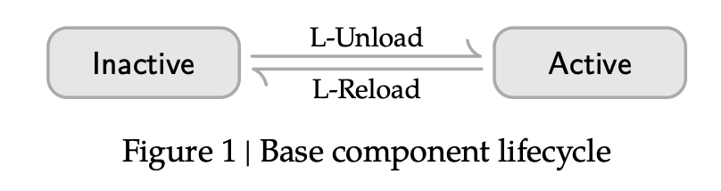
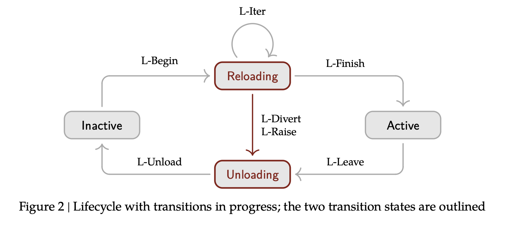
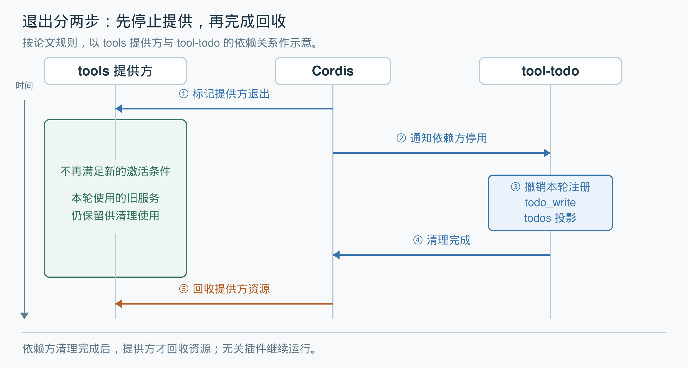

# 第 4 单元｜用生命周期协调依赖与清理

[返回目录](README.md) · [上一篇：空间可组合性](03-spatial-composability.md) · [下一篇：让运行中的 DSH 随需求调整组成](05-composing-dsh.md)

前两单元分别介绍了两件事：用 effect 记录清理动作，用 coeffect 表达运行所需的依赖。本单元把它们连起来：**依赖变化后，怎样安排插件退出，让清理既能完成，也不会破坏其他插件？**

难点在于，加载和清理都需要时间，清理过程还可能继续使用原来的依赖。例如，归还连接需要连接池仍然存在。提供方如果提前销毁资源，依赖方即使保存了正确的清理函数，也可能无法执行。

论文因此引入生命周期协调：记录每个插件实例正在做什么，并安排依赖方与提供方的启停顺序。

## 1. Context 承载操作，Fiber 保存运行记录

先区分四个角色：

| 角色 | 在这里负责什么 |
|---|---|
| 插件代码 | 声明依赖，编写初始化时建立功能的逻辑 |
| Context（`ctx`，上下文） | 插件访问服务、调用受管理操作的入口，让依赖与操作有明确归属 |
| Fiber | Cordis 为**一个已安装的插件实例**建立的管理对象，保存生命周期状态、本轮依赖绑定和清理记录 |
| Cordis | 检查依赖、调用初始化逻辑，并推动 Fiber 完成加载和清理 |

这里的 Fiber 可以理解为“一份插件实例的运行档案”。**同一个 Fiber 可以经历多轮激活和停用**；依赖暂缺通常只是结束当前一轮运行，插件实例仍可保留，等待再次激活。

按过程看，四者这样配合：

1. **Cordis 检查 Fiber 的依赖。** 条件满足后，准备启动一轮运行。
2. **Cordis 把该实例的 `ctx` 传给插件初始化逻辑。** 插件通过它访问服务、建立功能。
3. **受管理的操作留下清理记录。** 例如，登记工具的方法内部使用 `ctx.effect`，将撤销动作归入当前实例。
4. **本轮运行结束时，Cordis 执行这些清理动作。** 插件开发者使用已封装好的注册方法时，无需再为同一项注册手写另一套卸载逻辑；自行管理新资源时，仍需提供正确的清理。

一个插件还可以安装子插件。子插件的创建也作为父插件的一项 effect 被管理，父插件退出会触发子插件退出。**父子关系表达创建和管理归属，服务依赖关系表达谁需要谁的能力**；两种关系不能直接等同。

## 2. 两个过渡状态容纳加载与清理

论文先用两个状态描述最简模型：



*论文原图 1，第 29 页；使用读者提供的原图截图。图中两个箭头的规则标签与第 31 页正文相反：正文规定 `L-Reload` 为 Inactive → Active，`L-Unload` 为 Active → Inactive。本篇按正文解释，原图保持不变。*

在这个模型中，**Inactive 表示尚未运行，Active 表示已经运行**。加载和清理都被当作立即完成的一步，因此图上没有位置表达“已经开始退出，但还在清理”。

真实运行需要容纳这些过程，论文图 2 因而增加了两个状态：



*论文原图 2，第 34 页；使用读者提供的原图截图。Reloading 表示加载中，也包括第一次加载；Unloading 表示退出过程中，可能正在等待依赖方或执行自身清理。*

沿三条路径读图即可：

1. **上方是正常加载。** Inactive → Reloading → Active。Reloading 上方的环表示初始化可以分多步执行，每步留下对应的撤销动作。
2. **下方是正常退出。** Active → Unloading → Inactive。先确定退出，再等待并完成清理，最后才结束本轮运行。
3. **中间是加载未完成就转向清理。** 初始化期间依赖改变，走 `L-Divert`；初始化失败，走 `L-Raise`。两者都进入 Unloading，回收此前已经建立且受到跟踪的影响。

两个过渡状态把“决定要做什么”和“实际已经做完什么”区分开，给其他插件响应、异步操作完成和清理动作执行留下时间。

## 3. 提供方退出时，先让依赖方完成清理

继续使用待办插件的例子：**`tools` 是管理工具登记的服务；`tool-todo` 是依赖它的待办插件，通过它登记可调用的 `todo_write` 工具。** `tool-todo` 还依赖 `sessionProjections`，通过它登记名为 `todos` 的待办状态投影，即根据会话事件计算当前待办清单的规则。下面假设后一项服务始终可用，只观察 `tools` 提供方退出。



*依据论文第 4.3.1 节及第 5.1.3 节绘制的辅助示意，以 DSH 的服务和插件名称说明论文要求的顺序。[SVG 原图](assets/ordered-provider-withdrawal.svg)。*

按图中编号看：

1. **标记提供方退出。** Cordis 让 `tools` 提供方进入 Unloading。它已不能满足新的激活条件，但此时尚未回收自身资源。
2. **通知依赖方停用。** `tool-todo` 重新检查依赖，发现运行条件不再满足，进入自己的退出过程。
3. **撤销本轮注册。** Cordis 执行待办插件留下的清理动作，撤销 `todo_write` 工具和 `todos` 投影的注册；期间保留它本轮使用的服务绑定。
4. **等待依赖方清理完成。** 待办插件结束这一轮运行，不再需要旧提供方支持清理。
5. **回收提供方自身资源。** 此时 `tools` 提供方才执行自己的清理。与这段依赖关系无关的插件可以继续运行。

关键是：**不再接受新的依赖，与实际销毁旧资源，是两个不同的时刻。**前者让依赖方开始退出，后者要等它们完成清理。

这里撤销的是工具和投影的注册。已经写入的会话事件、过去的工具调用结果，不会因此自动回滚。

## 4. 清理期间仍使用本轮原来的依赖

为了支持上面的顺序，运行记录中需要区分两份信息：

| 信息 | 用途 |
|---|---|
| 当前目标依赖 | 根据最新环境判断：现在应不应该运行，应使用哪些提供方 |
| 本轮已确定的依赖绑定（committed view） | 记录这一轮实际使用的提供方，保留到本轮清理结束 |

例如，环境中 `tools` 已被标记为不可用，待办插件就应该退出；但它的清理逻辑仍可能需要原来的工具服务。**最新目标决定下一步，本轮绑定支持当前这一步完成。**

本地 Cordis 源码中可以看到这份记录的建立和释放。以下两行分别摘自加载与卸载函数，不是连续代码：

```ts
// 开始加载时：保存本轮实际使用的服务实现
this.store = { ...this._store }

// 本轮清理完成后：释放这份记录
this.store = undefined
```

其中 `_store` 保存最新解析出的服务实现，`store` 保留本轮使用的绑定。对照[开始加载的位置](https://github.com/deepseek-ai/deepseek-harness/blob/639ed015397290b3745d163aafe02ffee4aa3f84/vendor/cordis/src/fiber.ts#L647)与[清理完成的位置](https://github.com/deepseek-ai/deepseek-harness/blob/639ed015397290b3745d163aafe02ffee4aa3f84/vendor/cordis/src/fiber.ts#L687)。

这段源码帮助理解“保留本轮依赖”。上一节完整的退出顺序依据论文规则：**不能仅凭保存绑定的代码，就认定资源回收的所有顺序要求都已实现。**

## 5. 中途变化与失败也经过清理

四状态模型还统一处理了几类容易遗漏的情况：

| 情况 | 生命周期怎样处理 |
|---|---|
| 初始化执行了一部分，依赖发生变化 | 在受管理的执行步骤边界停止继续初始化，进入清理，回收已跟踪的部分 |
| 依赖变化时，某一步异步操作已经开始 | 等这一步完成并收集其撤销动作，再转向清理；不会先短暂进入 Active |
| 初始化失败 | 清理此前已经跟踪的影响，将失败记录在该 Fiber 上；不会对同一失败状态无休止地自动重试 |
| 清理期间依赖又恢复 | 先完成旧一轮清理，再根据最新目标决定是否重新加载 |

这里的“步骤边界”由 effect 的执行方式提供，不意味着框架可以随意中断插件代码中的任何一行。错误记录属于当前 Fiber，不会仅因一个插件加载失败就自动让所有兄弟插件退出。

这些处理仍以正确的撤销动作和完整的资源跟踪为前提。操作如果先产生了影响、随后抛错，却从未留下清理记录，框架无法凭空补出恢复方法。

## 6. 独立性与依赖顺序支撑整体组合

多个插件交错运行时，两种机制各负责一部分：

- **可独立恢复的影响，由 effect 跟踪和回收。** 清理某个插件时，要保留其他插件仍然有效的改变。
- **有先后要求的服务关系，由 coeffect 声明和生命周期协调。** 提供方先可用，依赖方才运行；依赖方先清理，提供方再回收资源。

论文讨论的恢复以**可观察行为等价**为标准：相关接口看到的行为得到恢复，不要求内存布局或对象地址完全回到原样，也不意味着撤销已经发生的对外输出。

第 4.4 节进一步在各自的假设下证明恢复、依赖使用的一致性、进展与合流。直观上，合流说明：满足条件时，系统经过动态调整后，可以达到与最终组合直接建立时等价的状态。这些结论有前提，包括正确的撤销动作、相应的独立性；进展还需要无环的先后关系、有限的操作等条件，合流还要求没有失败且组件完整提供其声明的能力。

本单元记住这一条主线即可：

> **Context 让依赖和影响有明确归属，Fiber 保存插件实例的运行记录，生命周期把依赖变化与清理动作安排成有顺序的过程。**

## 按需深入：本篇没有展开的原文内容

| 想进一步弄明白的内容 | 原文位置 |
|---|---|
| Context 如何递归形成层级，插件为何能继续安装插件 | [§3.3.1，第 22–23 页](assets/dsh-paper.pdf#page=22) |
| 可观察行为等价、独立性及组合恢复的形式化条件 | [§3.3.2，第 23–27 页](assets/dsh-paper.pdf#page=23) |
| Fiber 的完整字段，目标与本轮绑定，以及插入、退役、移除的区别 | [§4.1–4.2，第 28–33 页](assets/dsh-paper.pdf#page=28) |
| 迭代、异步与失败的状态转移规则 | [§4.3，第 33–38 页](assets/dsh-paper.pdf#page=33) |
| 恢复、依赖顺序、进展与合流的证明及完整假设 | [§4.4，第 38–53 页](assets/dsh-paper.pdf#page=38) |
| Cordis 如何创建 Fiber、更新目标并串联加载和清理 | [§5.1.3，算法 4–5，第 58–60 页](assets/dsh-paper.pdf#page=58) |

*原文依据：[论文](assets/dsh-paper.pdf)第 3.3–4 节、第 5.1.3 节。DSH 源码用于辅助理解，并非论文对 DSH 的验证结论。页码为论文印刷页码，与本地 PDF 页序一致。*

[返回目录](README.md) · [上一篇：空间可组合性](03-spatial-composability.md) · [下一篇：让运行中的 DSH 随需求调整组成](05-composing-dsh.md)
