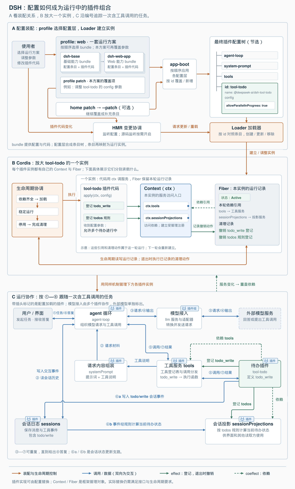

# 第 5 单元｜让运行中的 DSH 随需求调整组成

[返回目录](README.md) · [上一篇：用生命周期协调依赖与清理](04-lifecycle-coordination.md)

一个 DSH 应用启动后，模型接入、工具、会话记录和 agent 循环已经协作起来。但需求仍会变化：增加待办能力、修改工具参数，或替换有问题的插件代码。

前几个单元解决了插件如何加载、响应依赖变化和完成清理。本单元把这些机制放回完整应用：

> **用配置表达需要什么，由框架协调组成变化，让调整后的能力参与任务执行。**

下面以“启用、使用、停用待办能力”为主线。假设待办插件代码已经安装，所需服务可用，而且当前应用允许在运行中更新配置。



*图：依据论文第 5.2 节及 DSH 架构文档、配置和源码绘制的辅助示意。A 展示配置装配，B 放大一个待办插件实例，C 按编号展示运行过程。图按职责分层，绿色依赖线只突出待办案例，没有穷举所有插件依赖。[可放大的 HTML 图](assets/dsh-composition-architecture.html) · [SVG 原图](assets/dsh-composition-architecture.svg)。*

## A．配置描述期望，Loader 建立实例

先看图上层：使用者希望启用负责待办事项的 `tool-todo` 插件，这个要求怎样进入系统？

这里先认识 **bundle（组合分发包）**。实际应用通常同时需要模型接入、工具、会话等许多插件。如果每套运行方案都逐项配置，就会重复维护相似的清单和默认参数。DSH 因此用 bundle **成套提供一组插件的配置条目及所需代码，让常用组合可以复用和分发**。例如，多个运行方案共用 `dsh-base` 的基础能力，再分别补上界面或运行入口；其中的单项配置仍可被后续配置层覆盖。

沿图中的路径看：

1. **profile 选择运行方案。**  
   profile 是一套命名的组合安排，记录使用哪些 bundle 以及本方案的配置。例如，`web` 方案先选择基础能力 bundle，再叠加 Web 能力 bundle。

2. **patch 调整具体条目。**  
   patch 是补充或覆盖配置的文件，用来启停插件、修改参数等。`app-boot` 按顺序应用 bundle、profile、home 和命令行覆盖层，形成最终插件配置树；条目通过 `id` 匹配。覆盖某条目的 `config` 时，DSH 替换的是整份参数配置。

3. **条目描述一个插件实例。**  
   `id` 标识条目，`name` 选择实现模块，`config` 提供参数。图中 `tool-todo` 的参数决定是否允许多个待办事项同时进行。

4. **Loader 将条目落实为实例。**  
   Loader 即组件加载器。首次启动时建立组合；配置变化时，对照已有条目，创建、更新或移除相应实例。参数更新不一定要求重建实例，具体处理取决于插件的更新逻辑。

DSH [基础配置中的待办条目](https://github.com/deepseek-ai/deepseek-harness/blob/639ed015397290b3745d163aafe02ffee4aa3f84/packages/bundle/base/cordis.patch.yml#L430)只有几行：

```yaml
- id: tool-todo
  name: '@deepseek-ai/dsh-tool-todo'
  config:
    allowParallelInProgress: true
```

**bundle 是配置与代码的分发包，插件树组织的是最终条目。**bundle 不一定成为树中的父节点；配置层的覆盖顺序也不等于插件的激活顺序，后者还取决于服务依赖是否满足。

运行中，启用的 **HMR（热模块替换）**可以监听配置或源码变化，协调后续更新。DSH 基础配置默认只监听配置变化，源码监听需要开启；headless、SDK、ACP 默认关闭 HMR。具体行为由当前运行配置决定。

*对应资料：[DSH 的 profile 与 bundle](https://github.com/deepseek-ai/deepseek-harness/blob/639ed015397290b3745d163aafe02ffee4aa3f84/docs/architecture.md#L15)、[基础 bundle 的职责](https://github.com/deepseek-ai/deepseek-harness/blob/639ed015397290b3745d163aafe02ffee4aa3f84/packages/bundle/base/README.md#L76)、[HMR 配置](https://github.com/deepseek-ai/deepseek-harness/blob/639ed015397290b3745d163aafe02ffee4aa3f84/packages/boot/hmr/README.md#L25)。*

## B．Context 提供入口，Fiber 保存本轮记录

图中层放大了一个 `tool-todo` 实例。启用要求进入 Cordis 后：

1. **生命周期机制检查依赖，调用初始化代码。**  
   `tools` 和 `sessionProjections` 都可用后，Cordis 将该实例的 `ctx` 和配置参数传给 `apply(ctx, config)`。

2. **插件通过 Context 使用服务。**  
   经 `ctx.tools` 登记可调用的 `todo_write`，经 `ctx.sessionProjections` 登记 `todos` 投影规则，即从会话事件计算当前待办状态的规则。

3. **Fiber 保存这一轮的运行记录。**  
   包括状态、实际使用的依赖引用，以及登记方法提供的撤销动作。

4. **退出时，生命周期机制使用这些记录完成清理。**

因此，可以把两者的区别记成：

- **Context：插件通过什么入口使用环境、建立能力。**
- **Fiber：框架依据什么记录管理这个实例的运行与退出。**

服务实现可以供多个插件使用；各实例通过自己的 Context 访问，并保留各自的运行记录。图中的服务依赖体现 **coeffect**，登记及其撤销体现 **effect**。

*源码对应：[待办插件的初始化与注册](https://github.com/deepseek-ai/deepseek-harness/blob/639ed015397290b3745d163aafe02ffee4aa3f84/packages/todo/tool-todo/src/index.ts#L117)、[Fiber 的运行记录](https://github.com/deepseek-ai/deepseek-harness/blob/639ed015397290b3745d163aafe02ffee4aa3f84/vendor/cordis/src/fiber.ts#L184)。*

## C．插件协作完成一次带工具调用的任务

待办能力启用后，沿图下层的编号阅读：

| 步骤 | 发生的事情 |
|---|---|
| **① 接收任务** | 用户要求 agent 整理待办清单。 |
| **② 准备请求** | agent 循环读取会话历史，取得 `systemPrompt` 组装的提示词和工具说明。 |
| **③ 请求模型** | 模型接入插件将请求发送给外部模型。 |
| **④ 接收模型输出** | 本例中，模型提出调用 `todo_write`；也可能直接给出答复。 |
| **⑤ 执行工具** | agent 循环交给 `tools` 分发，调用登记在其中、定义于 `tool-todo` 的执行函数。 |
| **⑥ 更新会话数据** | 工具追加 `todo/write` 事件；这些事件也供 `todos` 投影规则计算当前待办状态。 |
| **⑦ 返回工具结果** | 结果回到 agent 循环，供后续模型请求使用；需要时继续调用工具。 |
| **⑧ 给出答复** | agent 将最终答复交给用户。 |

图中的 **⑥a、⑥b 是状态更新支路**：记录事件，再据此计算当前状态。

这个过程中，装配配置可以保持不变。**调用 `todo_write` 改变会话数据；启停 `tool-todo` 才改变系统组成。**

### agent 循环本身也由插件提供

图中带插头标记的部件都通过插件提供，包括：

- `agent-loop`：组织模型请求与工具调用。
- `system-prompt`：组装提示词和工具说明。
- 工具、会话、投影及模型接入相关插件。

因此，DSH 的组合范围覆盖这些基础能力。它们的实现可以通过配置替换，同时需要满足相应的服务接口与生命周期要求。**Context 和 Fiber 是 Cordis 的管理对象；图中的外部模型则是被调用的服务。**

*对应资料：[DSH 的全插件架构](https://github.com/deepseek-ai/deepseek-harness/blob/639ed015397290b3745d163aafe02ffee4aa3f84/docs/architecture.md#L9)、[任务执行流程](https://github.com/deepseek-ai/deepseek-harness/blob/639ed015397290b3745d163aafe02ffee4aa3f84/docs/architecture.md#L84)、[待办工具写入会话事件](https://github.com/deepseek-ai/deepseek-harness/blob/639ed015397290b3745d163aafe02ffee4aa3f84/packages/todo/tool-todo/src/index.ts#L192)。*

## D．停用能力时，同一套机制负责退出

使用者后来决定停用待办功能，控制流程再次从图上层进入：

**禁用条目 → Loader 调整实例 → Cordis 执行清理 → 撤销工具与投影注册。**

对应到图中，就是撤销 `tool-todo` 沿两条绿色实线建立的登记。`tools` 和 `sessionProjections` 仍可为其他插件服务；已经保存的会话事件继续保留。这描述的是能力登记的退出，正在执行的调用还需遵循具体工具的退出约定。

如果退出的是某个服务提供方，Cordis 还需要沿依赖关系协调相关插件，复用[上一单元](04-lifecycle-coordination.md)介绍的有序退出机制。

修改插件代码也可以接入这套机制：配置可能保持原样，由 HMR 确定受影响范围，清理旧实例，再用新代码建立实例。论文还描述了新模块导入失败时恢复模块缓存、用旧模块重建实例的流程。能否在线完成具体更新，仍取决于运行配置和资源的退出约定；DSH 当前安装包版本的替换需要重启。

## 本单元的结论与边界

整张图表达的是一条连续的路径：

> **配置确定组合，Loader 调整实例，Context 与 Fiber 确定依赖和影响的归属，生命周期协调变化，业务插件完成实际任务。**

这使局部能力的调整有了明确的表达方式和执行过程，未受影响的部分可以继续运行。

这些机制仍依赖正确的清理、兼容的接口和合理的依赖关系；循环依赖需要重新组织，不可信代码需要额外隔离，已经发生的外部输出也不会自动撤销。

论文以 **Koishi** 提供实际应用证据，将自演化 agent harness 列为后续验证方向；DSH 源码用于辅助观察这些思想如何落地。Koishi 案例属于实际应用观察，而非性能或开发效率的定量对照实验；它使用 Cordis v3，论文描述的是进一步发展的 v4。

## 按需深入：本篇没有展开的原文内容

本篇保留应用主线。希望理解内部算法或更严格的适用条件时，可继续查阅：

| 内容 | 原文位置 |
|---|---|
| 配置树的增量更新、条目字段处理及隔离域迁移 | [§5.2.1，第 62–64 页，算法 7](assets/dsh-paper.pdf#page=62) |
| 热重载的模块分类、影响范围与失败恢复 | [§5.2.2，第 64–66 页，算法 8–10](assets/dsh-paper.pdf#page=64) |
| Koishi 案例及其证据范围 | [§5.3，第 66–67 页](assets/dsh-paper.pdf#page=66) |
| 可恢复的资源获取与对外输出；服务中介、多提供方与滚动更新 | [§6.1–6.2，第 67–69 页](assets/dsh-paper.pdf#page=67) |
| 沙箱、循环依赖、接口版本与语言及操作系统支持 | [§6.3–6.7，第 69–74 页](assets/dsh-paper.pdf#page=69) |
| 全文结论与自演化 agent harness 的后续验证方向 | [§8，第 79 页](assets/dsh-paper.pdf#page=79) |

*原文依据：[论文](assets/dsh-paper.pdf)第 5–6、8 节。profile、bundle、patch 及具体 agent 数据流来自 DSH 文档与源码，用于说明应用层如何采用这些思想。页码为论文印刷页码，与本地 PDF 页序一致。*

[返回目录](README.md) · [上一篇：用生命周期协调依赖与清理](04-lifecycle-coordination.md)
