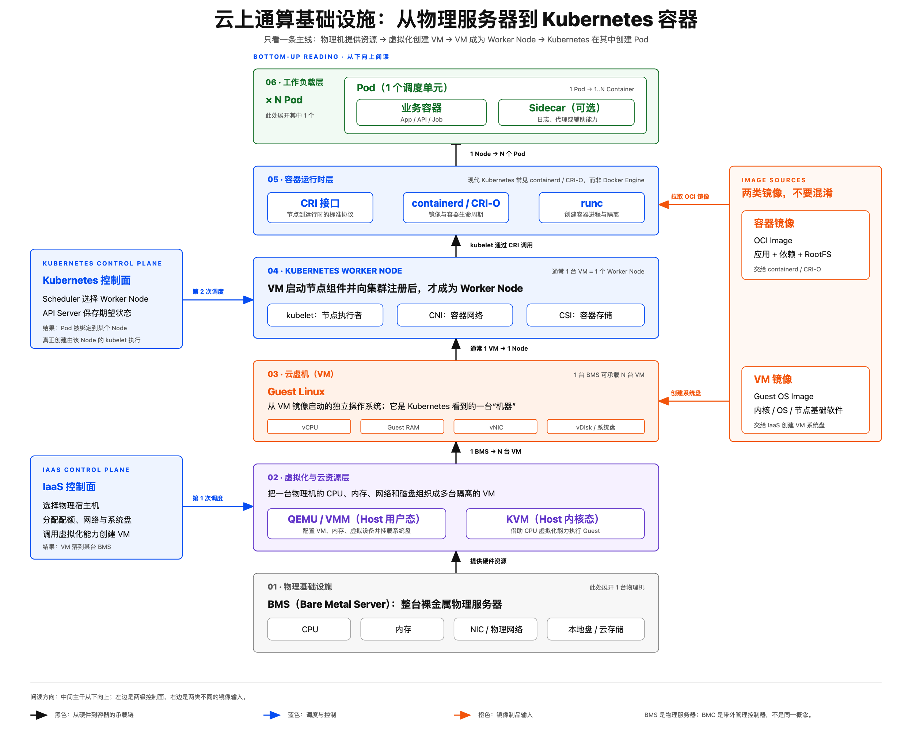

# 云上 VM 如何承载 Kubernetes 容器

[返回目录](./README.md) · [术语速查](./glossary.md)

> 本页问题：一台物理机如何支撑云 VM、Worker Node、Pod 和容器？

这张图只展开一条常见的云上路径：物理服务器先被虚拟化并创建 VM，VM 运行 Guest Linux 和节点组件后注册为 Kubernetes Worker Node，最后由节点上的容器运行时创建 Pod 内的容器。

## 1. 物理基础设施

这一层提供真实的计算、内存、网络和存储资源，是上层所有虚拟资源的物理基础。

- **BMS（Bare Metal Server）**：整台裸金属物理服务器。
- **CPU、内存、NIC 和磁盘**：被虚拟化层分配给不同 VM 的真实硬件资源。
- **BMC**：负责远程开关机、硬件状态监控等带外管理，不在容器运行的主数据路径上。

## 2. 虚拟化与云资源层

这一层将一台 BMS 的资源组织成多台相互隔离的 VM，并管理 VM 的创建、启动和销毁。

- **IaaS 控制面**：选择物理宿主机，分配配额，并准备 VM 需要的网络和系统盘。
- **QEMU/VMM**：运行在 Host 用户态，负责配置 vCPU、Guest RAM、虚拟设备和系统盘。
- **KVM**：位于 Host Linux Kernel，借助 CPU 虚拟化能力真正执行 Guest 指令。

## 3. 云虚机层

这一层提供一套独立的操作系统环境，并作为 Kubernetes Worker Node 的载体。

- **VM 镜像**：包含 Guest OS 和基础软件，IaaS 根据它生成 VM 系统盘。
- **Guest Linux**：虚机内部的操作系统，管理 VM 内的进程、内存、网络和文件系统。
- **vCPU、Guest RAM、vNIC 和 vDisk**：虚拟化层暴露给 Guest 的虚拟 CPU、内存、网卡和磁盘。

## 4. Kubernetes Worker Node

VM 启动 kubelet 等节点组件并向集群注册后，才成为可被 Kubernetes 调度的 Worker Node。常见形态是 `1 台 VM = 1 个 Worker Node`。

- **Kubernetes Scheduler**：在控制面中为 Pod 选择合适的 Worker Node，但不亲自创建容器。
- **kubelet**：运行在每个 Worker Node 上，负责将 Pod 的期望状态变成实际状态。
- **CNI**：为 Pod 准备 IP、虚拟网卡和网络连接。
- **CSI**：为 Pod 挂载和管理持久化存储。

## 5. 容器运行时层

这一层负责拉取容器镜像、管理容器生命周期，并最终创建隔离的容器进程。

- **CRI**：kubelet 调用容器运行时的标准接口。
- **containerd/CRI-O**：拉取容器镜像，并管理容器的创建、启停和删除。现代 Kubernetes 通常使用它们，而不是直接使用 Docker Engine。
- **runc**：设置 namespace、cgroup 等底层隔离与限制，然后创建容器进程。
- **容器镜像仓库**：保存 OCI 镜像，其中包含应用、依赖和容器 RootFS。

## 6. 工作负载层

这一层运行用户的业务程序和辅助组件。一个 Worker Node 可以运行多个 Pod，一个 Pod 又可以包含一个或多个容器。

- **Pod**：Kubernetes 的最小调度单元，也是容器的外层边界。
- **业务容器**：运行真正的应用、API 或批处理任务。
- **Sidecar**：可选的辅助容器，通常负责代理、日志或其他辅助能力。它与业务容器都包含在 Pod 内。
- **Pod 共享环境**：同一 Pod 内的容器共享网络命名空间，并可以共享数据卷。

## 三组必须区分的关系

- **两次调度**：IaaS 把 VM 放到某台 BMS；Kubernetes Scheduler 把 Pod 放到某个 Worker Node。两者面向的资源和调度对象不同。
- **两类镜像**：VM 镜像提供 Guest OS 和节点基础软件；容器镜像提供应用、依赖和容器 RootFS。
- **数量关系**：`1 BMS → N VM`，通常 `1 VM → 1 Worker Node`，`1 Worker Node → N Pod`，`1 Pod → 1..N Container`。`N` 不是固定值，最终受 CPU、内存、网络、存储和管理策略限制。

> 图中主干表达的是**依赖与承载关系**，不是每创建一个 Pod 都从 BMS 重新开始。通常先由 IaaS 准备 VM 并组成 Worker Node 池，然后 Kubernetes 再将 Pod 调度到已存在的 Node。

---

相关内容：[Agent 沙箱技术全景](./02-sandbox-landscape.md) · [Host、Guest、VMM 与 KVM 的位置](./03-host-guest-vmm.md)

