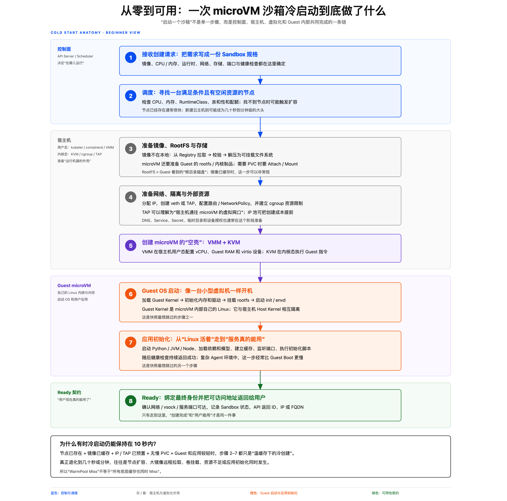

# 从零启动一个可用沙箱

[返回目录](./README.md) · [术语速查](./glossary.md)

> 本页问题：一次完整冷启动必须完成哪些工作？

一次 microVM 沙箱冷启动可以概括为八步：

1. **接收请求**：确定镜像、CPU、内存、Runtime、网络、存储和健康检查。
2. **调度节点**：选择满足资源和运行时要求的计算节点；在 Kubernetes 路线中，可通过 RuntimeClass 选择运行时。
3. **准备 RootFS**：拉取或命中镜像缓存，准备根文件系统和存储卷。
4. **准备外部资源**：分配 IP，创建 veth/TAP，配置路由、策略和 cgroup。
5. **创建 VM 空壳**：VMM 建立 vCPU、Guest RAM 映射和 virtio 设备。
6. **启动 Guest OS**：加载 Guest Kernel，挂载 RootFS，启动 `init/envd`。
7. **初始化应用**：加载运行时、依赖、模型和缓存，监听服务端口。
8. **进入 Ready**：所需网络或 Host–Guest 通信及健康检查通过，API 返回可用地址。

这些步骤描述的是工作内容，实际实现可能并行执行。节点和镜像是否已有缓存，会明显影响耗时。

---

相关内容：[预热池如何加速启动](./06-warm-pool.md) · [预热池未命中，为什么仍可能在 10 秒内启动](./07-warm-pool-miss.md)

