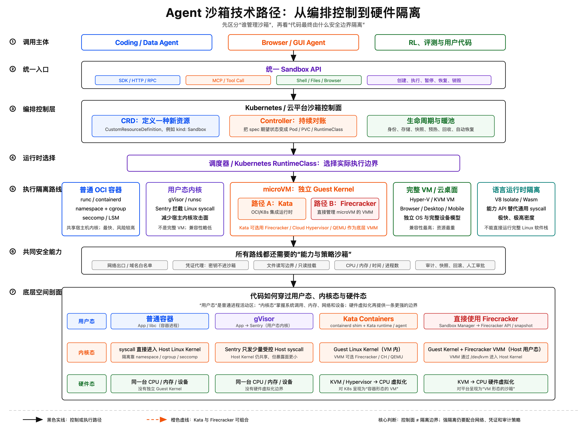
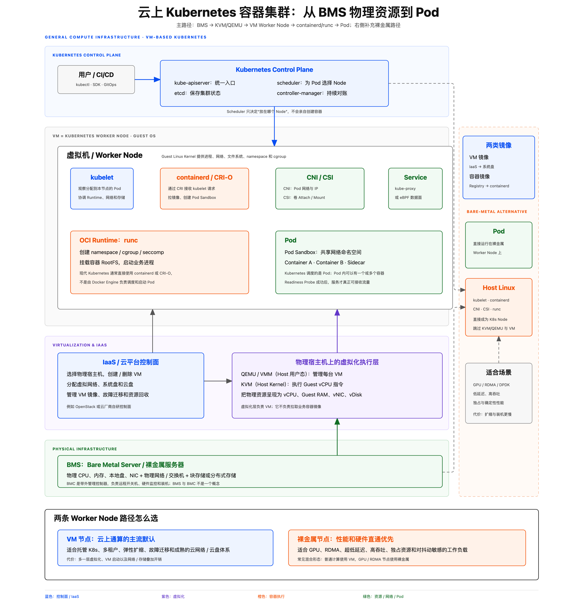
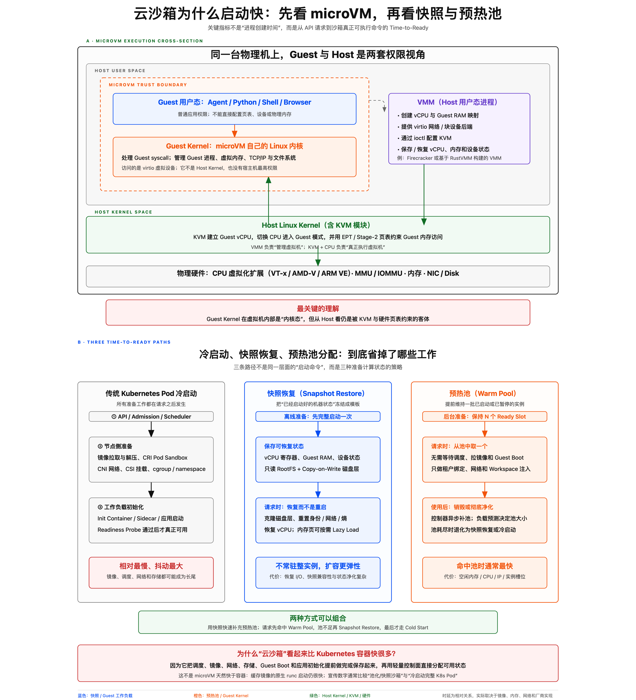
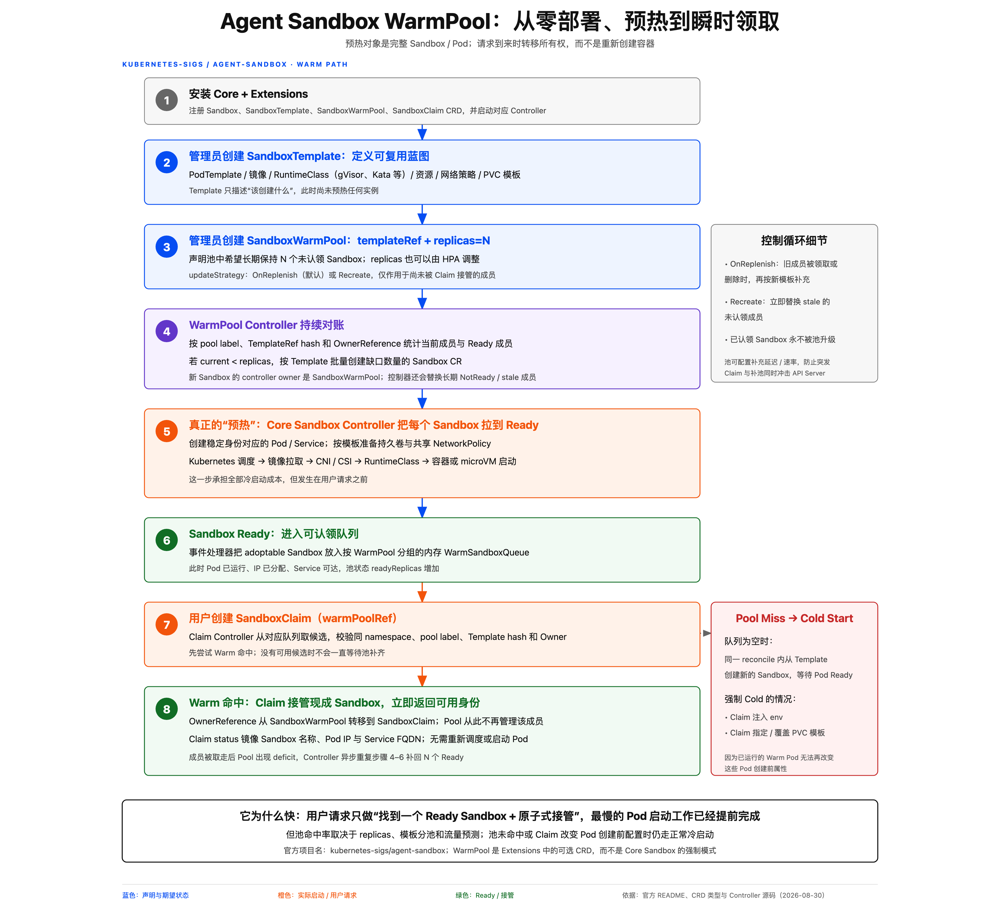
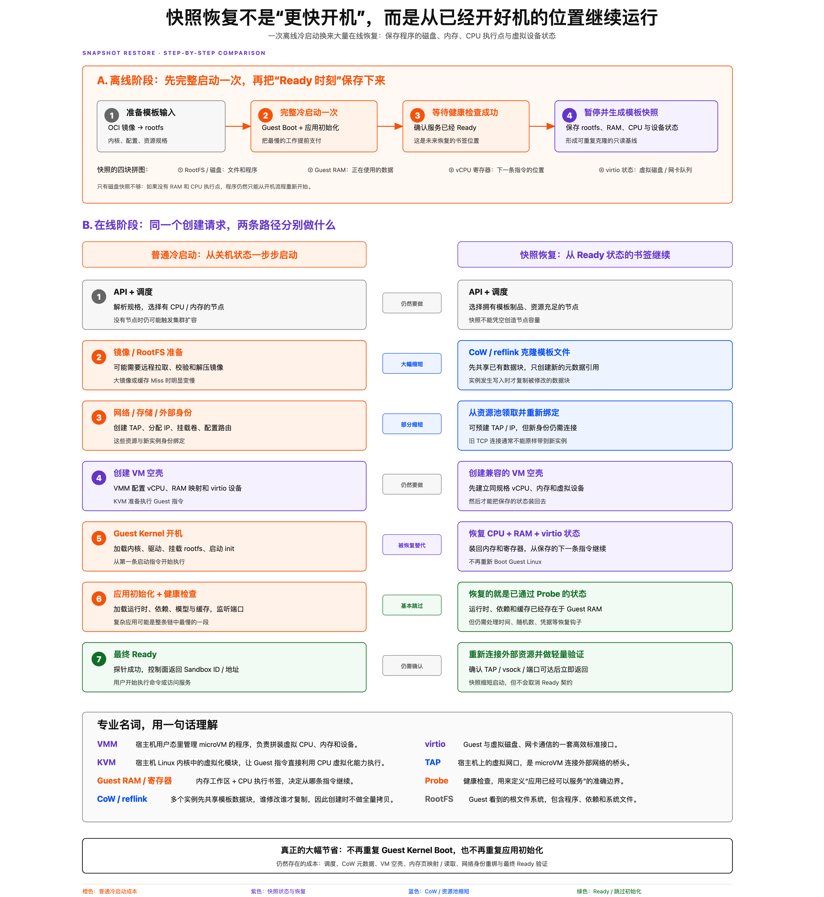
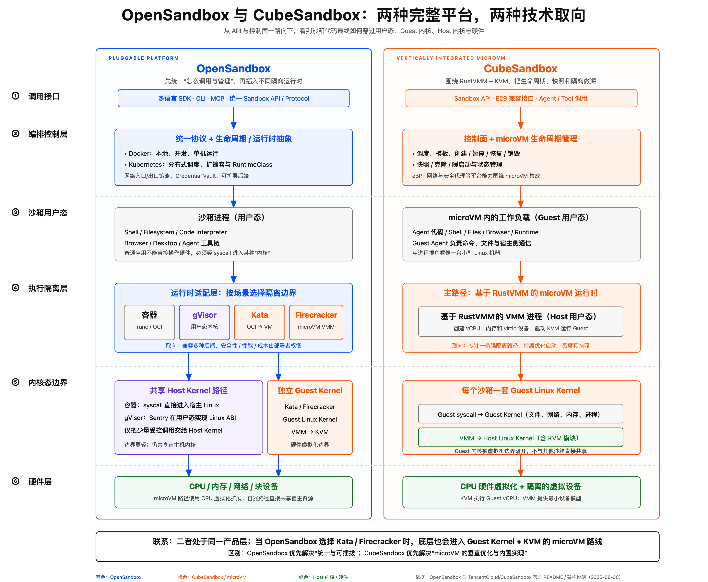

# Agent 沙箱底层原理与启动加速机制

> 学习目标：先理解沙箱技术的分层和一次完整冷启动，再理解预热池与快照恢复分别消除了哪些工作。

## 阅读路径

```text
沙箱技术分层
    ↓
microVM 底层结构
    ↓
一次完整冷启动
    ↓
预热池加速
    ↓
快照恢复加速
    ↓
两种机制的比较与组合
```

本文先讲通用机制。OpenSandbox 和 CubeSandbox 只作为工程案例：前者偏统一接口和运行时抽象，后者偏 microVM 与快照优化，详细内容放在附录。

---

## 1. Agent 沙箱技术全景



阅读这张图时，先把系统分成两个问题：

1. **谁管理沙箱**：统一 API、调度、生命周期、身份、存储和回收，属于编排控制层。
2. **谁隔离代码**：普通容器、gVisor、Kata、Firecracker 或完整 VM，属于执行隔离层。

因此，`Sandbox` 是上层资源抽象，并不天然等于某一种底层 Runtime。同一个控制面可以根据场景选择不同隔离边界。

> 核心认识：**管理沙箱**和**隔离沙箱**是两个不同层面。

### 1.1 云上 Kubernetes 容器集群的基础设施分层



云上常见主路径是：物理基础设施提供 CPU、内存、网络和存储；IaaS 与 KVM/QEMU 创建虚拟机；虚拟机中的 Guest Linux 作为 Kubernetes Worker Node；Control Plane 为 Pod 选择 Node，目标节点上的 kubelet 再通过 CRI 调用 containerd 或 CRI-O，配合 CNI、CSI 和 runc 创建 Pod。

图中需要注意三个边界：

- **VM 镜像与容器镜像不同**：前者由 IaaS 用来创建 VM 系统盘，后者由节点上的容器运行时从 Registry 拉取。
- **Scheduler 与 kubelet 分工不同**：Scheduler 只选择 Node，kubelet 才负责在目标节点协调 Pod 的实际创建。
- **虚拟化不是必经层**：Kubernetes Worker Node 也可以直接部署在 BMS 上，跳过 KVM/QEMU 和 VM。

| Worker Node 路径 | 适合场景 | 主要取舍 |
|---|---|---|
| VM 节点 | 托管 K8s、多租户、弹性扩缩、故障迁移 | 管理灵活，但多一层虚拟化与 VM 启动开销 |
| 裸金属节点 | GPU、RDMA、DPDK、低延迟、高吞吐、确定性性能 | 性能和硬件直通更好，但装机、扩缩和运维更重 |

生产环境常采用混合形态：普通计算节点使用 VM，GPU、RDMA 或对抖动敏感的节点使用裸金属。

> 核心认识：BMS 是 Bare Metal Server；BMC 才是负责远程开关机和硬件监控的带外管理控制器。

---

## 2. microVM 的底层结构



图的上半部分展示了 microVM 的空间关系：

- **Guest 用户态**：Agent、Python、Shell、Browser 等工作负载。
- **Guest Kernel**：microVM 内部自己的 Linux 内核，管理 Guest 的进程、内存、网络和文件系统。
- **VMM**：宿主机用户态中的虚拟机管理程序，负责创建 vCPU、映射内存并提供虚拟设备。
- **KVM**：Host Linux Kernel 中的虚拟化模块，借助 CPU 虚拟化能力执行 Guest 指令。
- **物理硬件**：CPU、内存、网卡和磁盘。

普通容器没有独立 Guest Kernel，容器中的系统调用直接进入 Host Kernel；microVM 多了一层独立内核和虚拟硬件边界，隔离更强，也多出 VM 启动与恢复问题。

> 核心认识：VMM 负责“管理虚拟机”，KVM 与 CPU 负责“执行虚拟机”。

---

## 3. 从零启动一个可用沙箱


一次 microVM 沙箱冷启动可以概括为八步：

1. **接收请求**：确定镜像、CPU、内存、Runtime、网络、存储和健康检查。
2. **调度节点**：寻找资源充足且支持目标 RuntimeClass 的宿主机。
3. **准备 RootFS**：拉取或命中镜像缓存，准备根文件系统和存储卷。
4. **准备外部资源**：分配 IP，创建 veth/TAP，配置路由、策略和 cgroup。
5. **创建 VM 空壳**：VMM 建立 vCPU、Guest RAM 映射和 virtio 设备。
6. **启动 Guest OS**：加载 Guest Kernel，挂载 RootFS，启动 `init/envd`。
7. **初始化应用**：加载运行时、依赖、模型和缓存，监听服务端口。
8. **进入 Ready**：网络、vsock 和健康检查通过，API 返回可用地址。

### 为什么有些冷启动仍能控制在 10 秒内？

`WarmPool Miss` 只代表没有完整 Ready Sandbox 可以直接领取，不代表所有下层缓存同时失效。以下条件仍可能保持“温热”：

- 节点已经存在且资源充足；
- 镜像和模板制品已在本地；
- IP、TAP 等网络资源已预置；
- 没有慢速 PVC Attach；
- Guest 和应用本身较轻。

只有节点扩容、大镜像远程拉取、云盘挂载或复杂应用初始化叠加发生时，启动时间才更容易进入数十秒甚至分钟级。

> 核心认识：Pool Miss 不等于节点、镜像、网络和存储缓存全部 Miss。

---

## 4. 预热池：提前启动完整实例



预热池保存的是**已经完成步骤 1～8 的完整 Sandbox**。

### 后台预热

```text
SandboxTemplate 定义蓝图
        ↓
SandboxWarmPool 声明 replicas=N
        ↓
Controller 创建缺少的 Sandbox
        ↓
调度、镜像、网络、Runtime、应用初始化
        ↓
保持 N 个未领取的 Ready Sandbox
```

### 用户领取

用户创建 `SandboxClaim` 后，Controller 从可用队列选择一个候选实例，将所有权从 WarmPool 转移给 Claim，并返回 Sandbox 名称、Pod IP 和 Service 地址。原有 Pod 不需要重建或重启。

领取后池中出现缺口，Controller 再异步创建新实例补池。

### 命中与击穿

- **命中**：主要成本是查找、校验和所有权转移，通常是最低延迟路径。
- **击穿**：没有可领取实例，退化到新建 Sandbox；但仍可能命中节点、镜像和网络资源缓存。
- **容量边界**：瞬时可直接领取的实例数约等于池中 Ready 数量 `N`。

> 核心认识：预热池没有让冷启动步骤更快，而是把冷启动提前到用户请求之前完成。

---

## 5. 快照恢复：从 Ready 状态继续运行



快照恢复更接近“休眠恢复”或“游戏存档”，而不是更快地重新开机。

### 5.1 生成模板快照

```text
准备镜像和 VM 配置
        ↓
完整冷启动一次模板 VM
        ↓
等待应用健康检查成功
        ↓
暂停 vCPU
        ↓
保存 Ready 时刻的运行状态
```

模板构建仍需支付一次完整冷启动成本，但后续实例可以重复使用结果。

### 5.2 快照保存的四类状态

| 状态 | 作用 |
|---|---|
| RootFS / 磁盘 | 保存系统文件、程序、依赖和磁盘写入结果 |
| Guest RAM | 保存运行时、堆栈、缓存和内核数据结构 |
| vCPU 寄存器 | 记录下一条指令和 CPU 执行上下文 |
| virtio 设备状态 | 保持虚拟磁盘、网卡和设备队列的一致性 |

只有磁盘快照并不够：如果没有 RAM 和 vCPU 执行点，程序仍然只能从开机流程重新启动。

### 5.3 请求时如何恢复

1. 调度到有资源且拥有模板制品的节点。
2. 通过 CoW/reflink 克隆 RootFS 和快照文件。
3. 创建与模板兼容的 vCPU、内存和虚拟设备空壳。
4. 恢复 Guest RAM、vCPU 寄存器和设备状态。
5. 重新分配实例身份，绑定 TAP、IP、vsock 和存储。
6. 处理时间、随机数、凭据和失效连接等恢复钩子。
7. 进行轻量 Ready 验证并返回实例。

### 5.4 CoW 为什么快

Copy-on-Write 允许多个实例先引用同一份模板数据块；某个实例真正修改数据时，才复制被修改的部分。因此创建时不需要完整复制数 GB 的 RootFS 或内存快照。

随着实例运行和写入增多，私有数据仍会逐渐增加，真实 CPU、RAM、磁盘和恢复吞吐依然是最终边界。

### 5.5 快照优化了什么

| 冷启动阶段 | 快照恢复的处理 |
|---|---|
| API 和调度 | 仍然需要 |
| 镜像、RootFS 准备 | 本地模板与 CoW 大幅缩短 |
| IP、TAP、存储 | 可通过资源池缩短，但仍需重新绑定 |
| VM 空壳 | 仍然需要创建 |
| Guest Kernel Boot | 被状态恢复替代 |
| 应用初始化 | 基本跳过 |
| Ready 验证 | 仍然需要，但通常较轻 |

> 核心认识：快照恢复不是“更快开机”，而是从已经开好机的位置继续执行。

---

## 6. 预热池与快照恢复的比较

| 维度 | 预热池 | 快照恢复 |
|---|---|---|
| 预热对象 | 完整运行实例 | 可克隆的运行状态 |
| 请求时的主要工作 | 领取并转移所有权 | 克隆制品并恢复 VM |
| 单次最低延迟 | 通常更低 | 略高，仍有恢复成本 |
| 空闲资源成本 | 较高 | 较低 |
| 瞬时容量 | 受 Ready 实例数 `N` 限制 | 受节点容量与恢复吞吐限制 |
| 流量预测依赖 | 较强 | 较弱 |
| 规模与成本上限 | 较低 | 较高 |

### 为什么说快照的“上限”更高？

一个 WarmPool 实例被领取后就离开池子；池中有 `N` 个实例，最多只能连续命中约 `N` 次。继续提升瞬时容量，需要长期维持更多完整运行实例。

模板快照不会被领取掉，同一份模板可以持续克隆。它仍受 CPU、真实 RAM、I/O、IP 和节点数量限制，但不需要为每个潜在请求提前保持一台完整运行的 microVM。

因此：

- **单次命中速度**：WarmPool 通常更有优势；
- **突发扩展、成本和模板复用**：Snapshot Restore 通常更有优势。

---

## 7. 两种机制如何组合

一种理想的三级路径是：

```text
请求到达
   │
   ├─ WarmPool 有 Ready 实例 ──→ 直接领取
   │
   ├─ WarmPool 已空 ───────────→ 从 Ready 快照恢复
   │
   └─ 快照不可用 ─────────────→ 完整冷启动
```

三层分别解决不同问题：

- **WarmPool**：保证最前面一批请求的最低延迟；
- **Snapshot Restore**：快速补充实例并承接突发流量；
- **Cold Start**：作为兼容性最强的最终兜底路径。

这是一种理想组合，并不表示所有项目已经完整实现。Agent Sandbox 的 WarmPool 与快照扩展、CubeSandbox 的模板快照与节点资源池，当前各自解决的问题和组合方式并不相同。

> 核心认识：预热池解决“前几个请求有多快”，快照解决“请求增加后能否持续较快”。

---

## 8. 最小术语表

| 术语 | 简单理解 |
|---|---|
| CRD | Kubernetes 中定义新资源类型的机制 |
| RuntimeClass | 为 Pod 选择具体容器或沙箱 Runtime |
| RootFS | Guest 或容器看到的根文件系统 |
| Host Kernel | 物理宿主机的 Linux 内核 |
| Guest Kernel | microVM 内部自己的 Linux 内核 |
| VMM | 宿主机用户态中创建和管理虚拟机的程序 |
| KVM | Host Kernel 中利用 CPU 虚拟化执行 Guest 的模块 |
| vCPU | 暴露给 Guest 的虚拟 CPU |
| Guest RAM | 分配给 Guest 的虚拟内存 |
| virtio | Guest 使用虚拟磁盘、网卡等设备的标准接口 |
| TAP | 宿主机连接 microVM 的虚拟网口 |
| CoW/reflink | 先共享数据块，发生写入时再复制 |
| Probe | 判断应用是否真正可用的健康检查 |

---

# 附录 A：OpenSandbox



OpenSandbox 代表的是一种偏横向的平台取向：先统一 Sandbox API、生命周期和调用协议，再接入 Docker、Kubernetes 以及不同隔离 Runtime。

它主要回答：

> 如何用一致的方式创建、调用、暂停、恢复和销毁不同类型的沙箱？

因此，OpenSandbox 并不与 microVM 路线互斥。当它选择 Kata 或 Firecracker 一类 Runtime 时，底层同样会进入 Guest Kernel、VMM 和 KVM 路径。

---

# 附录 B：CubeSandbox


CubeSandbox 是垂直整合 microVM 与快照优化的工程案例，其通用概念与实现组件的对应关系如下：

| 通用概念 | CubeSandbox 中的实现 |
|---|---|
| 模板构建 | 临时 microVM 完整启动并等待 HTTP Probe |
| 快照制品 | RootFS、Guest RAM、vCPU 与设备状态 |
| CoW 克隆 | CubeCoW 与 XFS `FICLONE` |
| 网络资源预置 | TAP/IP 资源池 |
| VM 恢复 | CubeShim → CubeHypervisor → `restore_vm()` |
| 控制与状态 | CubeMaster、Cubelet 与 Redis |

它主要回答：

> 如何围绕一条 microVM 路径，把模板构建、快照克隆、资源预置和恢复延迟持续做深？

图中的性能数字依赖具体硬件、模板、本地缓存和并发条件，不应直接视为所有环境下的固定启动时间。

---

## 参考项目

- [Kubernetes SIG Agent Sandbox](https://github.com/kubernetes-sigs/agent-sandbox)
- [OpenSandbox](https://github.com/alibaba/OpenSandbox)
- [TencentCloud CubeSandbox](https://github.com/TencentCloud/CubeSandbox)

> 名称说明：本文中的 Agent Sandbox 指 `kubernetes-sigs/agent-sandbox`；它不是一个名为 `openkruise/agent-sandbox` 的独立官方仓库。
