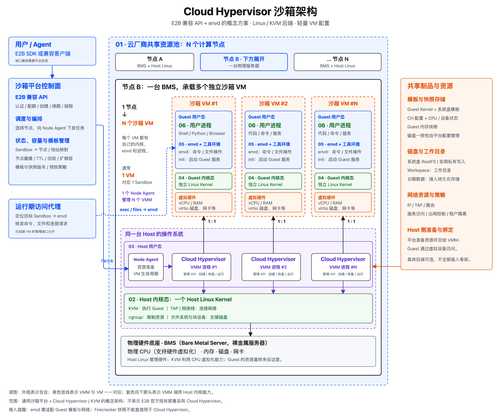

# Agent 沙箱底层原理与启动加速机制

> 学习目标：先建立云上 Kubernetes 容器集群的基础框架，再理解沙箱直接管理轻量 VM 的架构，以及冷启动、预热池和快照恢复。

## 阅读路径

```text
云上通算基础设施
    ↓
沙箱技术分层
    ↓
沙箱直接管理轻量 VM（Cloud Hypervisor）
    ↓
microVM 底层结构
    ↓
一次完整冷启动
    ↓
预热池加速
    ↓
快照恢复加速
    ↓
两种机制的比较与组合
```

本文先讲通用机制。OpenSandbox 和 CubeSandbox 只作为工程案例：前者偏统一接口和运行时抽象，后者偏 microVM 与快照优化，详细内容放在附录。

---

## 先读：核心术语与协作关系

每条只回答两个问题：**它负责什么？它与谁配合？** 可以先读“虚拟机与沙箱执行”这一组，再按需查阅其他术语。

### 基础：机器、内核与进程

- **BMS（Bare Metal Server，裸金属服务器）**：提供物理 CPU、内存、磁盘和网卡；上面安装 Host 操作系统，再承载容器或 VM。
- **Node（节点）**：平台可调度的一台计算机器，可以是物理机或云 VM；调度器选中它后，由节点上的管理程序落实任务。
- **VM / microVM（虚拟机 / 轻量虚拟机）**：拥有虚拟硬件和独立操作系统的执行环境；microVM 通常精简设备和启动流程，二者都由 VMM 管理。
- **Host / Guest（宿主 / 客体）**：Host 是承载 VM 的机器及其系统，Guest 是 VM 内的系统；VMM 在 Host 侧运行，用户代码可以在 Guest 内运行。
- **Kernel（内核）**：操作系统管理进程、内存和设备的核心；Host Kernel 管宿主机资源，Guest Kernel 管 VM 内的资源。
- **用户态 / 内核态**：程序运行的两种权限层级。应用、VMM、envd 属于相应系统的用户态；Host Linux Kernel 和 KVM 属于 Host 内核态，Guest Kernel 属于 Guest 内核态。
- **进程 / 系统调用（syscall）**：进程是运行中的程序；它通过系统调用请求所属操作系统内核提供文件、网络、内存等服务。

### 虚拟机与沙箱执行：谁管理谁

- **Sandbox（沙箱）**：平台提供的受约束执行环境，通常有实例 ID、资源限制和生命周期；底层可以是容器、VM 或语言执行环境。
- **控制面 / Scheduler（调度器）**：控制面维护沙箱状态与策略，调度器负责选择执行节点；选定后将任务交给 Node Agent 或 Kubernetes 节点组件。
- **Node Agent（节点代理）**：本文指沙箱节点上的守护程序，是通用角色名；接收控制面指令，准备网络和磁盘，再调用 VMM 创建、恢复或销毁 VM。
- **VMM（Virtual Machine Monitor，虚拟机监控器）**：配置并管理 VM 的 vCPU、内存和虚拟设备；在本文 Linux/KVM 路线中运行于 Host 用户态，调用 KVM 执行 Guest。
- **KVM（Kernel-based Virtual Machine）**：Host Linux Kernel 中的虚拟化模块；接收 VMM 的调用，借助 CPU 硬件虚拟化能力运行 Guest，不负责整个沙箱资源池的调度。
- **Cloud Hypervisor / Firecracker / QEMU**：VMM 的具体实现；Node Agent 可以直接调用它们，Kata 也可以选用其中的实现。
- **vCPU / Guest RAM**：Guest 看到的虚拟 CPU 和内存；由 VMM 配置，并由 KVM、Host 内核及物理资源共同支撑。
- **envd（Guest Agent）**：E2B 的环境内代理，负责命令、进程和文件操作；访问代理将请求送给它，它在 Guest 内操作，不创建自己的 VM。
- **init**：Linux 启动后的首个用户态进程，通常负责启动和管理服务；Guest 内的 envd 等程序由它或其启动链拉起。

常见协作：**控制面选节点 → Node Agent 准备资源 → VMM 调用 KVM 运行 Guest → envd 接收操作请求 → 用户进程执行。** 这是职责关系；创建实例与执行命令是两条不同的请求路径。

### Kubernetes 与容器：如何接入执行环境

- **容器 / Pod**：容器是隔离运行的进程环境，Pod 是 Kubernetes 的最小调度单元，可包含多个容器；普通容器共享所在系统的内核，Kata 可将 Pod 的容器放进 VM。
- **kubelet**：每个 Kubernetes Worker Node 上的节点管理程序；接收已分配到本节点的 Pod，调用容器管理器创建并维护它。
- **CRI（Container Runtime Interface）**：kubelet 调用容器管理器的标准接口；常见实现方是 containerd 和 CRI-O。
- **containerd / CRI-O**：管理镜像和容器生命周期；在 Kubernetes 中接收 CRI 请求，再交给配置好的底层运行时。
- **runc / runsc**：具体执行运行时；runc 创建普通 Linux 容器，runsc 将容器接入 gVisor。
- **gVisor / Sentry**：gVisor 提供沙箱运行时，Sentry 是其中处理大量系统调用的用户态内核；它在应用与 Host Kernel 之间增加一道边界。
- **Kata Containers / kata-agent**：Kata 将容器请求落实为 VM 内的容器；Host 侧运行时管理 VMM，Guest 内的 kata-agent 创建、管理容器。它与处理用户命令的 envd 职责不同。
- **CRD / Controller**：CRD 为 Kubernetes 增加资源类型，Controller 持续把资源的期望状态变为实际状态；沙箱平台可以用它们管理实例和预热池。
- **RuntimeClass**：Kubernetes 中声明 Pod 所用运行时配置的资源；配合节点运行时配置选择 runc、Kata 等，不亲自启动容器或 VM。
- **OpenKruise Agents / SIG Agent-Sandbox**：两个不同的 Kubernetes 沙箱管理项目；它们属于编排管理层，与 Kata、VMM 可以分层组合。
- **namespace / cgroup / seccomp**：分别隔离进程看到的资源视图、限制资源用量、过滤系统调用；容器运行时将它们与权限等机制配合使用。

### 文件、网络与环境

- **镜像 / 模板**：创建环境时使用的预制材料；OCI 镜像通常提供容器程序与依赖，VM 模板还需配套 Guest 内核和虚拟设备配置。
- **RootFS / Workspace**：RootFS 是环境看到的根文件系统，Workspace 是用户工作目录；由存储后端提供，并被容器或 Guest 中的程序访问。
- **virtio**：Guest 与虚拟设备交互的一组标准接口；Guest 驱动通过它访问 VMM 或其他后端提供的磁盘、网络等能力。
- **TAP / vsock**：TAP 在 Host 侧连接虚拟网卡与宿主网络；vsock 提供 Host 与 Guest 之间的通信通道，可用于代理交互，是否采用取决于实现。
- **CNI / CSI**：Kubernetes 生态对接网络和存储的接口体系；相应插件为 Pod 配置网络、供应或挂载存储。
- **V8 Isolate / WebAssembly / Wasmtime**：V8 Isolate 提供引擎内的执行隔离；WebAssembly 是受约束的模块格式，Wasmtime 是执行它的运行时，均需由宿主服务限制可调用的外部能力。

### 启动加速与生命周期

- **WarmPool（预热池）**：提前保留可领取的实例；控制面负责领取和补池，底层仍由运行时完成实例启动。
- **Snapshot / Restore（快照 / 恢复）**：保存并恢复运行状态；VM 快照涉及内存、CPU 与设备状态，磁盘一致性还需存储和平台配合，只有磁盘快照不能直接恢复进程执行点。
- **CoW / reflink（写时复制 / 文件克隆）**：CoW 先共享数据，写入时再生成私有副本；支持 reflink 的文件系统可按此方式克隆文件，用于减少模板或磁盘复制成本。
- **Probe / Ready（探测 / 就绪）**：Probe 检查服务能否正常工作，Ready 表示满足平台的可用条件；进程已启动不一定代表沙箱可以交付。
- **TTL（Time To Live，存活时限）**：实例或租约允许保留的时间；由控制面续期或到期回收，与运行时协作停止并清理环境。

---

## 0. 云上 VM 承载 Kubernetes Worker Node


这张图只展开一条常见的云上路径：物理服务器先被虚拟化并创建 VM，VM 运行 Guest Linux 和节点组件后注册为 Kubernetes Worker Node，最后由节点上的容器运行时创建 Pod 内的容器。

### 六层职责与关键组件

#### 1. 物理基础设施

这一层提供真实的计算、内存、网络和存储资源，是上层所有虚拟资源的物理基础。

关键组件：

- **BMS（Bare Metal Server）**：整台裸金属物理服务器。
- **CPU、内存、NIC 和磁盘**：被虚拟化层分配给不同 VM 的真实硬件资源。
- **BMC**：负责远程开关机、硬件状态监控等带外管理，不在容器运行的主数据路径上。

#### 2. 虚拟化与云资源层

这一层将一台 BMS 的资源组织成多台相互隔离的 VM，并管理 VM 的创建、启动和销毁。

关键组件：

- **IaaS 控制面**：选择物理宿主机，分配配额，并准备 VM 需要的网络和系统盘。
- **QEMU/VMM**：运行在 Host 用户态，负责配置 vCPU、Guest RAM、虚拟设备和系统盘。
- **KVM**：位于 Host Linux Kernel，借助 CPU 虚拟化能力真正执行 Guest 指令。

#### 3. 云虚机层

这一层提供一套独立的操作系统环境，并作为 Kubernetes Worker Node 的载体。

关键组件：

- **VM 镜像**：包含 Guest OS 和基础软件，IaaS 根据它生成 VM 系统盘。
- **Guest Linux**：虚机内部的操作系统，管理 VM 内的进程、内存、网络和文件系统。
- **vCPU、Guest RAM、vNIC 和 vDisk**：虚拟化层暴露给 Guest 的虚拟 CPU、内存、网卡和磁盘。

#### 4. Kubernetes Worker Node

VM 启动 kubelet 等节点组件并向集群注册后，才成为可被 Kubernetes 调度的 Worker Node。常见形态是 `1 台 VM = 1 个 Worker Node`。

关键组件：

- **Kubernetes Scheduler**：在控制面中为 Pod 选择合适的 Worker Node，但不亲自创建容器。
- **kubelet**：运行在每个 Worker Node 上，负责将 Pod 的期望状态变成实际状态。
- **CNI**：为 Pod 准备 IP、虚拟网卡和网络连接。
- **CSI**：为 Pod 挂载和管理持久化存储。

#### 5. 容器运行时层

这一层负责拉取容器镜像、管理容器生命周期，并最终创建隔离的容器进程。

关键组件：

- **CRI**：kubelet 调用容器运行时的标准接口。
- **containerd/CRI-O**：拉取容器镜像，并管理容器的创建、启停和删除。现代 Kubernetes 通常使用它们，而不是直接使用 Docker Engine。
- **runc**：设置 namespace、cgroup 等底层隔离与限制，然后创建容器进程。
- **容器镜像仓库**：保存 OCI 镜像，其中包含应用、依赖和容器 RootFS。

#### 6. 工作负载层

这一层运行用户的业务程序和辅助组件。一个 Worker Node 可以运行多个 Pod，一个 Pod 又可以包含一个或多个容器。

关键组件：

- **Pod**：Kubernetes 的最小调度单元，也是容器的外层边界。
- **业务容器**：运行真正的应用、API 或批处理任务。
- **Sidecar**：可选的辅助容器，通常负责代理、日志或其他辅助能力。它与业务容器都包含在 Pod 内。
- **Pod 共享环境**：同一 Pod 内的容器共享网络命名空间，并可以共享数据卷。

### 三组必须区分的关系

- **两次调度**：IaaS 把 VM 放到某台 BMS；Kubernetes Scheduler 把 Pod 放到某个 Worker Node。两者面向的资源和调度对象不同。
- **两类镜像**：VM 镜像提供 Guest OS 和节点基础软件；容器镜像提供应用、依赖和容器 RootFS。
- **数量关系**：`1 BMS → N VM`，通常 `1 VM → 1 Worker Node`，`1 Worker Node → N Pod`，`1 Pod → 1..N Container`。`N` 不是固定值，最终受 CPU、内存、网络、存储和管理策略限制。

> 图中主干表达的是**依赖与承载关系**，不是每创建一个 Pod 都从 BMS 重新开始。通常先由 IaaS 准备 VM 并组成 Worker Node 池，然后 Kubernetes 再将 Pod 调度到已存在的 Node。

---

## 1. Agent 沙箱技术全景


这张图按职责建立五层骨架：用户如何调用、平台如何管理、节点如何执行、代码如何隔离，以及资源来自哪里。同一层列出的是典型实现，可以按场景选择或组合；纵向箭头表示职责与依赖，不是每个请求都依次经过所有组件。

### 1. 使用与 API

这一层向用户和 Agent 提供统一的沙箱操作，隐藏底层节点与运行时差异。

关键组件：

- **Sandbox API / SDK**：提供创建、连接、执行、文件操作和销毁等能力，例如 E2B 兼容 API。
- **接入与访问代理**：接收 HTTP / RPC 请求，定位目标实例；MCP 或工具调用也可以在这一层封装沙箱能力。

### 2. 编排与生命周期

这一层决定实例放在哪里、分配多少资源、保留多久，并维护实际状态与期望状态的一致性。

关键组件与典型方案：

- **调度与状态管理**：选择节点，记录实例状态、地址和租约，处理回收、容量与故障恢复。
- **Kubernetes 方案**：CRD 扩展资源类型，Controller 管理生命周期，Kubernetes 调度 Pod；OpenKruise Agents 是这一层的典型实现。
- **平台自有控制面**：使用自己的 API、状态存储和调度服务管理执行节点，不要求采用 Kubernetes CRD。

### 3. 运行时接入与执行管理

这一层将管理请求落实为节点上的执行环境。容器管理器、底层运行时和 VMM 分工不同。

关键组件与典型路线：

- **containerd / CRI-O**：容器生命周期管理组件；在 Kubernetes 中接收 kubelet 经 CRI 发来的请求。
- **runc / runsc / Kata**：分别代表普通容器执行、gVisor 接入和 VM 隔离容器运行时方案。
- **Kata → VMM**：Kata 对接容器生态，可调用 Cloud Hypervisor、Firecracker、QEMU 等；Guest 内的 kata-agent 负责创建和管理容器。
- **Node Agent → VMM**：平台直接管理 VM 的路线；Node Agent 准备资源，通过 VMM 管理接口创建或恢复实例。
- **环境内执行代理**：例如 envd，负责已经启动的沙箱中的命令、进程与文件操作；与管理 VM 的 Node Agent 分工不同。
- **语言执行引擎**：如 V8 Isolate、Wasmtime，在宿主服务中执行受约束的脚本或 WebAssembly 模块。

> OpenKruise 管理沙箱，Kata 提供容器运行时集成，Cloud Hypervisor 等 VMM 承载虚拟机。三者可以组合，但不等同。Kubernetes 的 RuntimeClass 用于声明运行时选择，本身不创建 VM。

### 4. 执行环境与隔离机制

这一层关注代码与外部环境之间的边界，不能仅用项目名称分类。

典型机制：

- **普通容器**：使用 namespace、seccomp、权限和安全策略等约束进程，共享承载它的 Linux 内核。
- **用户态内核**：如 gVisor，其 Sentry 在用户态处理大量 Linux 系统调用，减少应用直接接触的 Host 内核接口。
- **虚拟机隔离**：每个 VM 有独立 Guest Kernel 与虚拟硬件；Kata 接入和直接管理 VM 都可以采用。microVM 是精简的 VM 形态，不是与 VM 完全独立的一种隔离原理。
- **语言 / 模块隔离**：由 V8 或 WebAssembly 引擎约束内存访问和宿主能力，通常不能直接运行任意 Linux 程序。

这些机制可以叠加，例如在 VM 中运行容器。隔离能力、兼容性和性能需要结合配置与工作负载判断。

### 5. 宿主基础设施与资源池

这一层提供实际计算、内存、网络与存储，多台执行节点组成平台可调度的资源池。

关键组件：

- **Host Linux Kernel**：管理宿主进程、内存、网络与文件系统；cgroup 主要用于资源限制。
- **KVM 与 CPU 虚拟化能力**：在 Linux/KVM 的 VM 路线中协同执行 Guest；VMM 位于 Host 用户态，KVM 位于 Host 内核态。
- **物理硬件与计算节点**：最终资源来自 CPU、内存、磁盘和网卡；节点可以是 BMS，也可以是具备相应能力的云 VM。云 VM 内再运行 VM 时，需要嵌套虚拟化等支持。

### 跨层能力：资源、安全与启动加速

这些能力与上述各层配合，不构成额外的顺序执行层。

- **网络与存储**：提供镜像、模板、系统盘、工作目录、IP、路由和访问代理；Kubernetes 路线中常通过 CNI / CSI 对接网络和存储。
- **安全与运维**：身份与租户授权、凭据管理、网络和文件策略、资源限制、超时回收、监控与审计。
- **预热池**：提前准备可领取的实例，由控制面维护数量和分配。
- **快照恢复**：由支持该能力的运行时及存储保存和恢复运行状态；可与预热池组合，不能视为任意运行时都自带的能力。
- **资源预置与缓存**：提前准备节点、镜像、模板和网络资源，减少请求到来后的准备工作。

阅读后续内容时，分别判断：**采用哪种管理方式、形成哪种隔离边界、使用哪些加速机制。** 不要把某个项目与其中一种机制永久绑定。

参考：[OpenKruise Agents](https://github.com/openkruise/agents)、[Kata 组件](https://github.com/kata-containers/kata-containers#main-components)、[Kata 支持的 VMM](https://github.com/kata-containers/kata-containers/blob/main/docs/hypervisors.md)。

---

## 2. 沙箱直接管理轻量 VM

### 2.1 Cloud Hypervisor 架构骨架



这条路线由沙箱平台选择计算节点，再由节点上的 Cloud Hypervisor 创建或恢复沙箱 VM。云厂商维护资源池，用户通过 API 使用沙箱，无需自行管理节点，因此可以提供 Serverless 形态。

图中采用 **E2B 兼容 API + envd + Cloud Hypervisor / KVM** 的概念组合，不代表 E2B 官方现有部署。Cloud Hypervisor 是面向云工作负载的 VMM，这里展示其用于轻量沙箱的配置。

#### 1. 共享资源池与物理硬件

资源池把多台计算节点组织成可调度容量；每个节点的物理硬件是 VM 资源的来源。图顶部展示资源池，节点底部展示硬件，二者是集合与成员的关系。

关键组件：

- **BMS（Bare Metal Server）**：裸金属物理服务器；本图一个计算节点对应一台 BMS。
- **CPU、内存、磁盘和网卡**：提供实际计算、数据保存和通信能力；CPU 的硬件虚拟化功能支撑 Guest 执行。
- **资源池管理**：记录节点健康与可用容量，按需要扩缩容；它是平台控制面的职责。

#### 2. Host 内核态

宿主机的 Linux 内核管理物理资源，为节点上的多个 VMM 提供虚拟化、网络和存储能力。

关键组件：

- **KVM**：Linux 内核中的虚拟化模块，借助 CPU 硬件能力执行 Guest。
- **TAP / 网络栈**：连接 VM 虚拟网卡与宿主机网络，配合路由和策略实现通信。
- **cgroup**：对 VMM 等宿主机进程实施 CPU、内存等资源限制。
- **文件系统与块设备**：承载系统盘文件、快照数据和存储后端。

#### 3. Host 用户态

这一层运行宿主机上的管理程序。它与第 2 层属于同一个节点、同一个 Host 操作系统。

关键组件：

- **Node Agent**：接收平台任务，准备网络、磁盘和模板，管理节点内多个 VMM 的生命周期。
- **Cloud Hypervisor（VMM）**：配置虚拟 CPU、内存和设备，并调用 KVM 运行 Guest；本方案每个 VMM 进程承载一个沙箱 VM。
- **VMM 管理 API**：Node Agent 控制 Cloud Hypervisor 的接口，可通过本地 Unix socket 调用，用于创建、启动、暂停、快照、恢复等操作。

#### 4. 沙箱 VM：Guest 内核与虚拟硬件

每个 VM 提供独立的操作系统执行环境。虚拟硬件位于 Guest 内核下方，为它提供可用的计算与设备接口。

关键组件：

- **Guest Linux Kernel**：管理该 VM 内的进程、内存和设备；不同 VM 有各自的 Guest 内核。
- **vCPU / Guest RAM**：VM 可见的 CPU 与内存，最终由宿主机的物理资源支撑。
- **virtio 设备**：让 Guest 高效访问虚拟磁盘、网卡等设备；需要 Guest 内核具备相应驱动。

#### 5. Guest 沙箱环境

这一层位于 VM 的用户态，为执行命令、操作文件和运行应用准备基础环境。

关键组件：

- **envd**：运行在 Guest 内的代理，处理命令、进程和文件请求；不负责创建或调度 VM。
- **init**：Guest 启动后的首个用户态进程，负责启动和管理 envd 等服务。
- **语言与工具环境**：Python、Node.js、Shell、浏览器等，决定沙箱开箱可运行哪些任务。
- **RootFS / Workspace**：分别提供系统根文件系统和用户工作目录；Workspace 是否持久化取决于配置。

#### 6. 用户工作负载

这一层运行用户提交的代码、命令和服务，与 envd 同处 Guest 用户态。

关键组件：

- **用户进程**：实际执行 Python、Shell、浏览器或业务服务；一个 Sandbox 可运行多个进程。
- **Guest 系统调用**：用户进程通过 Guest 内核申请内存、读写文件和访问网络；需要磁盘或网络 I/O 时，再经虚拟设备连接宿主机后端。

#### 侧边：API、调度与生命周期

控制面管理整个资源池；运行期代理把请求送到已经存在的沙箱。

关键组件：

- **E2B 兼容 API**：向客户端提供创建、查询、续期和销毁等接口；兼容性由平台实现。
- **调度与编排**：根据资源、模板等条件选择节点，并向 Node Agent 下发任务。
- **状态与容量管理**：维护 Sandbox 到节点和地址的映射，处理配额、TTL、回收、扩缩容及模板版本。
- **运行期访问代理**：定位目标 Sandbox，将命令和文件请求转发给其中的 envd。

两条主要请求路径：

- **创建 / 恢复**：客户端 → 平台 API → 调度与编排 → Node Agent → Cloud Hypervisor → KVM / Guest。
- **执行命令 / 文件操作**：客户端 → 运行期代理 → envd → Guest 内的进程或文件。

#### 侧边：模板、快照、存储与网络

这些资源由 Host 侧准备、加载或绑定，为 VM 提供启动材料和外部连接。

关键组件：

- **模板制品**：Guest 内核、系统盘及预装环境，定义沙箱初始配置。
- **快照制品**：保存 VM 配置、Guest 内存、CPU 与设备状态；平台还需配套管理一致的磁盘状态。
- **存储后端**：提供系统盘、实例私有写入空间与可选的持久化工作目录。
- **网络资源与策略**：提供 IP、TAP、路由、服务访问和出网控制。

> 替换 VMM 时，Node Agent 管理接口、Guest 模板及设备配置需要适配；envd 可以保留但需验证接入。Firecracker 快照不能直接用于 Cloud Hypervisor，需要重新生成。

数量关系：**1 个资源池 → N 个节点；1 个节点 → N 个 VMM；1 个 VMM → 1 个沙箱 VM；通常 1 个 VM → 1 个 Sandbox → 多个用户进程。** 各处的 N 可以不同，实际数量受资源和策略限制。

参考：[Cloud Hypervisor 官方说明](https://github.com/cloud-hypervisor/cloud-hypervisor#1-what-is-cloud-hypervisor)、[快照恢复文档](https://github.com/cloud-hypervisor/cloud-hypervisor/blob/main/docs/snapshot_restore.md)。

### 2.2 microVM 的底层结构与启动方式


图的上半部分展示了 microVM 的空间关系：

- **Guest 用户态**：Agent、Python、Shell、Browser 等工作负载。
- **Guest Kernel**：microVM 内部自己的 Linux 内核，管理 Guest 的进程、内存、网络和文件系统。
- **VMM**：宿主机用户态中的虚拟机管理程序，负责创建 vCPU、映射内存并提供虚拟设备。
- **KVM**：Host Linux Kernel 中的虚拟化模块，借助 CPU 虚拟化能力执行 Guest 指令。
- **物理硬件**：CPU、内存、网卡和磁盘。

普通容器没有独立 Guest Kernel，容器中的系统调用直接进入 Host Kernel；microVM 多了一层独立内核和虚拟硬件边界，隔离更强，也多出 VM 启动与恢复问题。

> 核心认识：VMM 负责“管理虚拟机”，KVM 与 CPU 负责“执行虚拟机”。

---

## 3. 从零启动一个可用沙箱


一次 microVM 沙箱冷启动可以概括为八步：

1. **接收请求**：确定镜像、CPU、内存、Runtime、网络、存储和健康检查。
2. **调度节点**：选择满足资源和运行时要求的计算节点；在 Kubernetes 路线中，可通过 RuntimeClass 选择运行时。
3. **准备 RootFS**：拉取或命中镜像缓存，准备根文件系统和存储卷。
4. **准备外部资源**：分配 IP，创建 veth/TAP，配置路由、策略和 cgroup。
5. **创建 VM 空壳**：VMM 建立 vCPU、Guest RAM 映射和 virtio 设备。
6. **启动 Guest OS**：加载 Guest Kernel，挂载 RootFS，启动 `init/envd`。
7. **初始化应用**：加载运行时、依赖、模型和缓存，监听服务端口。
8. **进入 Ready**：网络、vsock 和健康检查通过，API 返回可用地址。

### 为什么有些冷启动仍能控制在 10 秒内？

`WarmPool Miss` 只代表没有完整 Ready Sandbox 可以直接领取，不代表所有下层缓存同时失效。以下条件仍可能保持“温热”：

- 节点已经存在且资源充足；
- 镜像和模板制品已在本地；
- IP、TAP 等网络资源已预置；
- 没有慢速 PVC Attach；
- Guest 和应用本身较轻。

只有节点扩容、大镜像远程拉取、云盘挂载或复杂应用初始化叠加发生时，启动时间才更容易进入数十秒甚至分钟级。

> 核心认识：Pool Miss 不等于节点、镜像、网络和存储缓存全部 Miss。

---

## 4. 预热池：提前启动完整实例


预热池保存的是**已经完成步骤 1～8 的完整 Sandbox**。

### 后台预热

```text
SandboxTemplate 定义蓝图
        ↓
SandboxWarmPool 声明 replicas=N
        ↓
Controller 创建缺少的 Sandbox
        ↓
调度、镜像、网络、Runtime、应用初始化
        ↓
保持 N 个未领取的 Ready Sandbox
```

### 用户领取

用户创建 `SandboxClaim` 后，Controller 从可用队列选择一个候选实例，将所有权从 WarmPool 转移给 Claim，并返回 Sandbox 名称、Pod IP 和 Service 地址。原有 Pod 不需要重建或重启。

领取后池中出现缺口，Controller 再异步创建新实例补池。

### 命中与击穿

- **命中**：主要成本是查找、校验和所有权转移，通常是最低延迟路径。
- **击穿**：没有可领取实例，退化到新建 Sandbox；但仍可能命中节点、镜像和网络资源缓存。
- **容量边界**：瞬时可直接领取的实例数约等于池中 Ready 数量 `N`。

> 核心认识：预热池没有让冷启动步骤更快，而是把冷启动提前到用户请求之前完成。

---

## 5. 快照恢复：从 Ready 状态继续运行


快照恢复更接近“休眠恢复”或“游戏存档”，而不是更快地重新开机。

### 5.1 生成模板快照

```text
准备镜像和 VM 配置
        ↓
完整冷启动一次模板 VM
        ↓
等待应用健康检查成功
        ↓
暂停 vCPU
        ↓
保存 Ready 时刻的运行状态
```

模板构建仍需支付一次完整冷启动成本，但后续实例可以重复使用结果。

### 5.2 快照保存的四类状态

| 状态 | 作用 |
|---|---|
| RootFS / 磁盘 | 保存系统文件、程序、依赖和磁盘写入结果 |
| Guest RAM | 保存运行时、堆栈、缓存和内核数据结构 |
| vCPU 寄存器 | 记录下一条指令和 CPU 执行上下文 |
| virtio 设备状态 | 保持虚拟磁盘、网卡和设备队列的一致性 |

只有磁盘快照并不够：如果没有 RAM 和 vCPU 执行点，程序仍然只能从开机流程重新启动。

### 5.3 请求时如何恢复

1. 调度到有资源且拥有模板制品的节点。
2. 通过 CoW/reflink 克隆 RootFS 和快照文件。
3. 创建与模板兼容的 vCPU、内存和虚拟设备空壳。
4. 恢复 Guest RAM、vCPU 寄存器和设备状态。
5. 重新分配实例身份，绑定 TAP、IP、vsock 和存储。
6. 处理时间、随机数、凭据和失效连接等恢复钩子。
7. 进行轻量 Ready 验证并返回实例。

### 5.4 CoW 为什么快

Copy-on-Write 允许多个实例先引用同一份模板数据块；某个实例真正修改数据时，才复制被修改的部分。因此创建时不需要完整复制数 GB 的 RootFS 或内存快照。

随着实例运行和写入增多，私有数据仍会逐渐增加，真实 CPU、RAM、磁盘和恢复吞吐依然是最终边界。

### 5.5 快照优化了什么

| 冷启动阶段 | 快照恢复的处理 |
|---|---|
| API 和调度 | 仍然需要 |
| 镜像、RootFS 准备 | 本地模板与 CoW 大幅缩短 |
| IP、TAP、存储 | 可通过资源池缩短，但仍需重新绑定 |
| VM 空壳 | 仍然需要创建 |
| Guest Kernel Boot | 被状态恢复替代 |
| 应用初始化 | 基本跳过 |
| Ready 验证 | 仍然需要，但通常较轻 |

> 核心认识：快照恢复不是“更快开机”，而是从已经开好机的位置继续执行。

---

## 6. 预热池与快照恢复的比较

| 维度 | 预热池 | 快照恢复 |
|---|---|---|
| 预热对象 | 完整运行实例 | 可克隆的运行状态 |
| 请求时的主要工作 | 领取并转移所有权 | 克隆制品并恢复 VM |
| 单次最低延迟 | 通常更低 | 略高，仍有恢复成本 |
| 空闲资源成本 | 较高 | 较低 |
| 瞬时容量 | 受 Ready 实例数 `N` 限制 | 受节点容量与恢复吞吐限制 |
| 流量预测依赖 | 较强 | 较弱 |
| 规模与成本上限 | 较低 | 较高 |

### 为什么说快照的“上限”更高？

一个 WarmPool 实例被领取后就离开池子；池中有 `N` 个实例，最多只能连续命中约 `N` 次。继续提升瞬时容量，需要长期维持更多完整运行实例。

模板快照不会被领取掉，同一份模板可以持续克隆。它仍受 CPU、真实 RAM、I/O、IP 和节点数量限制，但不需要为每个潜在请求提前保持一台完整运行的 microVM。

因此：

- **单次命中速度**：WarmPool 通常更有优势；
- **突发扩展、成本和模板复用**：Snapshot Restore 通常更有优势。

---

## 7. 两种机制如何组合

一种理想的三级路径是：

```text
请求到达
   │
   ├─ WarmPool 有 Ready 实例 ──→ 直接领取
   │
   ├─ WarmPool 已空 ───────────→ 从 Ready 快照恢复
   │
   └─ 快照不可用 ─────────────→ 完整冷启动
```

三层分别解决不同问题：

- **WarmPool**：保证最前面一批请求的最低延迟；
- **Snapshot Restore**：快速补充实例并承接突发流量；
- **Cold Start**：作为兼容性最强的最终兜底路径。

这是一种理想组合，并不表示所有项目已经完整实现。Agent Sandbox 的 WarmPool 与快照扩展、CubeSandbox 的模板快照与节点资源池，当前各自解决的问题和组合方式并不相同。

> 核心认识：预热池解决“前几个请求有多快”，快照解决“请求增加后能否持续较快”。

---

# 附录 A：OpenSandbox


OpenSandbox 代表的是一种偏横向的平台取向：先统一 Sandbox API、生命周期和调用协议，再接入 Docker、Kubernetes 以及不同隔离 Runtime。

它主要回答：

> 如何用一致的方式创建、调用、暂停、恢复和销毁不同类型的沙箱？

因此，OpenSandbox 并不与 microVM 路线互斥。当它选择 Kata 或 Firecracker 一类 Runtime 时，底层同样会进入 Guest Kernel、VMM 和 KVM 路径。

---

# 附录 B：CubeSandbox


CubeSandbox 是垂直整合 microVM 与快照优化的工程案例，其通用概念与实现组件的对应关系如下：

| 通用概念 | CubeSandbox 中的实现 |
|---|---|
| 模板构建 | 临时 microVM 完整启动并等待 HTTP Probe |
| 快照制品 | RootFS、Guest RAM、vCPU 与设备状态 |
| CoW 克隆 | CubeCoW 与 XFS `FICLONE` |
| 网络资源预置 | TAP/IP 资源池 |
| VM 恢复 | CubeShim → CubeHypervisor → `restore_vm()` |
| 控制与状态 | CubeMaster、Cubelet 与 Redis |

它主要回答：

> 如何围绕一条 microVM 路径，把模板构建、快照克隆、资源预置和恢复延迟持续做深？

图中的性能数字依赖具体硬件、模板、本地缓存和并发条件，不应直接视为所有环境下的固定启动时间。

---

## 参考项目

- [Kubernetes SIG Agent Sandbox](https://github.com/kubernetes-sigs/agent-sandbox)
- [OpenSandbox](https://github.com/alibaba/OpenSandbox)
- [TencentCloud CubeSandbox](https://github.com/TencentCloud/CubeSandbox)

> 名称说明：Sandbox / Agent 沙箱是通用概念。OpenKruise Agents 指 `openkruise/agents`，SIG Agent-Sandbox 指 `kubernetes-sigs/agent-sandbox`；两者是不同项目，本文按具体名称区分。
