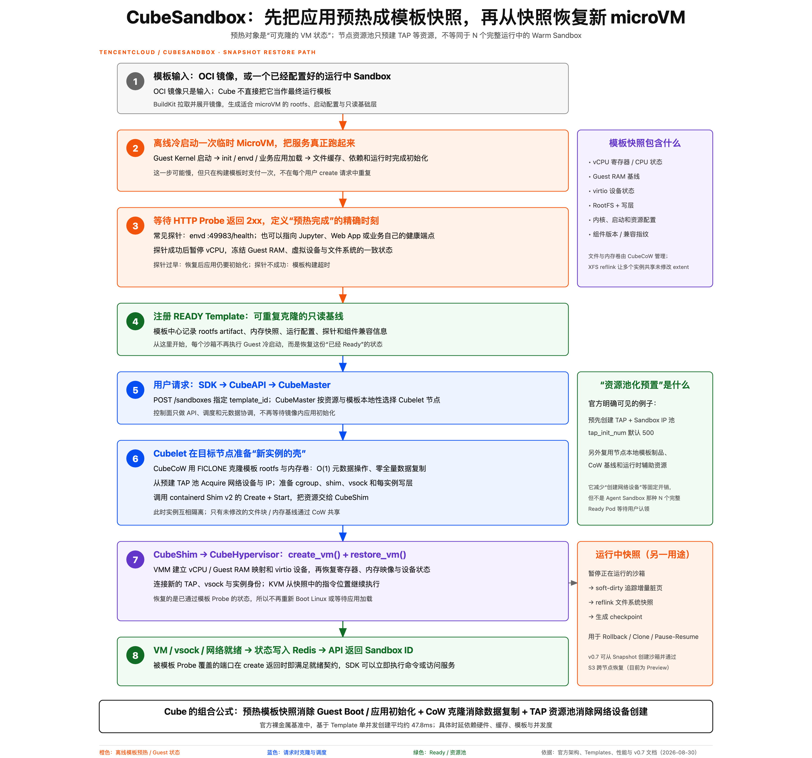

# 项目引子：CubeSandbox

[返回目录](./README.md) · [术语速查](./glossary.md)

> 本页问题：围绕 VM 与模板快照优化的平台，如何对应通用机制？

CubeSandbox 是垂直整合 microVM 与快照优化的工程案例，其通用概念与实现组件的对应关系如下：

| 通用概念 | CubeSandbox 中的实现 |
|---|---|
| 模板构建 | 临时 microVM 完整启动并等待 HTTP Probe |
| 快照制品 | RootFS、Guest RAM、vCPU 与设备状态 |
| CoW 克隆 | CubeCoW 与 XFS `FICLONE` |
| 网络资源预置 | TAP/IP 资源池 |
| VM 恢复 | CubeShim → CubeHypervisor → `restore_vm()` |
| 控制与状态 | CubeMaster、Cubelet 与 Redis |

它主要回答：

> 如何围绕一条 microVM 路径，把模板构建、快照克隆、资源预置和恢复延迟持续做深？

图中的性能数字依赖具体硬件、模板、本地缓存和并发条件，不应直接视为所有环境下的固定启动时间。

项目：[TencentCloud/CubeSandbox](https://github.com/TencentCloud/CubeSandbox)。具体组件与行为以所选版本为准。

---

相关内容：[模板快照如何生成](./08-snapshot-template.md) · [快照恢复如何缩短启动](./09-snapshot-restore.md) · [CoW 为什么能减少克隆成本](./10-copy-on-write.md)

