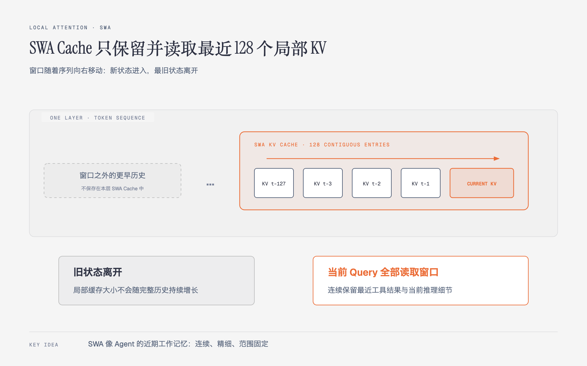
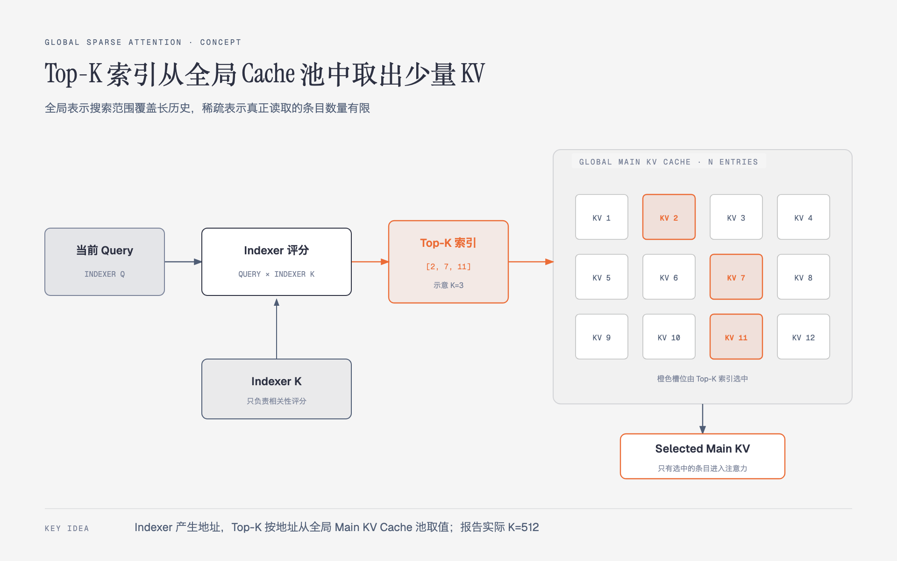
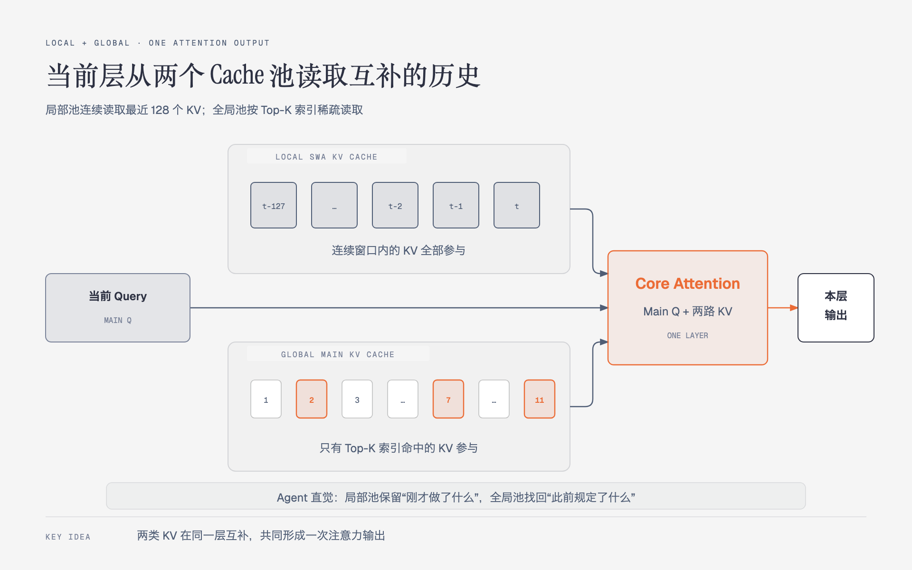

# 02 · 局部与全局注意力：模型如何同时使用近期细节与远处历史

> 状态：已完成  
> 深度：重点 · 架构前置  
> 论文定位：第 4、7、9–11、22 页

## 本篇只回答一个问题

**为什么模型既需要局部注意力，又需要全局稀疏注意力？**

一句话回答：**局部分支完整读取最近的连续历史，保留当前任务所需的细节；全局分支从更长的历史中只取与当前 Query 最相关的少量条目，补回远处信息。**

本文首次出现的缩写分别是 Key-Value（KV，键值）、Sliding-Window Attention（SWA，滑动窗口注意力）和 Compressed Sparse Attention 2（CSA2，压缩稀疏注意力 2）。

可以先把它理解成 Agent 的两种记忆：

| 信息来源 | 更像什么 | 解决什么问题 |
|---|---|---|
| SWA KV | 近期工作记忆 | 最近几步的代码、报错和操作细节需要连续保留 |
| Main KV | 可检索的长期历史 | 很早出现的需求、约束或代码仍可能在当前步骤有用 |

这个类比只用于建立直觉。SWA 和 Main KV 都是模型内部的注意力状态，并不是 Agent 框架中的外部记忆库或向量数据库。

## 1. SWA：连续读取最近 128 个位置

SWA 让当前 token 只读取一段连续的近期 KV。在 V4.1-Flash 中，窗口大小为 **128 token**。

图中最重要的是窗口的移动方式：

- 窗口内最近 128 个局部 KV 全部参与，不需要先做 Top-K 筛选。
- 新 token 进入后，窗口向右移动，最旧的局部 KV 离开窗口。
- 窗口大小固定，所以这部分运行时缓存不会随完整上下文无限增长。

这里的 128 指 token 位置，不是 128 轮对话或 128 次工具调用。SWA KV 还是**逐层生成的本层状态**；“局部”既表示它只覆盖近期范围，也表示不同层保留各自的局部表示。

离开 SWA 窗口不等于信息从模型的全部历史中消失。较早的信息仍可能通过全局 Main KV 分支被检索回来。

## 2. 全局稀疏检索：先选地址，再取内容

全局分支面对的是更长的历史。如果当前 Query 每次都读取全局 Cache 池中的所有条目，计算量会随着上下文长度增长。因此，CSA2 使用一个轻量 Indexer 先进行筛选：

1. 当前层的 **Indexer Q** 表示“这次要找什么”。
2. 它与历史条目的 **Indexer K** 计算相关性分数。
3. 取分数最高的 **Top-K 索引**，得到一组地址。
4. 按这些地址从 **Main KV Cache** 中读取对应条目。
5. 当前层的 **Main Q** 对这些 Selected Main KV 执行真正的注意力计算。

因此，Indexer K 和 Main KV 的职责不同：

- **Indexer K 用于检索和选地址。**
- **Main KV 保存被注意力读取的内容表示。**

图中只选 `[2, 7, 11]` 是为了便于观察；报告的实际 attention Top-K 是 **512**。Top-K 表示“当前 Query 在这一层实际读取哪些全局条目”，没有被选中的条目仍留在全局池中，之后的 Query 仍可能选中它们。

Main KV 条目也不一定永远与原始 token 一一对应。V4.1-Flash 的编码器 CSA2 使用压缩率 `m=2`，解码器使用 `m=1`。本篇只需记住：**Top-K 选择的是 Main KV 条目，而不是简单地从原文中挑出 K 个词。**

## 3. 两路历史如何进入同一层注意力

在一个 CSA2 层中，当前层会同时准备三类输入：

- 本层的 **Main Q**：当前 token 的全局查询。
- 本层的 **SWA KV**：最近 128 个位置的连续局部历史，全部读取。
- **Selected Main KV**：Indexer 从全局池中选出的 Top-K 条目，稀疏读取。

Selected Main KV 与 SWA KV 先拼接，再由 Main Q 在 Core Attention 中共同读取。它们不是两套互不相干的注意力结果：**局部与全局信息在同一次核心注意力计算中汇合，形成这一层的输出。**

论文中的 40 层网络有一个结构例外：前两个编码器层只使用 SWA；其余 18 个编码器层和 20 个解码器层使用包含局部与全局两路信息的 CSA2。

## 4. 为什么这种组合适合长任务 Agent

假设一个代码 Agent 已经工作了很久：

- 最近的终端报错、刚修改的函数和工具返回值连续出现在上下文末尾，适合由 SWA 完整读取。
- 用户最早提出的兼容性约束、很久前读过的接口定义可能离当前位置很远，适合由全局分支按当前需求检索。

只使用局部窗口，远处但关键的信息可能不可达；所有层都完整读取全部历史，长上下文的计算和缓存成本又会过高。V4.1-Flash 的基础思路是：**近期信息小范围密集读取，远期信息大范围稀疏读取。**

这仍然存在一个待解决的问题：全局 KV、Indexer K 和 Top-K 结果如果在很多层中重复保存、重复计算，成本依然很高。后续的 CSA2 跨层复用和分层稀疏索引正是继续压缩这部分成本。

## 需要记住的四句话

1. SWA 保存并完整读取最近 128 个位置的本层局部 KV。
2. Indexer Q 与 Indexer K 负责选出 Top-K 地址，Main KV 提供真正被读取的内容。
3. Main Q 同时读取 SWA KV 和 Selected Main KV，得到当前层输出。
4. 这套结构用“局部密集＋全局稀疏”兼顾近期细节、远处信息和长上下文成本。

## 自检

1. 一个历史位置离开 SWA 窗口后，为什么不能直接说模型已经忘记它？
2. Indexer K 和 Main KV 在全局稀疏检索中的职责分别是什么？
3. 图中 Top-K 选中三个条目，为什么不能把它理解为报告实际只读取三个 token？
4. 局部与全局分支是在各自产生最终输出，还是先汇合后进入 Core Attention？

---

[返回目录](./README.md) · [上一篇：01-Agent工作负载与推理成本](01-Agent工作负载与推理成本.md) · [下一篇：03-整体架构导读](03-整体架构导读.md)
