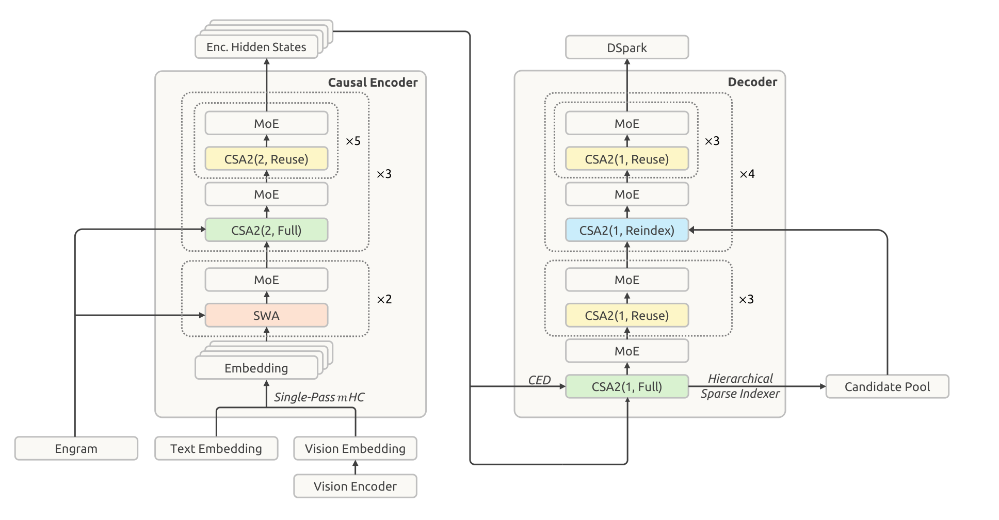
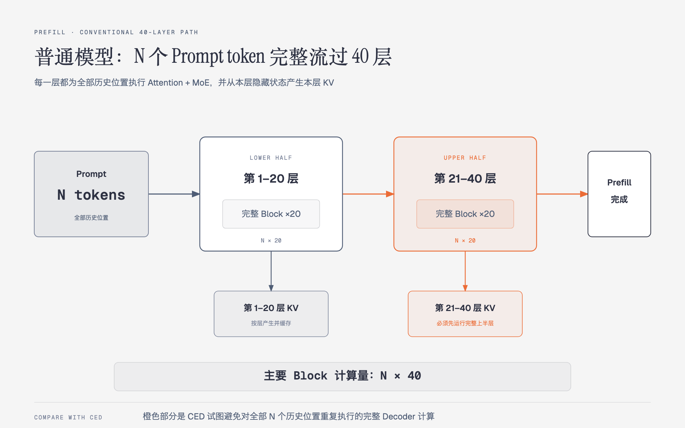
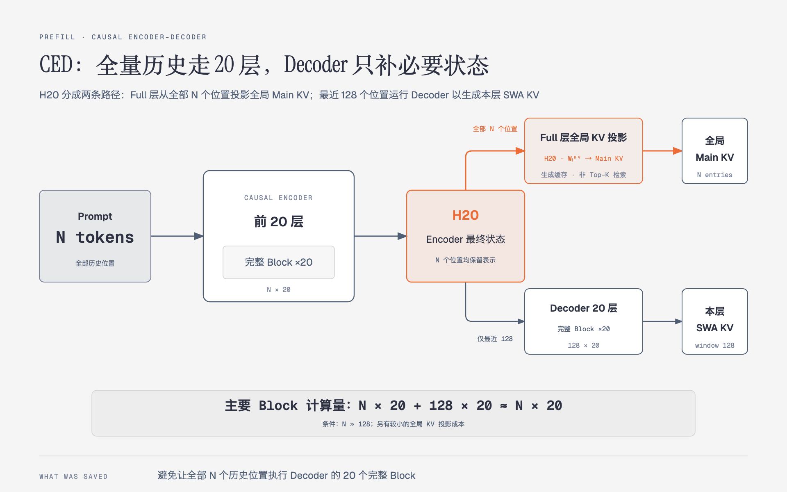

# 03 · 整体架构导读：先建立坐标系，再理解各项新机制

> 状态：已完成  
> 深度：重点 · 架构地图  
> 论文定位：第 7–11、22 页；图 3–5

## 本篇只回答一个问题

**DeepSeek-V4.1-Flash 的主要组件分别位于哪里，它们怎样组成一条完整的输入与生成路径？**

本篇先建立架构坐标系，只把每个组件放回正确位置。Causal Encoder-Decoder（CED，因果编码器-解码器）、Compressed Sparse Attention 2（CSA2，压缩稀疏注意力 2）、Sliding-Window Attention（SWA，滑动窗口注意力）和分层索引的内部细节由后续专篇展开。Key-Value（KV，键值）表示注意力缓存中的键和值。

## 1. 先看论文原始架构图



> 来源：DeepSeek-V4.1-Flash 技术报告 Figure 3。

这是一套支持文本与图像输入的 Mixture-of-Experts（MoE，混合专家）Transformer。语言主干共有 40 个因果 Transformer 层，被组织为：

```text
文本 / 图像
    ↓
20 层 Causal Encoder
    ↓
Encoder Hidden States（H20）
    ↓
20 层 Decoder
    ↓
DSpark
    ↓
生成文本或工具调用
```

原图同时叠加了层数、CSA2 模式、跨层共享和辅助模块。阅读时应先沿 Encoder → H20 → Decoder 的主干前进，再看横向连接。

## 2. 输入侧：文本、图像与 Engram

- 文本通过 Text Embedding 转换为语言模型可以处理的向量。
- 图像先经过 Vision Encoder，再被投影为 Vision Embedding。
- 两类 Embedding 被放入同一个输入序列，由语言主干共同处理。
- Engram 在选定层注入条件记忆。它是额外的参数化记忆模块，不等同于 KV Cache、Retrieval-Augmented Generation（RAG，检索增强生成）或 Agent 外部记忆。

本轮重点是长任务 Agent 的推理架构，因此视觉路径和 Engram 先建立位置感，分别留到选读篇说明。

## 3. Encoder 的 20 层如何排列

Encoder 前两层只使用 SWA：

```text
SWA + MoE，共 2 层
```

后 18 层使用 CSA2，分为三组：

```text
CSA2(2, Full)  + MoE
CSA2(2, Reuse) + MoE  ×5

以上 6 层为一组，共重复 3 组
```

因此总层数是：

$$
2+3\times(1+5)=20
$$

Encoder 的 CSA2 压缩率 `m=2`。它只压缩全局 Main KV 的序列条目，近似把每两个连续位置组合成一个全局条目；输入 token、隐藏状态主序列和 SWA KV 不会因此减半。

20 层处理完成后，所有输入位置共同形成 Encoder 最终隐藏状态：

$$
H_{20}\in\mathbb{R}^{N\times d}
$$

`N` 是输入长度，`d` 是隐藏维度。H20 是 CED 为 Decoder 生成全局 KV 的来源。

## 4. Decoder 的 20 层如何排列

Decoder 的第一组包含：

```text
CSA2(1, Full)  + MoE
CSA2(1, Reuse) + MoE  ×3
```

后面四组分别包含：

```text
CSA2(1, Reindex) + MoE
CSA2(1, Reuse)   + MoE  ×3
```

因此 Decoder 总层数是：

$$
(1+3)+4\times(1+3)=20
$$

Decoder 使用 `m=1`，全局 Main KV 不在序列维度合并相邻位置。报告给出了 `Encoder m=2、Decoder m=1` 的配置，但没有用独立消融完整解释这一分配。可以把它理解为一种架构取舍：Encoder 进一步减少全局条目，Decoder 保留更细的历史位置，并通过跨层共享控制缓存成本。

每个 CSA2 层依然包含上一篇所讲的两条历史来源：本层 SWA KV 与 Top-K Selected Main KV。

## 5. `CSA2(m, mode)` 怎样阅读

第一个参数 `m` 是全局 Main KV 的序列压缩率，第二个参数是运行模式。

| 模式 | Main KV / Indexer K | Top-K | 这一层的作用 |
|---|---|---|---|
| Full | 本层生成 | 本层检索 | 生成一套可供后续层共享的全局状态 |
| Reindex | 复用最近 Full 层的缓存 | 本层重新检索 | 不复制全局历史，同时允许本层选择不同位置 |
| Reuse | 复用最近 Full 层的缓存 | 复用最近一次结果 | 同时减少缓存副本与索引计算 |

三种模式都会计算本层 Main Q、本层 SWA KV 和 Core Attention。`Full` 表示完整承担 CSA2 的生成与索引职责，不表示对全部历史执行稠密注意力；它最终仍只让 Main Q 读取 Top-K Main KV。

## 6. 图中的几条横向连接

### CED

H20 连接到 Decoder 的 Full 层。它表示 Decoder 的全局 KV 可以从 Encoder 最终状态投影产生，不必让全部历史输入完整执行 Decoder 的 20 个 Block。

### Hierarchical Sparse Indexer

Decoder 的第一个 Full 层扫描完整可见历史，同时生成 Candidate Pool。后续 Reindex 层只在候选池中评分，再选出自己的 Top-512。

### Single-Pass manifold-constrained Hyper-Connections（mHC）

它贯穿 40 层主干，调整残差流混合方式，以便部署时减少激活数据搬运。本篇不展开其公式。

### DSpark

它位于 Decoder 输出侧，通过草稿生成和主模型验证加速 Decode。

## 7. 为什么 CED 能让 Prefill 接近减半

整体架构图只展示组件依赖，没有区分 Prefill 和 Decode。下面用同尺度的两张图补充时间路径。

### 普通 40 层模型



普通因果 Transformer 在 Prefill 时让全部 `N` 个 Prompt token 完整经过 40 层。每层都要执行 Attention、MoE，并从本层隐藏状态产生本层 KV：

$$
N\times20+N\times20=N\times40
$$

### CED



CED 先让全部 `N` 个位置完整经过 Encoder 20 层，得到 H20，随后分成两条路径：

1. Decoder 的 Full 层对所有 `N` 个 H20 位置执行轻量投影，产生全局 Main KV Cache；这一步是在生成缓存，不是执行 Top-K 检索。
2. 只有最近 `nwin=128` 个位置执行 Decoder 的完整 Block，用于产生各层自己的 SWA KV。

主要完整 Block 计算量变成：

$$
N\times20+128\times20
$$

当 `N≫128` 时：

$$
N\times20+128\times20\approx N\times20
$$

H20 到全局 KV 的线性投影仍有成本，所以真实 Floating-Point Operations（FLOPs，浮点运算次数）不会严格等于原来的 50%。关键收益来自：**绝大多数历史位置不再执行 Decoder 的 20 个完整 Attention＋MoE Block。**

这项收益主要作用于 Prefill。生成一个新 token 时，它仍需依次经过 Encoder 和 Decoder 的完整 40 层。

## 8. 把所有组件放回一次 Agent 循环

```text
代码、日志和工具结果进入模型
            ↓
Causal Encoder 处理大量新增输入
            ↓
CED 减少 Decoder 侧的历史 Prefill
            ↓
CSA2 减少多层全局 KV 副本和索引工作
            ↓
Candidate Pool 缩小后续层的检索范围
            ↓
Decoder 生成下一步行动
            ↓
DSpark 加速文本或工具调用生成
```

Figure 3 没有把所有优化都画成独立模块：SWA Bounded Replay 是缓存恢复策略，4-bit Floating Point（FP4，4 位浮点）是全局缓存的存储精度。它们影响部署与状态恢复，但不会在主干中增加新的 Transformer 方框。

## 需要记住的五句话

1. V4.1-Flash 的 40 层主干由 20 层 Causal Encoder 和 20 层 Decoder 组成。
2. H20 是所有输入位置经过 Encoder 后的最终隐藏状态，也是 Decoder 全局 KV 的来源。
3. `CSA2(m, mode)` 同时说明序列压缩率和 Full、Reindex、Reuse 分工。
4. CED 让全部历史执行 20 层主干，只让最近 128 个位置执行 Decoder 完整 Block，因而长输入 Prefill 接近减半。
5. CED、CSA2、分层索引、SWA 回放和 DSpark 分别优化不同阶段，组合后才形成完整的新架构。

## 自检

1. Figure 3 中 Encoder 和 Decoder 各有多少层，分别怎样分组？
2. `CSA2(2, Full)` 中的 `2` 和 `Full` 分别表示什么？
3. Full、Reindex 和 Reuse 各自重新计算或复用什么？
4. 为什么 CED 的 Prefill 计算接近减半，而 Decode 不会一起减半？
5. 为什么 FP4 和 SWA Bounded Replay 没有在 Figure 3 中表现为独立网络层？

---

[返回目录](./README.md) · [上一篇：02-局部与全局注意力](02-局部与全局注意力.md) · [下一篇：04-CED](04-CED.md)
