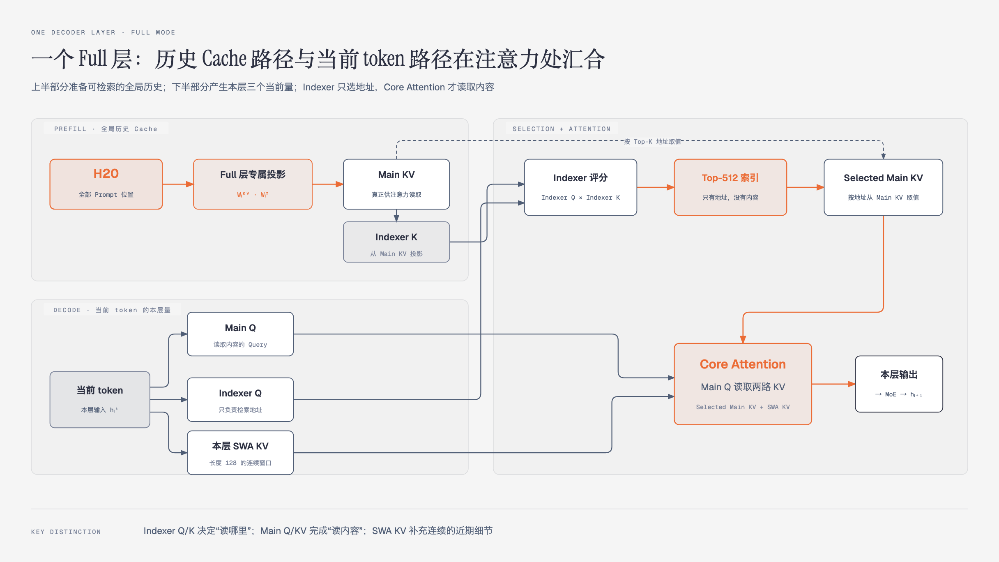

# 04 · Causal Encoder-Decoder（CED）：为什么大部分输入只需完整经过前半个模型

> 状态：已完成  
> 深度：重点 · 核心架构  
> 论文定位：第 4、7–10、20、22 页；公式 1、图 3–4

## 本篇只回答一个问题

**后半个模型没有完整处理全部历史输入，生成时需要的全局 Key-Value（KV，键值）从哪里来？**

一句话回答：**全部 Prompt token 先经过 20 层 Causal Encoder 形成 H20；Decoder 的 Full 层直接从 H20 投影全局 Main KV，只有最近 128 个位置继续执行 Decoder 的完整 Block，用于产生逐层独立的 Sliding-Window Attention KV（SWA KV，滑动窗口注意力键值）。**

## 1. CED 解决的是 Agent 的 Prefill 问题

长任务 Agent 会不断加入代码、日志和工具返回结果。新增输入很长或前缀缓存未命中时，普通 40 层因果 Transformer 需要让所有 Prompt token 完整经过 40 层。

CED 将同一条 40 层因果网络重新组织为：

```text
前 20 层：Causal Encoder
后 20 层：Decoder
```

这不是传统的双向 Encoder＋Cross-Attention Decoder。两部分依然保持因果性，模型仍然自回归生成文本。CED 改变的是长历史在 Prefill 阶段产生 Decoder 全局 KV 的方式。

## 2. 必须区分 Prefill 与 Decode

### Prefill：处理整段历史

对于长度为 `N` 的 Prompt，全部位置先经过 Encoder：

$$
H_{20}=\operatorname{Encoder}_{1:20}(X)
$$

$$
H_{20}\in\mathbb{R}^{N\times d}
$$

H20 中的每一行对应一个 Prompt 位置经过第 20 层后的隐藏向量。

大部分历史位置到这里就不再执行 Decoder 的完整 Attention＋Mixture-of-Experts（MoE，混合专家）Block。Decoder 需要的全局 KV 由 H20 的轻量投影产生；最近一个 SWA 窗口则继续进入 Decoder，生成逐层局部状态。

### Decode：处理一个新 token

生成第 `N+1` 个 token 时，这个当前 token 仍然依次经过 Encoder 20 层和 Decoder 20 层。它在 Decoder 每层产生 Query，读取已经缓存的历史 Main KV 与 SWA KV，并形成下一层隐藏状态。

因此，CED 的主要收益是减少长输入 Prefill，不是将每个 Decode token 的网络深度减半。

## 3. H20 如何变成 Decoder 全局 KV

CED 的一般形式规定，对于 Decoder 层 `l>20`，全局 KV 不再从该层所有历史位置的隐藏状态 `H_l` 产生，而是直接从 H20 投影：

$$
C_l=H_{20}W_l^{KV}
$$

$$
Z_l=H_{20}W_l^Z
$$

其中：

- `H20`：全部 Prompt 位置的 Encoder 最终隐藏状态；
- `Wₗᴷⱽ`：第 `l` 层的 KV 投影参数；
- `Cₗ`：投影得到的 KV 表示；
- `Wₗᶻ` 与 `Zₗ`：用于 KV 压缩的投影和权重。

线性投影仍有计算成本，但远小于让所有 `N` 个位置在 Decoder 中执行 20 次完整的 Attention、残差流和 MoE。

### CED 与 Compressed Sparse Attention 2（CSA2，压缩稀疏注意力 2）组合后的实际情况

如果单独讨论 CED，不同 Decoder 层可以使用各自的投影参数从 H20 生成层专属全局 KV。

V4.1-Flash 同时使用 CSA2。实际 Decoder 中只有 Full 模式负责从 H20 计算并保存 Main KV 和 Indexer K；Reindex 与 Reuse 模式共享这份全局缓存。因此不能把实际结构理解为 20 个 Decoder 层分别从 H20 保存 20 份 Main KV。

## 4. “写入全局 KV Cache”究竟发生了什么

Prefill 会为历史 Prompt 计算可重复读取的向量状态：

```text
Main KV Cache
├── 历史位置 1 的 Main K / V
├── 历史位置 2 的 Main K / V
├── ...
└── 历史位置 N 的 Main K / V
```

保存的是数值向量，不是原始文本。Decode 生成新 token 时，模型不用重新处理全部历史，只需用当前 Query 检索并读取这些向量。

在 CSA2 中还会保存一套更轻量的 Indexer K。它只负责帮助确定 Main KV 的读取地址；真正进入核心注意力的是被 Top-K 选中的 Main KV。

## 5. 一个 Decoder Full 层的完整数据流



这张图叠加了两个时间阶段：上半部分是 Prefill 产生的历史 Cache，下半部分是 Decode 时一个当前 token 的本层计算。

### 5.1 Prefill：准备全局历史

Full 层首先对全部历史位置的 H20 执行本层专属投影，得到 Main KV。Decoder 的压缩率为 `m=1`，所以相邻历史位置不会在序列维度合并。

随后从 Main KV 投影得到 Indexer K：

$$
K_l^{idx}=\operatorname{ProjectK}(M_l)
$$

两类状态分别负责：

| 状态 | 作用 |
|---|---|
| Main KV | 保存真正供注意力读取的全局历史内容 |
| Indexer K | 用轻量表示参与检索，帮助找到 Main KV 地址 |

Full 层生成的 Main KV 和 Indexer K 可以被后面的 Reindex 与 Reuse 层共享。

### 5.2 Decode：当前 token 产生三个本层量

当前 token 到达 Decoder 层 `l` 时拥有本层输入隐藏状态 `hₗᵗ`。在实际的第一个 Decoder Full 层，这个状态来自当前 token 的 Encoder 输出 `H₂₀ᵗ`。

它通过不同投影产生三类状态：

$$
q_l^{main}=h_l^tW_l^{mainQ}
$$

$$
q_l^{idx}=h_l^tW_l^{idxQ}
$$

$$
(k_l^{swa},v_l^{swa})=h_l^tW_l^{swaKV}
$$

| 当前量 | 作用 |
|---|---|
| Main Q | 在 Core Attention 中真正读取内容 |
| Indexer Q | 与 Indexer K 评分，只负责寻找地址 |
| SWA KV | 追加到本层长度为 128 的连续局部窗口 |

当前 token 的全局 KV 条目也会经 Full 层投影追加到全局 Cache，供更晚生成的 token 使用。图中为了突出“当前 Query 如何读取既有历史”，没有单独画出这条追加路径。

### 5.3 Indexer：从全局历史中选地址

Indexer Q 与可搜索的 Indexer K 计算相关性：

$$
s_j=\operatorname{Score}(q_l^{idx},K_{l,j}^{idx})
$$

随后取得分最高的 512 个地址：

$$
I_l=\operatorname{TopK}(s,512)
$$

Top-512 只是索引列表，不包含历史内容。模型再用这些地址从 Main KV Cache 取出对应向量：

$$
M_l^{selected}=M_l[I_l]
$$

### 5.4 Core Attention：局部与全局汇合

Main Q 同时读取：

- Top-512 Selected Main KV；
- 本层长度为 128 的连续 SWA KV。

简化公式为：

$$
O_l=\operatorname{Attention}
\left(
q_l^{main},
\left[M_l^{selected};KV_l^{swa}\right]
\right)
$$

其中 `[ ; ]` 表示将两路 KV 拼接。注意力输出再经过残差流和 MoE，形成下一层输入：

$$
O_l\rightarrow\operatorname{MoE}\rightarrow h_{l+1}^t
$$

## 6. 为什么 SWA KV 不能全部从 H20 投影

全局 Main KV 的目标是让 Decoder 从整个历史中稀疏读取信息，因此 CED 可以统一以 Encoder 最终状态为来源。

SWA KV 承担逐层局部计算。第 `l` 层的局部 K/V 需要从本层隐藏状态 `H_l` 产生，每层都有自己的局部表示，不能全部用 H20 代替。

因此 Prefill 时还需让 Prompt 末尾的一个窗口经过 Decoder 20 层：

```text
最近 128 个 H20 位置
        ↓
Decoder 第 21–40 层
        ↓
每层自己的 SWA KV
```

这里采用的是近似的 Decoder SWA Bounded Replay。为什么一个窗口能够代替理论上更长的精确回放范围，将在 SWA 有界回放专篇说明。

## 7. Prefill 为什么接近减半

普通 40 层路径的主要 Block 计算量为：

$$
O(NL)=O(N\times40)
$$

CED 的主要 Block 计算量为：

$$
O(NL/2+n_{win}L/2)
$$

代入 `L=40`、`nwin=128`：

$$
O(N\times20+128\times20)
$$

当 `N≫128` 时，第二项相对很小：

$$
N\times20+128\times20\approx N\times20
$$

收益成立需要注意三个条件：

1. 输入长度远大于 128，固定回放成本才会被摊薄。
2. 任务有大量新增输入或缓存未命中，Prefill 才是显著瓶颈。
3. “接近减半”指主要 Prefill 计算，不代表端到端 Agent 延迟严格减半；工具执行、网络、缓存加载和 Decode 仍有成本。

报告用激活参数量表达了同一差异：Prefill 每个 token 约激活 8B 参数，Decode 每个 token 约激活 16B 参数。它们不是模型总参数量。

## 8. 放回一个 Agent 场景

假设代码 Agent 读取了 10 万 token 的仓库文件和日志：

- 普通路径需要让这 10 万个位置执行全部 40 层。
- CED 让全部位置执行 Encoder 20 层，再从 H20 投影全局历史状态。
- 只有最近 128 个位置继续执行 Decoder 完整 Block，补齐本层 SWA KV。
- 开始生成工具调用时，每个新 token 仍执行完整 40 层，并从全局 Cache 与局部窗口读取历史。

因此 CED 特别适合 input-heavy 的 Agent 工作负载。它降低的是“读入大量新资料”的计算成本，不直接保证工具更快、任务更正确或输出生成快一倍。

## 需要记住的四句话

1. H20 是全部 Prompt 位置经过前 20 层后的隐藏状态集合。
2. Decoder Full 层从 H20 投影 Main KV，避免全部历史执行后 20 个完整 Block。
3. Main KV 与 Indexer K 是历史缓存；Main Q、Indexer Q 和 SWA KV 是当前层仍需独立产生的状态。
4. CED 将长 Prompt 的主要完整 Block 计算从 `N×40` 降到 `N×20＋128×20`，Decode token 仍走完整 40 层。

## 自检

1. H20 是单个向量，还是包含所有 Prompt 位置的状态矩阵？
2. 为什么线性投影全部 N 个 H20 位置仍然可以节省大量 Prefill 计算？
3. Indexer Q/K 与 Main Q/KV 分别负责什么？
4. 为什么 Decoder 的 Main KV 可以从 H20 产生，而 SWA KV 仍需逐层生成？
5. CED 与 CSA2 组合后，是否每个 Decoder 层都会保存一份从 H20 投影的新 Main KV？

## 与后续内容的衔接

CED 回答“Decoder 的全局 KV 从哪里来”；下一篇 CSA2 回答“这些 KV 和 Top-K 如何跨层共享，进一步减少缓存副本和索引计算”。

---

[返回目录](./README.md) · [上一篇：03-整体架构导读](03-整体架构导读.md) · [下一篇：05-CSA2](05-CSA2.md)
