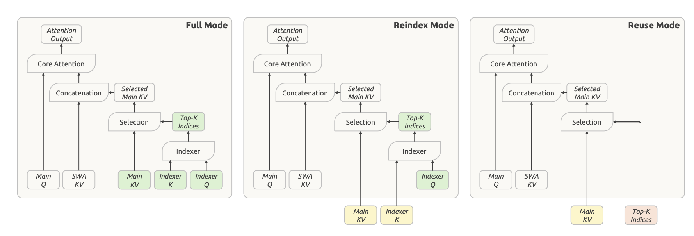
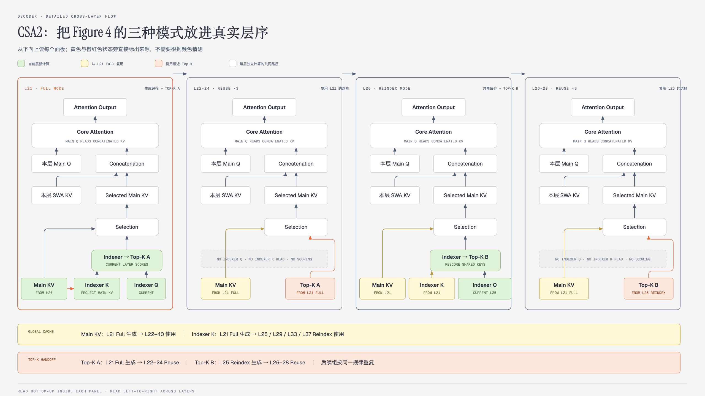

# 05 · Compressed Sparse Attention 2（CSA2）：跨层共享历史缓存与检索结果

> 状态：已完成  
> 深度：重点 · 核心架构  
> 论文定位：第 4、9–12、22、37 页；Figure 4

## 本篇只回答一个问题

**不同 Decoder 层能否共享同一份全局历史，同时保留各层选择不同历史位置的能力？**

本文中的 Key-Value（KV，键值）是注意力缓存中的键和值；Sliding-Window Attention（SWA，滑动窗口注意力）表示逐层保留的局部注意力分支。

一句话回答：**Full 层生成 Main KV、Indexer K 和 Top-K；Reindex 层共享 Main KV 与 Indexer K，但重新计算 Top-K；Reuse 层直接共享 Main KV 和最近的 Top-K。三种模式都保留本层 Main Q、SWA KV 和 Core Attention。**

## 1. CSA2 要消除哪两种跨层重复

长上下文中的全局注意力需要保存和使用两类历史状态：

- **Main KV**：真正供 Core Attention 读取的历史内容；
- **Indexer K**：供轻量 Indexer 评分、寻找 Main KV 地址的检索表示。

如果每一层都独立保存一份 Main KV 和 Indexer K，缓存会随层数成倍增长。如果每一层又重新对历史执行 Indexer 评分，Decode 时还会重复大量检索计算。

CSA2 将这两个问题拆开处理：

```text
共享 Main KV / Indexer K
        ↓
减少跨层缓存副本、加载和搬运

复用 Top-K indices
        ↓
减少重复的 Indexer 评分
```

报告从三个相乘维度描述长上下文缓存成本：

| 维度 | 含义 | V4.1-Flash 中的处理 |
|---|---|---|
| 条目大小 | 每条 KV 占多少字节 | 4-bit Floating Point（FP4，4 位浮点），留到 09 讲解 |
| 序列维度 | 一段历史产生多少条 Main KV | CSA2 的压缩率 `m` |
| 层维度 | 多少层各自保存一份缓存 | Full、Reindex、Reuse 跨层共享 |

05 重点讨论第三个维度，以及它与 Top-K 复用的关系。

## 2. 先看原文 Figure 4



> 来源：DeepSeek-V4.1-Flash 技术报告 Figure 4。原文 Figure 5 是 Hierarchical Sparse Indexer，将在 06 中讲解。

Figure 4 将三种模式并排展示。读图时先看颜色，再沿着 `Main KV → Selection → Selected Main KV → Core Attention` 的路径向上阅读。

### 颜色表示状态来自哪里

| 颜色 | 含义 |
|---|---|
| 绿色 | 当前层新计算的、用于区分三种模式的状态 |
| 黄色 | 从最近 Full 层复用的 Main KV 或 Indexer K |
| 橙红色 | 从最近一次产生索引的 Full 或 Reindex 层复用的 Top-K indices |
| 白色 | 三种模式共有的状态和计算路径 |

Main Q 和 SWA KV 虽然画成白色，仍然由每一层独立计算。绿色只突出三种模式之间会发生变化的部分，不能理解成“只有绿色方块才由本层计算”。

## 3. 三种模式共有的主干

无论是 Full、Reindex 还是 Reuse，最后都执行同一条注意力路径：

```text
Top-K indices
      ↓
从 Main KV 中取出 Selected Main KV
      ↓
与本层 SWA KV 拼接
      ↓
本层 Main Q 执行 Core Attention
      ↓
Attention Output
```

三种模式都会计算：

- 本层 **Main Q**；
- 本层 **SWA KV**；
- 本层 **Core Attention**；
- 本层 **Attention Output**。

所以“Reuse”只表示复用全局历史状态和检索结果，不表示跳过整个 Attention 层。

## 4. Full、Reindex、Reuse 分别做什么

### 4.1 Full：建立内容缓存并完成一次检索

Full 层承担完整的 CSA2 路径：

```text
本层生成 Main KV
        ↓
从 Main KV 投影 Indexer K
        ↓
本层生成 Indexer Q
        ↓
Indexer Q 与 Indexer K 评分
        ↓
产生新的 Top-K indices
        ↓
从 Main KV 取出 Selected Main KV
```

它同时回答两个问题：

1. 后续层共享的全局内容保存在哪里？
2. 当前层要从这些内容中读取哪些位置？

当 CSA2 与 Causal Encoder-Decoder（CED，因果编码器-解码器）组合时，Decoder 的 Full 层直接从 H20 投影 Main KV，再由 Main KV 投影 Indexer K。

### 4.2 Reindex：共享内容，重新选择地址

Reindex 层不再生成新的 Main KV 和 Indexer K，而是读取最近 Full 层产生的缓存：

```text
共享 Main KV + 共享 Indexer K
                       ↑
本层新的 Indexer Q ────┘
        ↓
重新评分
        ↓
产生本层新的 Top-K indices
```

因此，Reindex 不增加新的全局内容缓存副本，但允许当前层选择与前面不同的历史位置。

### 4.3 Reuse：内容和地址都复用

Reuse 层直接取得：

- 最近 Full 层产生的 Main KV；
- 最近一次 Full 或 Reindex 产生的 Top-K indices。

它按这些索引从 Main KV 中取出 Selected Main KV，然后与本层 SWA KV 一起进入 Core Attention。

Reuse 不需要生成 Indexer Q，也不需要读取 Indexer K 执行评分。被复用的 Top-K 必须是针对当前这份 Main KV 产生的索引，否则索引地址和内容池无法对应。

### 4.4 放在一张表里比较

| 本层状态或计算 | Full | Reindex | Reuse |
|---|---|---|---|
| Main Q | 本层计算 | 本层计算 | 本层计算 |
| SWA KV | 本层计算 | 本层计算 | 本层计算 |
| Main KV | 本层生成 | 复用 Full | 复用 Full |
| Indexer K | 从本层 Main KV 投影 | 复用 Full | 不需要读取 |
| Indexer Q | 本层计算 | 本层计算 | 不计算 |
| Top-K indices | 本层生成 | 本层重新生成 | 复用最近结果 |
| Core Attention | 本层执行 | 本层执行 | 本层执行 |

可以把它们记成：

- **Full：更新内容，也更新选择。**
- **Reindex：不更新内容，只更新选择。**
- **Reuse：内容和选择都不更新。**

## 5. 为什么不能全部使用 Reuse

如果 Full 层选出一批 Top-K 后，所有更深层都永久复用它们，成本最低，但模型会失去跨层调整检索结果的能力。

token 经过多个 Transformer 层后，隐藏状态会发生变化。浅层当前认为重要的历史位置，不一定仍是深层最需要的信息。Reindex 让深层使用自己的 Indexer Q 重新表达“这一层现在要找什么”，再对共享的 Indexer K 评分。

因此，Reindex 是 Full 与 Reuse 之间的折中：

| 模式 | 缓存成本 | 索引成本 | 选择灵活性 |
|---|---:|---:|---:|
| Full | 高 | 有 | 重新建立缓存并选择 |
| Reindex | 低 | 有 | 在共享缓存上重新选择 |
| Reuse | 低 | 无 | 沿用最近一次选择 |

Reindex 保留了跨层检索差异，但剩余的重新评分仍可能扫描很长的历史。下一篇的 Hierarchical Sparse Indexer 正是为了继续降低这部分成本。

## 6. 三种模式在实际 Decoder 中如何串联



这张图把原文 Figure 4 的模块展开到 Decoder 的前两组实际层序中。每个面板内部从下向上读取，面板之间从左向右读取：

```text
L21 Full → L22–24 Reuse → L25 Reindex → L26–28 Reuse
```

底部两条横栏明确记录全局缓存和 Top-K 分别由哪一层生成、被哪些层使用；L29–40 按照 `Reindex + Reuse ×3` 的相同规律继续。

V4.1-Flash 的 20 个 Decoder 层分成五组，每组四层：

```text
L21 Full    → L22–24 Reuse ×3
L25 Reindex → L26–28 Reuse ×3
L29 Reindex → L30–32 Reuse ×3
L33 Reindex → L34–36 Reuse ×3
L37 Reindex → L38–40 Reuse ×3
```

这条时间线中有两种不同寿命的状态：

- **内容状态寿命长**：L21 Full 生成 Main KV 和 Indexer K。后续层共享 Main KV，四个 Reindex 层还使用这份 Indexer K。
- **选择结果寿命短**：Full 或 Reindex 每四层刷新一次 Top-K，后面的三个 Reuse 层沿用这次选择。

所以 CSA2 的核心不是“所有层做完全相同的注意力”，而是：

> **共享“历史中存了什么”，周期性更新“这一层要读什么”。**

Encoder 使用另一种分组：前两层是纯 SWA，后 18 层以 `Full + Reuse ×5` 为一组，共三组。每组的 Full 生成该组共享的 Main KV 和 Indexer K；Encoder 没有使用 Reindex。

## 7. CSA2 相比 CSA 改了什么

Compressed Sparse Attention（CSA，压缩稀疏注意力）已经会沿序列维度压缩 Main KV，并通过 Indexer 选择 Top-K。CSA2 在此基础上增加跨层共享，同时简化压缩器和 Indexer：

1. **增加层维度共享**：共享 Main KV、Indexer K，并允许复用 Top-K。
2. **保留 `m=1`**：不合并相邻序列条目的特殊情况。
3. **去掉重叠压缩窗口**：CSA 的相邻压缩条目会使用重叠来源，CSA2 改为不重叠。
4. **去掉压缩中的绝对位置编码**：简化压缩实现。
5. **简化 Indexer K 路径**：直接从 Main KV 投影 Indexer K，不再从隐藏状态走一条独立压缩路径。

V4.1-Flash 的 Encoder 使用 `m=2`，Decoder 使用 `m=1`。`m` 压缩的是全局 Main KV 的序列条目，不改变输入 token 数、隐藏状态主序列或 SWA KV。

## 8. 收益、依据与证据边界

### 8.1 两类直接收益

| 设计 | 直接减少什么 |
|---|---|
| 共享 Main KV / Indexer K | 跨层缓存副本、存储、加载与数据搬运 |
| 复用 Top-K indices | Indexer Q 生成和全局评分计算 |
| 周期性 Reindex | 在不增加 Main KV 副本的前提下恢复跨层选择差异 |

### 8.2 作者为什么会采用共享

报告给出的依据主要有三层：

1. **结构上的成本分解**：缓存成本在条目大小、序列长度和层数三个维度相乘，减少层间副本会直接降低全局缓存规模。
2. **前人工作的实践结果**：IndexCache、You Only Index Once（YOIO）和 HySparse 等工作已经分别尝试跨层复用索引、路由或 KV，说明层维度压缩是可行方向。
3. **训练时适应共享结构**：CSA2 是模型训练时就存在的注意力结构，不是部署时临时将不同层缓存强行合并，模型可以学习在共享约束下工作。

CSA2 同时保留每层 Main Q、SWA KV 和 Core Attention，并通过 Reindex 周期性刷新选择。这些设计可以解释它为什么不会让所有层退化为同一次注意力，但属于结构直觉，不是数学上的等价性证明。

### 8.3 原文没有证明什么

报告没有给出“相邻层 Main KV 必然等价”或“Top-K 可以无损复用”的理论证明，也没有提供能单独隔离每种复用策略贡献的完整消融。

论文展示的是端到端结果：V4.1-Flash 在缓存显著缩小后，整体能力仍与对照模型相当或更强；内部测试没有发现系统性能力下降。但这不能证明每个任务、每种上下文或每个共享决策都不会损失信息。

报告最终也将 **CSA2 的潜在选择错误**列为尚未充分刻画的鲁棒性边界。

### 8.4 数字不能全部归因于 CSA2

报告所称全局 KV 约 **890 bytes/token、约为 V4-Flash 的 1/4**，是 CSA2 跨层共享与 FP4 缓存共同作用的结果。持久 KV 约为 V4-Flash 的 **1/8** 还包含取消 SWA 长期持久缓存和有界回放的收益。

这些数字在[09-其他架构与工程改进](09-其他架构与工程改进.md)的 FP4 部分中统一拆解，不能在本篇直接写成“CSA2 单独将总缓存压缩到 1/4 或 1/8”。

## 9. 放回 Agent 长任务

长任务 Agent 可能保留几十万乃至更多 token 的代码、日志、网页和工具结果。全局 Main KV 会随上下文增长，并在 Decode 每一步被读取。

CSA2 的作用是：

- 避免 Decoder 多层重复保存同一套全局内容状态；
- 避免大多数层重复执行全局索引；
- 通过 Reindex 让部分深层仍能改变历史选择；
- 保留每层局部 SWA 和实际注意力计算。

它降低的是长上下文服务的缓存与检索成本，不直接保证 Agent 找到正确证据、作出正确工具调用或完成任务。稀疏选择的可靠性仍需通过任务评测和极端上下文测试验证。

## 需要记住的五句话

1. Full 同时生成 Main KV、Indexer K 和新的 Top-K。
2. Reindex 共享 Main KV 与 Indexer K，但用本层 Indexer Q 重新选择 Top-K。
3. Reuse 共享 Main KV 和最近 Top-K，不执行 Indexer 评分。
4. 所有模式仍会计算本层 Main Q、SWA KV 和 Core Attention。
5. CSA2 有明确的成本动机和实践依据，但报告没有证明跨层共享在所有情况下无损。

## 自检

1. Reindex 与 Reuse 的区别是否只是名称不同？它们分别重新计算什么？
2. 为什么 Reuse 层不需要读取 Indexer K？
3. 为什么需要周期性 Reindex，而不让全部 Decoder 层直接 Reuse？
4. Decoder 的 Main KV、Indexer K 和 Top-K 各自能跨多少层复用？
5. 为什么不能把全局 KV 降到 1/4 全部归因于 CSA2？

## 与前后内容的衔接

CED 回答“Decoder 全局 KV 从哪里来”；CSA2 回答“哪些层共享这些 KV、哪些层重新选择历史”。下一篇继续回答：**保留下来的 Reindex 如何避免再次扫描整个超长上下文？**

---

[返回目录](./README.md) · [上一篇：04-CED](04-CED.md) · [下一篇：06-分层稀疏索引](06-分层稀疏索引.md)
