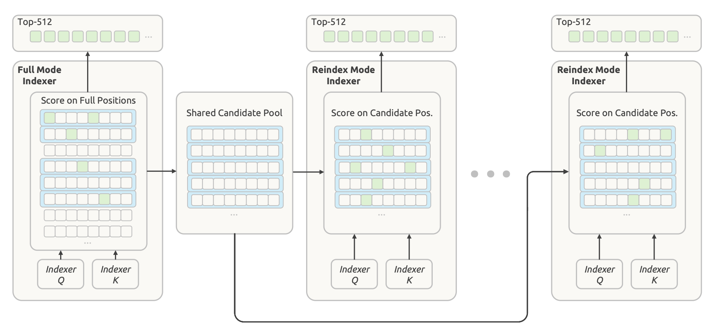

# 06 · Hierarchical Sparse Indexer：分层稀疏索引如何缩小后续搜索范围

> 状态：已完成  
> 深度：重点 · 长上下文检索  
> 论文定位：第 11–12、22、37 页；Figure 5

## 本篇只回答一个问题

**怎样减少后续 Reindex 层对超长历史的重复扫描，同时允许不同层选择不同的历史位置？**

一句话回答：**Decoder 的第一个 Full 层扫描全部历史位置，同时产生自己的 Top-512 和一个比完整历史小、但比 Top-512 大的共享候选池；后续 Reindex 层只在候选池中重新选择，Reuse 层沿用最近的 Top-512。**

## 1. 从 CSA2 留下的问题开始

Compressed Sparse Attention 2（CSA2，压缩稀疏注意力 2）已经减少了运行 Indexer 的层数：

- Full 层执行完整索引；
- Reindex 层重新索引；
- Reuse 层沿用最近的 Top-K，不执行索引。

但如果 Full 和 Reindex 都对全部历史位置评分，在百万级上下文中仍然很贵。Hierarchical Sparse Indexer（分层稀疏索引器）继续缩小每次 Reindex 的搜索范围。

先看 Figure 5 从左到右的结构：

1. 第一个 **Full Mode Indexer** 扫描全部因果可见位置；
2. 中间形成 **Shared Candidate Pool**；
3. 第一个 **Reindex Mode Indexer** 在候选池内评分；
4. 更深的 Reindex 层继续使用同一个候选池，但可以产生不同的 Top-512。



> 来源：DeepSeek-V4.1-Flash 技术报告 Figure 5。Figure 5 只画了需要执行 Indexer 的 Full 和 Reindex；Reuse 不执行新的索引，因此没有画入主流程。

## 2. 先读懂图中的位置、行列和颜色

### 2.1 一个 token position 是什么

文本经过 tokenizer 后会变成一串 token。每个 token 在序列中占据一个位置，这就是一个 **token position**。

```text
token     [用户] [要求] [修改] [这段] [代码]
position     1      2      3      4      5
```

token 不一定对应一个完整汉字、单词或句子。position 只表示它在序列中的顺序。每个历史位置都会对应自己的隐藏状态、Indexer K 和 Main KV 条目；Figure 5 的一个小方格表示一个可以被 Indexer 评分和选择的历史位置。

对于当前 decode query，因果可见的历史包括：

```text
原始 Prompt token + 已经生成的 token
                  ↓
          当前 query 可见的历史位置
```

因此，本篇中的 `N` 是**当前 query 可以看到的全部历史 token positions 数量**。第一次生成时，它基本等于 Prompt 的 token 数；继续生成后，已经生成的 token 也会加入历史。

Hierarchical Sparse Indexer 只用于 Causal Encoder-Decoder（CED，因果编码器—解码器）的 Decoder。V4.1-Flash 的 Decoder 使用 `m=1`，所以这里的 Main KV 位置与历史 token position 一一对应。

### 2.2 一个 block 是怎么来的

模型按照序列顺序，每 8 个连续位置组成一个 **block**：

```text
位置  1～8   → Block 1
位置  9～16  → Block 2
位置 17～24  → Block 3
```

Block 不是根据语义切分出的句子、代码段或文档块，也不是 tokenizer 产生的新 token。它只是为了提高筛选效率，将连续位置按固定大小分组；最后不足 8 个位置时，最后一块的有效位置数可以少于 8。

对应到 Figure 5：

- 一行表示一个 block；
- 一行内横向的 8 个小方格表示该块的 8 个连续位置；
- 纵向的不同行表示沿历史序列排列的不同 block；
- 省略号表示真实上下文中还有大量没有画出的 block；
- 横向的 8 列是块内偏移，不是注意力头、隐藏维度或 Transformer 层。

顶部的 `Top-512` 方框也不是一个 block。它只是把当前层最终选中的 512 个位置集中画出来，不再保留这些位置原来的块布局。

### 2.3 不同颜色分别表示什么

根据 Figure 5 的原文图注：

| 图形 | 含义 |
|---|---|
| 白色小方格 | 一个历史位置，但没有被当前层选入最终 Top-512 |
| 绿色小方格 | 当前 Indexer 最终选中的位置，即当前层 Top-512 的成员 |
| 浅蓝色条带 | 根据块内最大 Indexer score 选中的 block |
| 灰色边框和箭头 | 图形结构与数据流，没有额外的选择语义 |

最容易混淆的是蓝色和绿色：

> **蓝色表示“整个 block 进入候选池”，绿色表示“单个位置进入当前层的最终 Top-512”。**

所以，一个蓝色 block 中可以没有绿色位置。它仍然被保留，是为了给后续 Reindex 层留下更宽的搜索范围。

## 3. Full 层同时完成两种筛选

观察 Figure 5 最左侧的 `Full Mode Indexer`。当前 query 产生 Indexer Q，全部历史位置已经具有对应的 Indexer K。Full 层对所有因果可见位置进行评分。

简化表示为：

$$
s_i=\operatorname{IndexerScore}(q,k_i)
$$

其中：

- `q` 是当前 query 的 Indexer Q；
- `k_i` 是第 `i` 个历史位置的 Indexer K；
- `s_i` 是该位置的 Indexer score。

得到全部位置的分数后，同一批分数沿两条路径同时筛选。

### 3.1 位置级筛选：产生 Full 本层的 Top-512

Full 直接从全部位置中选择分数最高的 512 个：

$$
T_{\text{Full}}
=
\operatorname{Top512}\left(\{s_i\}_{i=1}^{N}\right)
$$

它们对应左侧矩阵里的绿色方格，以及左上方的 `Top-512` 输出。这些 indices 随后用于从 Main KV Cache 中读取 Full 本层真正参与稀疏注意力的 512 个 Main KV 条目。

### 3.2 块级筛选：建立共享 Candidate Pool

假设第 `j` 个 block 为：

$$
B_j=\{i_{j,1},i_{j,2},\ldots,i_{j,8}\}
$$

该 block 的分数取块内 8 个位置分数的最大值：

$$
b_j=\max_{i\in B_j}s_i
$$

然后从所有 block 中最多选择分数最高的 2,048 个：

$$
J=\operatorname{Top2048}\left(\{b_j\}\right)
$$

这些入选 block 对应 Figure 5 左侧的蓝色条带。模型随后将它们覆盖的**全部位置**放入 Candidate Pool：

$$
C=\bigcup_{j\in J}B_j
$$

候选池最多包含：

$$
|C|\leq2048\times8=16384
$$

Candidate Pool 收集的是入选 block 中的全部 8 个位置，不只是其中的绿色位置。这就是 Figure 5 中间候选池主要用蓝色条带表示的原因：这里记录的是后续层可以搜索哪些位置，不是重复展示 Full 已经选择过哪些位置。

## 4. 2,048、8、16,384 和 512 对应哪里

| 数量 | Figure 5 中的含义 |
|---:|---|
| 8 | 一条蓝色 block 中横向排列的位置数 |
| 2,048 | Full 层最多选择的蓝色 block 数量 |
| 16,384 | 入选 block 覆盖的候选位置上限，即 `2,048 × 8` |
| 512 | 每个 Full 或 Reindex 层最终选择的绿色位置数量 |

这构成两级筛选：

$$
N\text{ 个全部历史位置}
\longrightarrow
\leq 16384\text{ 个候选位置}
\longrightarrow
512\text{ 个实际读取位置}
$$

候选池相对完整历史更窄，但最多是最终 Top-512 的 32 倍：

$$
\frac{16384}{512}=32
$$

对于超长上下文，三者的典型大小关系是：

$$
512\leq|C|\leq16384\leq N
$$

如果当前可见历史不足 16,384 个位置，候选池自然不会达到上限。

## 5. Reindex 如何在同一候选池中重新选择

看 Figure 5 中间和右侧的 `Reindex Mode Indexer`。这些层不再面对全部 `N` 个历史位置，而只面对 Shared Candidate Pool 中的位置。

对于第 `l` 个 Reindex 层：

1. 该层产生自己的 Indexer Q；
2. 复用 Full 层生成的 Indexer K；
3. 只对候选池 `C` 中的位置重新评分；
4. 从候选池中选出属于该层的 Top-512。

$$
s_i^{(l)}
=
\operatorname{IndexerScore}(q_l,k_i),
\qquad i\in C
$$

$$
T_l
=
\operatorname{Top512}
\left(\{s_i^{(l)}\mid i\in C\}\right)
$$

Figure 5 不同 Reindex 面板中的绿色位置不同，表示不同层可以产生不同的最终选择：

$$
T_{l_1}\neq T_{l_2}
$$

中间 Candidate Pool 到最右侧 Reindex 的长箭头表示：同一个 query 的候选池会跨后续索引层共享，不只供紧邻的一个 Reindex 使用。

这里涉及三层不同的集合：

| 集合 | 决定什么 | 是否跨 Reindex 层变化 |
|---|---|---|
| 全部因果可见位置 | 第一个 Full 能搜索的完整范围 | 随 query 的可见历史变化 |
| Candidate Pool | 后续 Reindex 被允许搜索的范围 | 同一 query 的后续索引层共享 |
| 某层 Top-512 | 该层实际读取哪些 Main KV | 每个 Reindex 层可以不同 |

## 6. 为什么不直接让所有层复用 Full 的 Top-512

如果后续所有层都直接复用 Full 的 Top-512，确实更省计算，但所有层只能查看同一批历史位置。

不同深度的层可能需要不同信息。以代码 Agent 为例：

- 浅层可能优先关注用户最近提出的修改要求；
- 中间层可能更需要函数定义、类型约束或较早的工具结果；
- 更深层可能重新关注测试失败与调用关系。

因此，架构没有把后续搜索范围直接冻结成 512 个位置，而是保留一个最多 16,384 个位置的中间候选池：

```text
每个索引层扫描全部 N 个位置
    搜索灵活，但超长上下文代价高

所有层固定复用同一 Top-512
    代价最低，但深层无法改变选择

共享 Candidate Pool，各 Reindex 产生自己的 Top-512
    缩小搜索范围，同时保留跨层选择差异
```

Reuse 层走得更远：它不生成 Indexer Q，也不进行新的评分，直接沿用最近一次 Full 或 Reindex 产生的 Top-512。

## 7. 为什么 block 分数取最大值

论文明确规定：

$$
b_j=\max_{i\in B_j}s_i
$$

但报告没有给出严格的理论证明。可以用下面的直觉理解：

> 一个 block 只要存在一个高度相关的位置，就保留整个 block，避免这个局部强信号被其余低分位置的平均值稀释。

整块保留还会带上强相关位置周围的几个相邻位置。对于代码片段、工具调用和结构化记录，这些邻近位置可能补充必要的局部语义。这是机制直觉，不是报告已经证明的理论结论。

作者还指出，Decoder 中较浅 Indexer 的信息可以自然限制深层 Indexer 的候选范围，而不需要另外建立块级表示或长期缓存新的块级状态。这里主要复用了首个 Full 已经计算的位置分数；候选 indices 本身仍需要在当前 query 的后续索引层之间传递。

## 8. 它究竟减少了多少扫描

V4.1-Flash 的 20 个 Decoder 层包含：

- 1 个 Full 层；
- 4 个 Reindex 层；
- 15 个 Reuse 层。

如果没有分层候选池，5 个运行 Indexer 的层都可能扫描完整历史。仅按被评分的位置数粗略计算：

$$
5N
$$

加入 Hierarchical Sparse Indexer 后：

$$
N+4C,
\qquad C\leq16384
$$

假设当前 query 可以看到 100 万个历史位置。每 8 个位置组成一块，一共约有：

$$
\frac{1{,}000{,}000}{8}=125{,}000\text{ 个 block}
$$

没有分层候选池时，5 个索引层合计可能评分：

$$
5N=5{,}000{,}000\text{ 个位置}
$$

使用分层候选池后，最多评分：

$$
1{,}000{,}000+4\times16{,}384=1{,}065{,}536\text{ 个位置}
$$

这个数字只用于理解搜索范围，不等于端到端推理加速比。实际推理还包含注意力、Mixture-of-Experts（MoE，混合专家）、缓存读取和其他计算。

需要保留的复杂度边界是：

- 第一个 Full 仍扫描全部历史，成本为 `O(N)`；
- 后续每个 Reindex 最多扫描 `C = 16,384` 个位置，固定候选池大小时成本为 `O(C)`；
- Reuse 不运行 Indexer。

因此不能写成“整个索引成本与上下文长度无关”。准确说法是：

> **分层稀疏索引将后续 Reindex 的搜索成本限制在固定大小的候选池内，但保留了第一次完整范围扫描。**

## 9. Candidate Pool 是什么状态

Candidate Pool 是：

- 针对当前 decode query 建立的；
- 由第一个 Full 层产生的；
- 在该 query 后续的 Decoder 索引层之间共享的；
- 用来限制 Reindex 搜索域的临时候选范围。

它不是：

- 整个请求永久不变的全局候选池；
- Main KV Cache 的替代品；
- 当前层实际读取的全部 Main KV；
- 最终 Top-512。

下一个 decode query 的 Indexer Q 会变化，因果可见范围也可能增加，因此会重新执行相应的 Full 选择流程。

## 10. 训练适配、Agent 意义与风险

Hierarchical Sparse Indexer 在后训练阶段引入，并且训练与推理采用相同的候选限制。因此，深层 Indexer 会在部署时真正可见的搜索域中学习选择，而不是推理时临时缩小一个按完整搜索训练出的 Indexer。

对长任务 Agent，它主要改善的是重复检索成本：

```text
长代码仓库、工具轨迹、多轮任务历史
              ↓
Full 对完整历史做一次高召回筛选
              ↓
后续 Reindex 在候选池中调整关注位置
              ↓
Reuse 继续复用最近选择
```

它也引入了明确的错误传播边界：

> 如果第一个 Full 没有把关键位置所在的 block 放进 Candidate Pool，后续 Reindex 无法跳出候选池将它找回。

报告结尾将 CSA2 的潜在 selection errors 和超长上下文稀疏检索的鲁棒性列为尚未充分刻画的边界。内部评测没有观察到系统性能力下降，但这不是对所有极端输入的保证。

因此，“支持 1M 上下文”不能直接等同于“能够可靠找回其中任意信息”。对 Agent 来说，关键历史首先要通过 Full 层的块级召回，才有机会被深层重新选择并用于注意力。

## 本篇结论

Figure 5 描述的是一套两级检索：

```text
当前 query 可见的 N 个历史位置
              ↓
每 8 个连续位置组成一个 block
              ↓
Full 对全部位置评分
       ├─ 位置级 Top-512 → Full 本层读取
       └─ 块级 Top-2,048 → 最多 16,384 个候选位置
                                  ↓
                    后续 Reindex 各选自己的 Top-512
                                  ↓
                    Reuse 沿用最近一次 Top-512
```

CSA2 决定“哪些层需要重新索引”，Hierarchical Sparse Indexer 决定“重新索引时需要搜索多大范围”。两者配合后，Decoder 既能周期性改变全局检索结果，又不需要每个 Reindex 层都重新扫描完整长上下文。

## 自检问题

1. Figure 5 中的绿色位置、蓝色 block 和顶部 Top-512 分别代表什么？
2. 为什么 Candidate Pool 最多包含 16,384 个位置，却没有把后续层的选择固定成 Full 的 Top-512？
3. 为什么不能说 Hierarchical Sparse Indexer 让全部索引成本与上下文长度无关？
4. 如果第一个 Full 漏掉了关键 block，后续 Reindex 能否恢复？为什么？

## 与下一篇的衔接

至此，CED、CSA2 和 Hierarchical Sparse Indexer 已经解释了 Prefill 计算、跨层缓存与长历史检索如何缩减。下一篇转向局部状态：当 Agent 暂停后恢复、局部 SWA 状态没有长期保存时，模型怎样只回放一个有限窗口重新开始计算。

---

[返回目录](./README.md) · [上一篇：05-CSA2](05-CSA2.md) · [下一篇：07-Encoder状态与KV缓存](07-Encoder状态与KV缓存.md)
