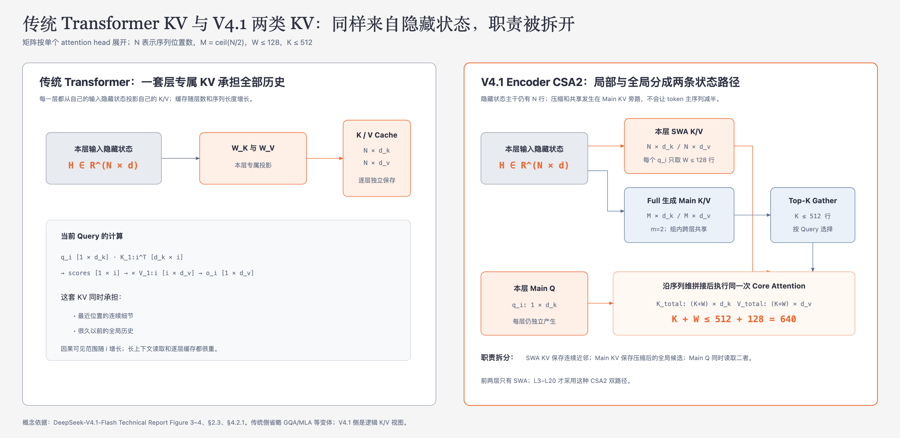
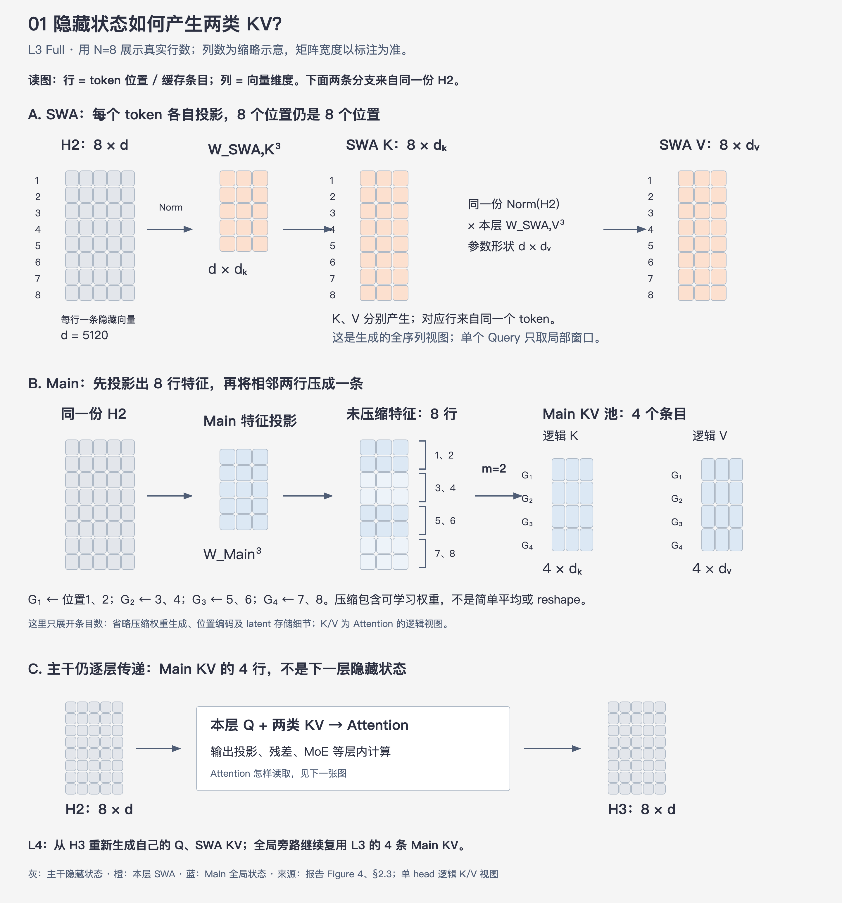
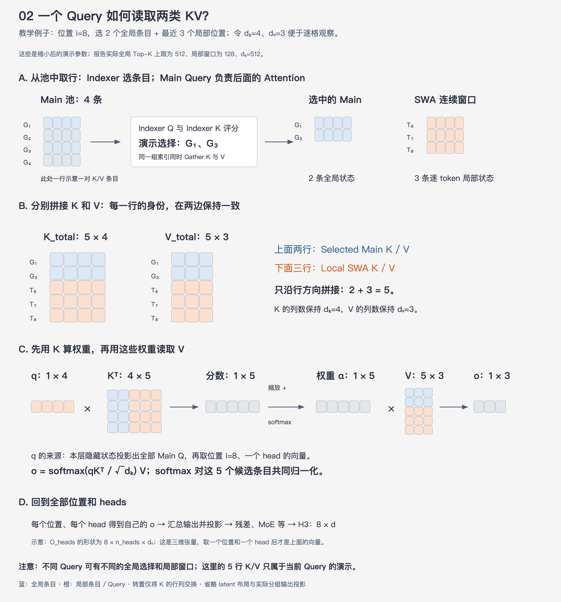

# 07 · Encoder 状态与 KV 缓存：隐藏状态、SWA KV 和 Main KV 如何流动

> 状态：已完成  
> 深度：重点 · SWA Bounded Replay 前置  
> 论文定位：第 7、10、19–20、22 页；Figure 3–4

## 本篇只回答一个问题

**一个 token 经过 Encoder 时，隐藏状态如何产生 Sliding-Window Attention KV（SWA KV，滑动窗口注意力键值）和 Main KV；三者分别怎样流动、使用和缓存？**

一句话回答：**隐藏状态是逐层传递的计算主干，每层都从本层输入隐藏状态产生自己的 SWA KV；只有 Compressed Sparse Attention 2（CSA2，压缩稀疏注意力 2）的 Full 层额外产生压缩 Main KV，供同组多层共享和稀疏读取。`m=2` 只把 Main KV 的序列条目压到约一半，不会压缩隐藏状态或 SWA KV。**

这篇先把“状态从哪里来”讲清楚。状态丢失以后为什么需要回放，放在下一篇。

## 1. 先用传统 Transformer 建立基线

设序列有 `N` 个 token，第 `l` 层收到的隐藏状态为：

$$
H^{l-1}\in\mathbb{R}^{N\times d}
$$

其中一行对应一个 token position，`d` 是隐藏维度。V4.1-Flash 的 `d=5120`。

传统 Transformer 在每一层用本层参数投影 Query、Key 和 Value：

$$
Q^l=H^{l-1}W_Q^l,
\qquad
K^l=H^{l-1}W_K^l,
\qquad
V^l=H^{l-1}W_V^l
$$

生成位置 `i` 时，本层 Query 读取因果可见的历史 K/V：

$$
o_i^l=
\operatorname{softmax}
\left(
\frac{q_i^l(K_{1:i}^l)^T}{\sqrt{d_k}}
\right)V_{1:i}^l
$$

这里要分清两类状态：

- `H^{l-1}` 是本层计算输入，经过 Attention、残差、Mixture-of-Experts（MoE，混合专家）等得到 `H^l`，继续传给下一层。
- `K^l/V^l` 是从隐藏状态投影出的 Attention 读取状态，用于后续 Query 回看历史；它不是传给下一层的主干隐藏状态。

传统方案中，每层的一套 KV 同时承担最近局部信息和全部长历史。长上下文下，序列越长、层数越多，缓存与读取成本越高。



V4.1 将这套职责拆成：

- ##### **SWA KV**：保存连续的近期局部状态；
- **Main KV**：保存压缩后的全局候选状态，再由 Indexer 稀疏选择。

二者最后仍进入同一次 Core Attention，不是两个互不相干的输出分支。

## 2. Encoder 的实际层结构

V4.1-Flash 的 Encoder 共 20 层：

```text
L1–L2：纯 SWA

L3 Full  → L4–L8  Reuse ×5
L9 Full  → L10–L14 Reuse ×5
L15 Full → L16–L20 Reuse ×5
```

### 2.1 为什么前两层只有 SWA

L1、L2 只建立局部注意力状态，不产生 Main KV、Indexer K 或全局 Top-K。第一个全局分支从 L3 Full 才开始。

报告只给出这一配置，没有提供“为什么恰好两层”或“纯 SWA 层数”的独立消融。可以使用的结构直觉是：浅层先建立 token、短语和邻近关系，同时省去最浅层的全局缓存与索引成本。这个解释不是论文已经证明的最优性结论。

前两层虽然没有 Global KV，它们的 SWA KV仍属于 Encoder 的短期局部状态。处理新 suffix 时，如果缓存边界处的 L1/L2 SWA KV缺失，后面的持久 Global KV不能替代它们，系统需要从 L1 开始回放最近窗口。旧 Prefix 的 Global KV本身仍然有效。

### 2.2 后 18 层为什么是 Full + Reuse

每组六层只有 Full 生成 Main KV和 Indexer K，后五个 Reuse 层共享它们。每个 Reuse 层仍会产生自己的 Main Q、SWA KV并执行 Core Attention。

因此“共享”发生在全局历史旁路；隐藏状态主干仍然逐层更新：

```text
H2 → L3 → H3 → L4 → H4 → … → H20
```

Full、Reuse 具体复用哪些状态，见 [05-CSA2](05-CSA2.md)。

## 3. 一个 Full 层怎样从隐藏状态生成两类 KV

下面以 L3 Full 为例。它接收 L2 输出 `H2`，其中仍有 `N` 个位置。先用 `N=8` 的小例子观察行数变化；图中矩阵的列数经过缩略，准确维度以文字标注为准。



读这张图时，先把**行**理解为 token position 或缓存条目，把**列**理解为一条向量的维度：

- `H2` 有 8 行，每行是一条 `d=5120` 维隐藏向量。
- SWA K 和 SWA V 分别由本层参数投影产生，仍各有 8 行，每一行对应原来的同一个 token。
- Main 分支先产生 8 行未压缩特征，再按 `m=2` 将相邻两个来源位置压成一个全局条目，因此得到 4 条 Main KV。
- L3 完成 Attention、输出投影、残差和 MoE 等层内计算后，输出 `H3` 仍为 8 行。4 条 Main KV 是供 Attention 读取的旁路状态，不是传给 L4 的隐藏状态。

图中将 Main K/V 画成供 Attention 使用的逻辑视图。实际实现还包含压缩权重、位置编码和 latent 存储等细节，本篇只追踪“多少个位置、每个位置变成什么状态”。

### 3.1 SWA 分支：逐位置、逐层产生

L3 使用本层专属参数，从 `H2` 投影 SWA K/V：

$$
K_{\mathrm{SWA}}^3
=
\operatorname{Norm}(H^2)W_{\mathrm{SWA},K}^3
$$

$$
V_{\mathrm{SWA}}^3
=
\operatorname{Norm}(H^2)W_{\mathrm{SWA},V}^3
$$

按单个 Attention head 的逻辑视图：

$$
K_{\mathrm{SWA}}^3\in\mathbb{R}^{N\times d_k},
\qquad
V_{\mathrm{SWA}}^3\in\mathbb{R}^{N\times d_v}
$$

完整 Prefill 中，每个位置都会产生本层 SWA K/V；但位置 `i` 的 Query 只读取连续窗口：

$$
W_i=\min(i,n_{\mathrm{win}}),
\qquad n_{\mathrm{win}}=128
$$

所以“生成轨迹有 `N` 行”和“一个 Query 最多读取 128 行”并不矛盾。会话续接真正需要短期保留的是 Prefix 边界末尾的窗口状态。

L4 会从 `H3` 使用自己的参数重新产生 L4 SWA KV，不能直接沿用 L3 SWA KV：

$$
K_{\mathrm{SWA}}^4
=
\operatorname{Norm}(H^3)W_{\mathrm{SWA},K}^4
$$

不同层的输入表示和投影参数都不同，因此每层 SWA KV都是层专属状态。

### 3.2 Main KV 分支：Full 产生、组内共享

L3 Full 还从 `H2` 走一条全局旁路。简化表示为：

$$
\widetilde{C}^{3}
=
\operatorname{MainProjection}_3(H^2)
$$

此时仍对应 `N` 个来源位置。CSA2 的非重叠压缩器按 `m=2` 将相邻两个来源位置形成一个 Main KV条目：

$$
M=\left\lceil\frac{N}{2}\right\rceil
$$

按供 Core Attention 使用的逻辑 K/V 视图：

$$
K_{\mathrm{Main}}^3\in\mathbb{R}^{M\times d_k},
\qquad
V_{\mathrm{Main}}^3\in\mathbb{R}^{M\times d_v}
$$

压缩器是模型学习到的变换，不能理解为简单平均两个 token。Main KV还会产生 Indexer K，用于确定每个 Query 要读取哪些全局条目。

L4–L8 不会再把 L3 Main KV压成 `N/4、N/8……`。它们复用的始终是 L3 生成的同一份约 `N/2` 行 Main KV。到了 L9 Full，模型重新从当时仍有 `N` 行的 `H8` 产生一份新的约 `N/2` 行 Main KV。

因此三种条目数关系是：

| 状态 | 序列条目数 | 是否传给下一层 | 是否跨层共享 |
|---|---:|---|---|
| 隐藏状态 `H^l` | `N` | 是，作为主干输入 | 否，每层都会更新 |
| 本层 SWA KV | 完整计算轨迹 `N`；单次读取最多 `128` | 否 | 否，每层独立 |
| Encoder Main KV | 约 `ceil(N/2)` | 否，作为 Attention 旁路 | 是，Full 对应组内共享 |

## 4. Main Q 怎样同时读取两类 KV

报告设置：Query heads 数 `H=64`、head dimension `d_k=512`、全局 Attention Top-K 为 `512`、SWA 窗口为 `128`。

下面继续使用缩小后的例子：当前 Query 属于位置 `i=8`，Indexer 从 4 个 Main 条目中选出 `G1、G3`，SWA 提供最近的 `T6、T7、T8`。为逐格展示矩阵形状，图中临时令 `d_k=4、d_v=3`；这些不是报告的实际参数。



整条路径包含三个动作：

1. **选取条目。** Indexer Q 与 Indexer K 负责评分，得到全局条目索引；同一组索引分别从 Main K 和 Main V 中 Gather 对应行。Main Query 不负责产生这些索引。
2. **分别拼接。** Selected Main K 与 Local SWA K 沿行方向拼成 `K_total`；对应的 Main V 与 SWA V 拼成 `V_total`。K、V 两边的行身份和顺序必须一致。
3. **执行 Attention。** 当前 Main Query 先与 `K_total` 计算相关性和 softmax 权重，再用这些权重加权读取 `V_total`。

示例中两条全局状态和三条局部状态共同形成 5 个候选，所以 `K_total` 有 5 行，`V_total` 也有 5 行。K 的列数为 `d_k`，V 的列数为 `d_v`，二者不要求相同。

对于位置 `i` 的一个 Query head，Indexer 先从完整 Main KV Pool 中选出 `K_i≤512` 个条目；SWA 分支提供 `W_i≤128` 个连续条目。K和V分别沿序列维拼接：

$$
K_i^{\mathrm{total}}
=
\operatorname{Concat}
\left(
K_{i,\mathrm{selected}}^{\mathrm{Main}},
K_{i,\mathrm{window}}^{\mathrm{SWA}}
\right)
\in\mathbb{R}^{S_i\times d_k}
$$

$$
V_i^{\mathrm{total}}
=
\operatorname{Concat}
\left(
V_{i,\mathrm{selected}}^{\mathrm{Main}},
V_{i,\mathrm{window}}^{\mathrm{SWA}}
\right)
\in\mathbb{R}^{S_i\times d_v}
$$

其中：

$$
S_i=K_i+W_i\leq512+128=640
$$

Main Q不会直接与一个混合的“KV矩阵”一步相乘。准确过程是：

$$
[1\times d_k]\,[d_k\times S_i]
\longrightarrow
[1\times S_i]
$$

$$
[1\times S_i]\,[S_i\times d_v]
\longrightarrow
[1\times d_v]
$$

第一步中的第二个矩阵是转置后的 `K_total^T`。它输出 `S_i` 个分数；经过缩放和 softmax 后得到 `S_i` 个权重。第二步使用同一组权重组合 `V_total` 的 `S_i` 行，得到当前位置、当前 head 的输出向量。

对全部 `N` 个位置、64 个 Query heads完成计算后，多头结果经过输出投影：

$$
O_{\mathrm{heads}}\in\mathbb{R}^{N\times64\times d_v}
\longrightarrow
H^3\in\mathbb{R}^{N\times d}
$$

这解释了为什么 Main KV只有约 `N/2` 个全局条目，而 L3 输出隐藏状态仍然有 `N` 行：每个 Query 都产生一个输出，输出行数由 Query 的位置数决定，不由它读取了多少条 KV 决定。`O_heads` 是一个三维张量；图中放大的 `q` 和 `o` 是从中固定一个位置、一个 head 后得到的向量。

## 5. 一次正常模型调用中，这些状态怎样变化

### 5.1 Prompt Prefill

假设第一轮输入有 `N` 个 token：

1. L1、L2 逐位置产生各自 SWA KV，并输出 `H1、H2`。
2. L3 Full 从 `H2` 产生本层 SWA KV、约 `N/2` 条 Main KV及 Indexer K。
3. L4–L8 各自产生 SWA KV和 Main Q，同时读取 L3共享的 Main KV。
4. L9和L15分别建立后两组新的 Main KV；隐藏状态主干始终维持 `N` 个位置。
5. L20输出 `H20`，供 Causal Encoder-Decoder（CED，因果编码器—解码器）构造 Decoder Global KV。

### 5.2 Decode 生成一个新 token

生成的新 token `t` 完成逐层计算后，会产生自己的隐藏状态与本层 SWA K/V。每层局部窗口追加新条目并移出过早位置。对 Decoder 全局分支而言，`t` 的 `H20` 经 Full 层对应投影形成一条新的 Main KV和Indexer K；由于 Decoder 的压缩率 `m=1`，它可以直接追加到已有全局内容池，供后续 token使用，不需要重新组合整个历史Main KV。

这里必须把“内容池扩展”和“当前Query筛选”分开：

1. **追加Global KV内容**：新位置形成新的Main KV/Indexer K条目，旧条目不重算。
2. **为下一个Query重新索引**：Decoder第一个Full Indexer根据新的Indexer Q，对当前全部可见Indexer K评分，生成本Query的Top-512和Candidate Pool。
3. **只读取入选内容**：Top-K决定当前Query从Main KV Pool读取哪些条目，不决定哪些条目可以留在缓存中。

Figure 5中每8个位置组成block，只是Hierarchical Sparse Indexer（分层稀疏索引器）构造候选池时的搜索分组，不是生成Main KV的条件。尾部block不足8个位置时，逻辑上只对已有有效位置评分；它不需要等到8个位置凑齐后才把新token加入全局内容池。报告没有展开尾部block的padding或mask实现细节。

新位置的Indexer score也不保证很高。如果它没有进入当前Query的Top-K，它仍保留在Main KV Pool中，之后的Query可能用不同分数选中它；同时，近期token还会通过连续SWA窗口被读取。

这里的关键不是保存每一层完整隐藏状态，而是保存后续 Attention 仍需复用的 KV状态。隐藏状态通常只在当前前向计算中逐层传递；长期保留所有层隐藏状态会抵消缓存压缩收益。

### 5.3 本轮结束后

V4.1 的部署策略按复用规律管理状态：

- Global KV进入持久缓存，保证至少 72 小时生命周期；
- Encoder SWA KV进入约占每台机器 10% Host DRAM的短期分布式池，TTL只有数分钟；
- Decoder SWA KV不进入 Prefix Cache，下次 Prefill按需重建。

Global KV适合长尾复用，因为旧 Prefix 很久以后仍可能再次命中；SWA KV主要服务活跃会话的下一次续接，窗口短、过期快。下一篇会解释短期 SWA状态未命中时如何继续。

## 6. 放回 Agent Loop

代码 Agent 第一轮读取仓库和任务描述，Encoder 将完整输入编码成逐层隐藏状态，同时形成局部 SWA状态和全局 Main KV。模型生成工具调用后，工具结果作为新 suffix追加。

如果下一轮很快到来，短期 Encoder SWA KV仍在，模型可以复用 Prefix边界的局部窗口并继续处理 suffix；如果几分钟后 SWA状态已经过期，但长期 Global KV仍命中，模型拥有“长期全局记忆”，却缺少从缓存边界继续计算所需的“逐层近期工作状态”。这正是 SWA Bounded Replay 的触发场景。

## 需要记住的六句话

1. 隐藏状态是层间主干；KV是 Attention 为以后读取准备的状态。
2. 每个 Encoder 层都有自己的 SWA KV，前两层只有 SWA。
3. Main KV只由 Full 层产生，并在对应 CSA2 组内共享。
4. `m=2` 只压缩 Main KV条目，不压缩 `N` 个隐藏状态位置。
5. 每个 Query最多拼接 512 个 Selected Main KV和128个局部 SWA KV。
6. Global KV长期保留，Encoder SWA KV短期保留；状态寿命差异引出了 Bounded Replay。

## 自检

1. 为什么 L3 Main KV只有约 `N/2` 行，L3输出隐藏状态仍有 `N` 行？
2. L4的 SWA KV和 Main KV分别从哪里来？
3. 对一个 Query来说，`512+128` 代表什么，为什么不是完整 Main KV Pool 的大小？
4. 为什么不能用命中的 Main KV代替丢失的 L1/L2 SWA KV？

## 与后续内容的衔接

本篇解释状态怎样产生与保存；下一篇回答：**短期 SWA KV缺失后，为什么精确恢复会扩大到 `L×nwin`，V4.1 又怎样把回放限制在最近128个 token？**

---

[返回目录](./README.md) · [上一篇：06-分层稀疏索引](06-分层稀疏索引.md) · [下一篇：08-SWA有界回放](08-SWA有界回放.md)
