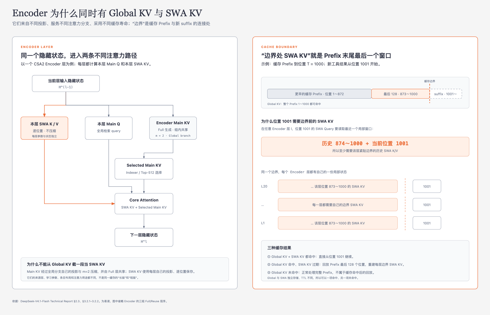
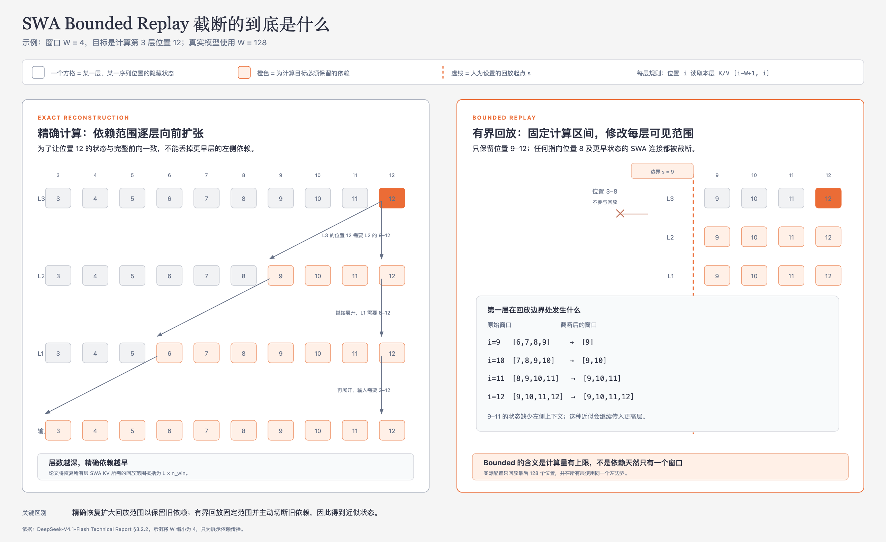
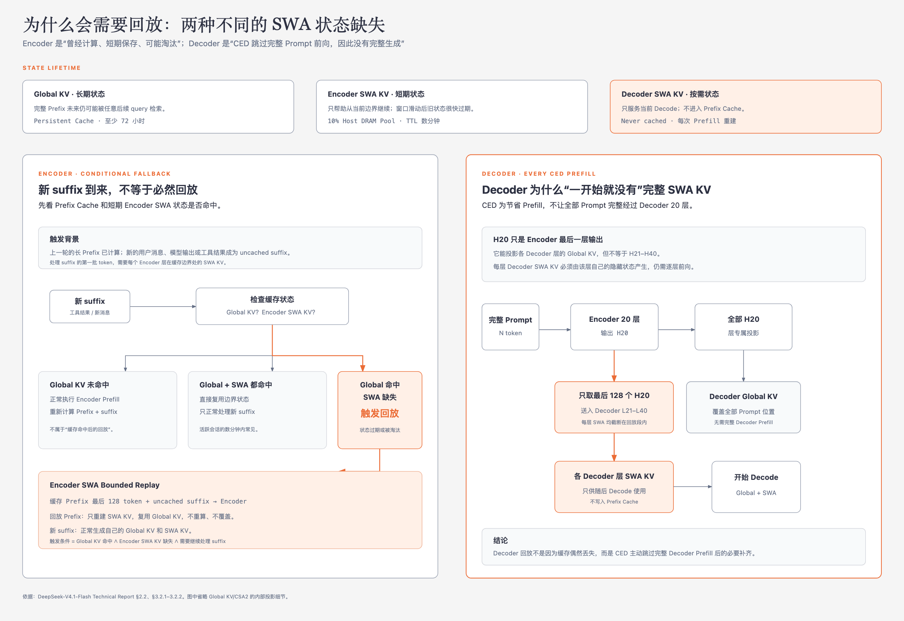

# 08 · SWA Bounded Replay：用有限回放恢复逐层局部状态

> 状态：已完成  
> 深度：重点 · 架构与部署的连接  
> 论文定位：第 9、19–20、37 页

## 本篇只回答一个问题

**Sliding-Window Attention KV（SWA KV，滑动窗口注意力键值）为什么需要回放，以及 V4.1 为什么只回放最近128个 token 就能将昂贵的缓存缺失降为可接受的近似恢复？**

一句话回答：**Global KV可以长期命中，但逐层 SWA KV只做分钟级短期缓存或根本不进入 Prefix Cache；缺失后，为了从缓存 Prefix继续处理新 suffix，必须重新得到各层边界局部状态。精确恢复的依赖会随层数向前扩张到约 `L×nwin`，SWA Bounded Replay把每层可见范围截在同一个128-token回放段内，只运行这128个位置，以小幅近似误差换取大幅计算与持久存储节省。**

## 1. 为什么会突然出现“回放”

在一次没有缓存缺失的连续前向中，SWA KV确实会随着 token逐层正常产生：

```text
本层输入隐藏状态
    ↓ 本层 SWA K/V投影
本层 SWA KV
    ↓ Attention读取最近窗口
本层输出隐藏状态
    ↓
进入下一层
```

这时不需要回放。回放只出现在**要从历史 Prefix的缓存边界继续计算，但边界处逐层 SWA KV不在了**，或者 Causal Encoder-Decoder（CED，因果编码器—解码器）为了节省 Prefill、从未为完整 Prompt建立 Decoder SWA KV的场景。

### 1.1 为什么 SWA KV会缺失

V4.1根据不同复用规律管理缓存：

| 状态 | 存放策略 | 生命周期 | 原因 |
|---|---|---|---|
| Global KV | Persistent KV Cache，SSD或Host Memory | 保证至少72小时 | 完整Prefix可能在很久以后再次命中 |
| Encoder SWA KV | 每台机器约10% Host DRAM组成的分布式池 | 数分钟TTL | 主要服务活跃会话的近期续接 |
| Decoder SWA KV | 不进入Prefix Cache | 当前Prefill/Decode使用 | CED每次可从最近Encoder输出按需重建 |

在上一代V4部署中，Global KV和SWA KV都进入持久缓存，并使用 Least Recently Used（LRU，最近最少使用）策略管理。虽然只在Prompt末尾和Output末尾保存一个窗口的SWA KV，它仍占接近一半的持久KV容量。

报告观察到两类缓存的访问规律并不匹配：Global KV有长尾复用，SWA KV通常只在活跃会话的分钟级窗口内复用，下一轮开始或会话结束后很快失去价值。因此V4.1取消SWA KV的长期持久化，用短期DRAM池承接大多数活跃会话；短期状态过期时再触发轻量回放。

### 1.2 “缓存边界”是什么

假设命中的Prefix覆盖位置1～1000，新工具结果是从位置1001开始的uncached suffix。1000和1001之间就是本次缓存命中边界。

位置1001在Encoder每一层都要形成自己的SWA Query。窗口大小为128时，它正常需要读取：

$$
[1001-128+1,1001]=[874,1001]
$$

其中位置1001自己的K/V可以从当前隐藏状态投影；真正需要从历史继承的是位置874～1000的127组本层SWA K/V。

如果这些状态仍在短期池中，可以直接复用历史窗口并追加位置1001，不需要整体重算。如果它们已经过期，Global KV虽然仍然命中，却无法替代层专属、逐位置的SWA K/V，于是需要回放Prefix末尾。



## 2. 缓存判断发生在什么时候

“先看Global KV是否命中”描述的是服务系统的决策逻辑，不是Encoder的层执行顺序。请求进入推理服务后，系统先根据Prefix Cache Key查询持久Global Cache和短期SWA Pool，此时模型还没有开始执行L1。

逻辑可以写成：

| Global KV | Encoder SWA KV | 处理方式 |
|---|---|---|
| 未命中 | 无论是否存在 | 正常处理完整Prefix，重新生成所需状态 |
| 命中 | 命中 | 从命中边界直接处理uncached suffix |
| 命中 | 未命中 | Encoder SWA Bounded Replay |

Global KV未命中时，仅有最近窗口SWA KV不足以恢复完整全局历史，所以仍需正常Prefill。只有“Global命中、SWA未命中”的组合，才需要在复用长期状态的同时单独恢复局部状态。

真正执行时仍然从Encoder L1、L2开始。它们是纯SWA层，也正因为没有Global分支，边界SWA状态缺失后无法跳过。

## 3. 为什么精确恢复不只需要128个token

容易产生的直觉是：每层窗口只有128，所以回放最后128个token即可精确恢复所有层。问题在于**SWA依赖会跨层累积**。

用窗口 `W=4`、三层网络理解：

- 为恢复L3末尾4个位置，先需要这些位置对应的L2隐藏状态；
- L2末尾位置各自又依赖L2窗口内的L1输出；
- 为精确得到更早的L2输入，L1所需范围还要继续向前扩展。



单层局部不等于多层总体依赖也局部。理论接收域会随层数扩大。报告将恢复 `L` 层SWA KV所需的精确回放规模概括为：

$$
L\times n_{\mathrm{win}}
$$

对Encoder的20层和 `nwin=128`，概念上的精确恢复范围可达到：

$$
20\times128=2560\text{ token}
$$

这里表示随层累计的回放工作量或依赖范围量级，不应理解为每一层都读取一个2560-token的SWA窗口；每个单层窗口仍然只有128。

如果某一层SWA KV缺失，而系统恰好保存了该层最近窗口的精确输入隐藏状态，理论上只需从这些隐藏状态投影这一层K/V。但持久缓存不会长期保存所有层的历史隐藏状态，否则存储成本会重新变大。报告也没有描述逐层部分恢复机制。因此生产路径从Encoder L1开始回放最后一个窗口，而不是从序列位置1开始重算。

## 4. Bounded Replay到底截断了什么

SWA Bounded Replay仍然让回放段经过所有相关Transformer层。它截断的是：**回放段中每层Query继续向回放起点之前寻找SWA K/V的依赖。**

设回放从位置 `s` 开始，某层位置 `i` 的正常SWA窗口本应是：

$$
[i-W+1,i]
$$

Bounded Replay改成：

$$
[\max(s,i-W+1),i]
$$

例如回放位置873～1000，`s=873`、`W=128`：

- 位置873只能看到回放段内的873，不再要求745～872的历史SWA状态；
- 位置900只能看到873～900；
- 越接近位置1000，可见的回放段越完整；
- 位置1000可以看到873～1000的完整128-token窗口。

因此依赖不会从L20一路向位置873之前扩张。所有层都只处理同一段128个token，最左侧的状态接受被截断后的近似，随后近似逐层传播；靠近右侧缓存边界的位置拥有更完整的局部上下文。

这就是“Bounded”的含义：

```text
精确恢复：为了让回放段左侧也精确，不断向更早位置补依赖

有界恢复：固定回放起点s，任何层都禁止向s之前继续取SWA状态
```

它不是跳过某几层，也不是把128窗口改小，而是把所有层的回放限制在同一个序列边界内。

## 5. Encoder SWA Bounded Replay

触发条件是：

```text
Global KV命中
+ Encoder SWA KV未命中
+ 需要处理新的uncached suffix
```

处理过程：

1. 取缓存Prefix最后 `nwin=128` 个token作为replayed prefix。
2. 将replayed prefix与新的uncached suffix接在一起处理。
3. replayed prefix只用于重新生成各层SWA KV。
4. replay期间直接读取已命中的Global KV，不重新计算、不覆盖旧Prefix Global KV。
5. uncached suffix正常产生自己的Global KV和SWA KV。

“只重建SWA KV”并不表示回放token只执行一个K/V线性投影。由于深层SWA KV依赖逐层隐藏状态，这128个token仍需从L1开始经过Encoder各层；区别在于全局历史状态可以直接复用，且SWA依赖不越过回放起点。

旧Prefix Global KV不会因为L1/L2 SWA状态过期而失效。近似影响的是回放得到的Prefix边界隐藏状态，以及由它继续计算的suffix状态。报告明确指出：uncached suffix新产生的Global KV和SWA KV会依赖cache-hit位置，因此不同命中边界下不保证数学一致。

## 6. Decoder SWA Bounded Replay

Decoder回放的起因不同。

在CED中，完整Prompt的 `N` 个token只完整经过20层Encoder得到 `H20`。Decoder各层需要的Global KV可以从全部 `H20` 使用层专属投影得到，因此大多数历史Prompt位置不必再完整经过20层Decoder。

但Decoder SWA KV不能仅从 `H20` 一次性投影出来：每层Decoder SWA KV依赖该层自己的隐藏状态。第一步Decode又马上需要各Decoder层的近期SWA窗口。

所以每次Prefill都会：

1. 取Prompt最后128个位置对应的Encoder输出；
2. 让这128个位置经过Decoder L21–L40；
3. 在每层采用同样的SWA回放边界截断；
4. 生成各Decoder层用于随后Decode的SWA KV；
5. 这些Decoder SWA KV只服务本轮Decode，不写入Prefix Cache。



因此“Decoder每次Prefill都执行一次Bounded Replay”的准确含义是：**每次模型调用进入Decode前，都让Prompt最近128个Encoder输出逐层经过Decoder，用于准备本轮生成需要的层专属SWA KV。**

这也是CED Prefill接近减半时仍保留的一项固定成本：

$$
O\left(N\frac{L}{2}+n_{\mathrm{win}}\frac{L}{2}\right)
\approx
O\left(N\frac{L}{2}\right),
\qquad N\gg n_{\mathrm{win}}
$$

## 7. 两种回放不要混在一起

| 对比项 | Encoder Bounded Replay | Decoder Bounded Replay |
|---|---|---|
| 直接原因 | 短期Encoder SWA KV过期或被淘汰 | CED没有让完整Prompt逐层经过Decoder |
| 是否每次Prefill发生 | 只有Global命中且Encoder SWA未命中时 | 每次Prefill |
| 回放输入 | 缓存Prefix最后128个token，并与新suffix一起处理 | Prompt最后128个位置的Encoder输出 `H20` |
| Global KV | 复用命中的Encoder Global KV | 从完整 `H20` 低成本构造Decoder Global KV |
| 产生的SWA KV | 恢复Encoder边界状态并支持suffix继续计算 | 准备本轮Decode需要的Decoder逐层SWA状态 |
| 是否写入Prefix Cache | Encoder SWA只进入短期DRAM池 | 不写入 |
| 是否精确等价 | 否 | 否 |

二者共享相同数学思想：固定一个128-token回放段，并禁止每层SWA依赖越过回放起点。

## 8. 放回一次完整Agent Loop

### 第一轮模型调用

```text
用户任务 + 系统提示 + 工具定义
        ↓
Encoder Prefill：生成隐藏状态、Encoder SWA KV、Encoder Global KV
        ↓
Decoder Prefill：构造Decoder Global KV，回放最近128个位置生成Decoder SWA KV
        ↓
Decode：逐token生成工具调用
```

生成过程中，每个新token逐层追加本层SWA KV；局部窗口滚动，Global KV也按相应路径扩展。工具调用完成后，本轮Decoder SWA只完成当前生成使命。

### 工具结果很快返回

新工具结果成为uncached suffix。如果Global KV和短期Encoder SWA KV都命中，模型直接复用每层边界窗口，逐层计算并追加suffix的新K/V。Encoder不需要回放旧Prefix；Decoder仍会为本轮生成回放Prompt最后128个位置。

### 几分钟后继续任务

Global KV仍在至少72小时的持久缓存中，但短期Encoder SWA KV可能已经过期：

```text
Global hit + Encoder SWA miss
        ↓
回放Prefix最后128个token
        ↓
近似恢复各Encoder层边界SWA KV
        ↓
继续处理新suffix
        ↓
Decoder再执行本轮128-token Bounded Replay
        ↓
开始生成
```

这类“长Prefix、多轮短suffix、偶尔间隔较久”的模式正是Agent工作负载：代码、日志和工具轨迹形成很长的可复用历史，每轮只新增少量内容。

## 9. 收益与证据边界

### 9.1 直接收益

- Encoder SWA KV不再占用长期Persistent KV Cache；
- SWA短期池过期后只回放128个token，而不是承担约 `L×128` 的精确恢复；
- Decoder只让最近128个Prompt位置执行完整Decoder路径，保留CED接近减半的Prefill收益；
- 缓存缺失从高代价失败路径变成可控的性能退化。

报告称V4.1持久KV容量约为V4的 `1/8`，来自两个近似相乘因素：取消持久SWA KV使容量接近减半，剩余Global KV又通过CSA2和FP4缩到约 `1/4`。不能将 `1/8` 全部归因于Bounded Replay。

### 9.2 近似边界

Bounded Replay明确不是数学等价恢复：

- Encoder suffix状态会依赖Prefix命中边界；
- Decoder重建的SWA KV不同于完整Decoder Forward；
- 极端依赖更早局部传播的信息，可能受到边界截断影响。

报告的实验结论是Encoder策略“barely compromises response quality”，Decoder策略只有“negligible impact”。Decoder还在后训练中模拟相同回放，让模型适应该近似。这些是端到端实验观察，不是所有输入下无损的理论证明。

## 需要记住的七句话

1. 连续前向不会回放；从缓存Prefix续接且局部状态缺失时才需要恢复。
2. Encoder SWA KV是分钟级短期状态，Global KV是至少72小时的长期状态。
3. 缓存查询发生在模型执行前，与L1、L2、L3的网络顺序无关。
4. 单层窗口只有128，但精确恢复依赖会跨层扩张到约 `L×128`。
5. Bounded Replay截断的是回放起点之前的SWA依赖，不是跳过Transformer层。
6. Encoder回放按缺失触发；Decoder回放在每次Prefill执行。
7. 两种恢复都是有实验支持的近似，不是数学等价变换。

## 自检

1. 为什么位置1001自己的K/V可以单独计算，却仍然需要位置874～1000的历史K/V？
2. “从Encoder L1开始回放”和“从序列第一个token开始回放”有什么区别？
3. 公式中的 `max(s,i-W+1)` 怎样阻止依赖继续向更早位置扩张？
4. 为什么Global KV未命中时，不会单独依靠命中的SWA KV继续？
5. Encoder和Decoder Bounded Replay的触发条件、输入和缓存去向分别是什么？

## 与后续内容的衔接

本篇解释了为什么局部状态可以不长期保存。下一篇用一篇精简速读收尾架构部分：说明剩余 Global KV 怎样通过 FP4 进一步缩小，以及 DSpark、Engram 和 Single-Pass mHC 在整体中的位置。

---

[返回目录](./README.md) · [上一篇：07-Encoder状态与KV缓存](07-Encoder状态与KV缓存.md) · [下一篇：09-其他架构与工程改进](09-其他架构与工程改进.md)
