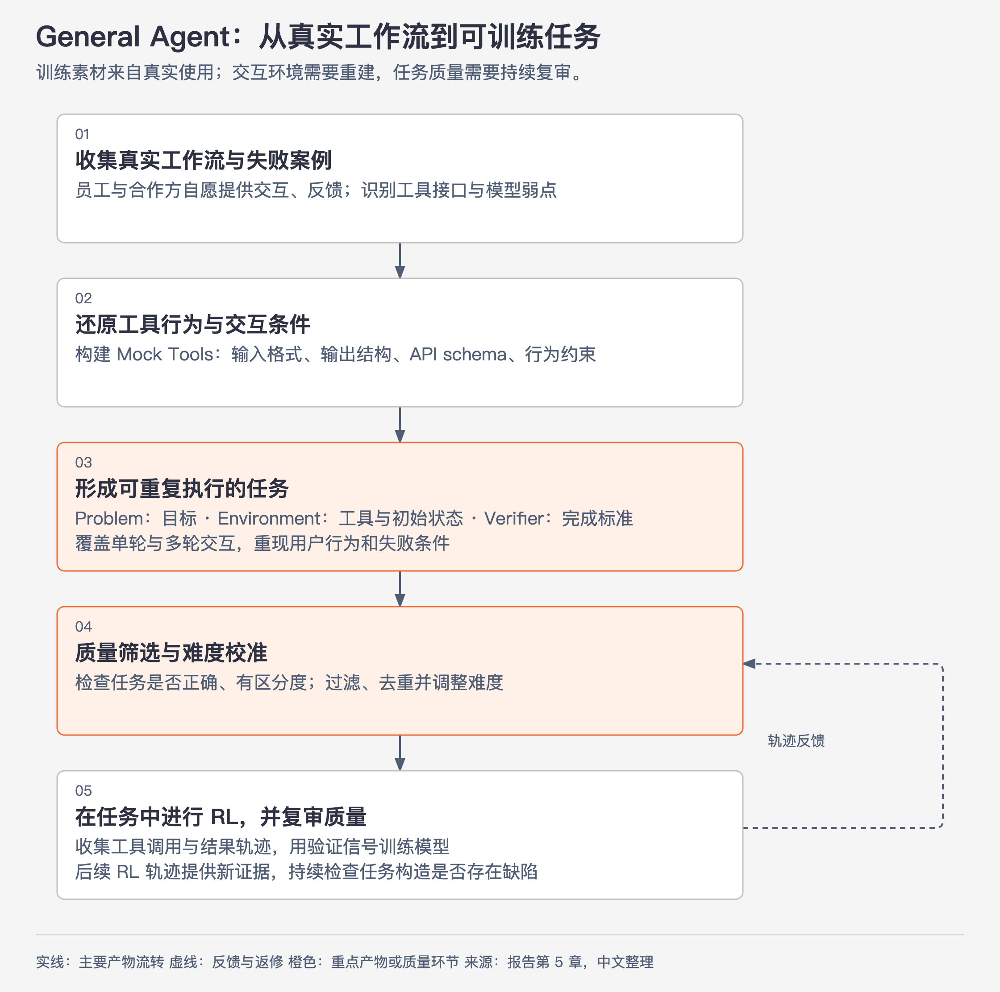
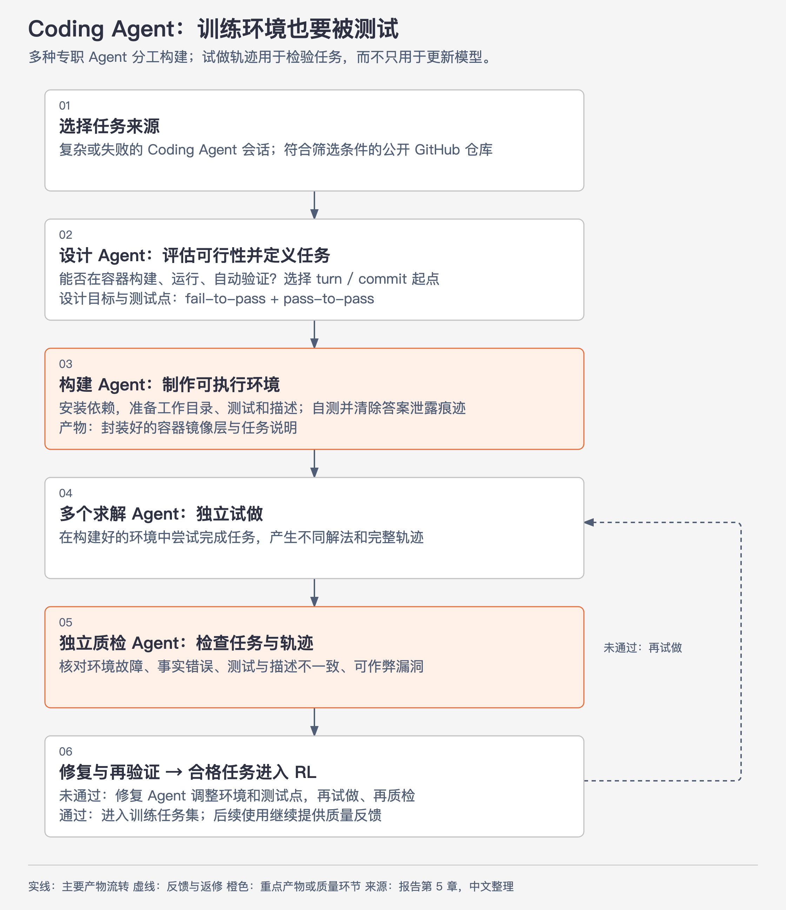
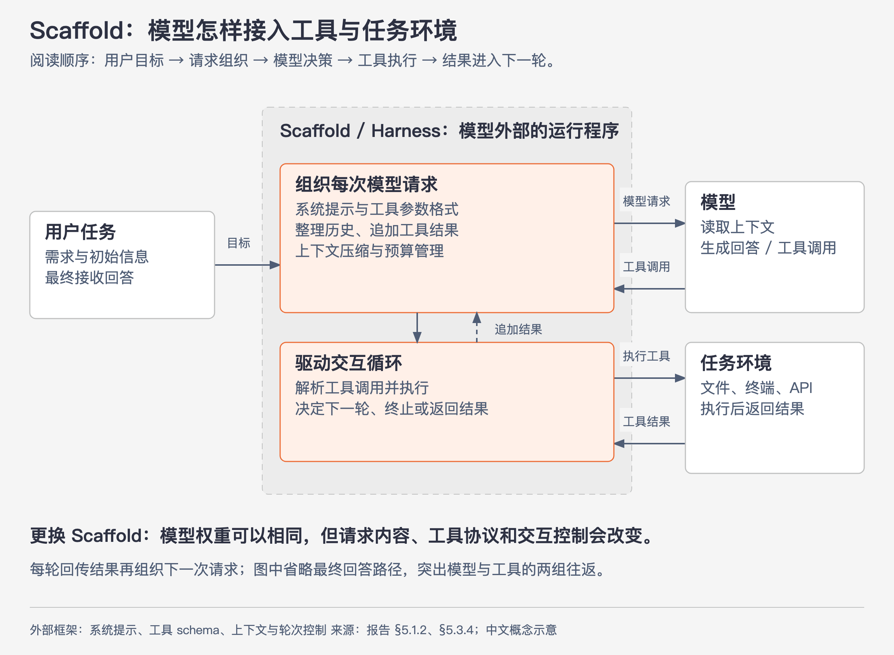
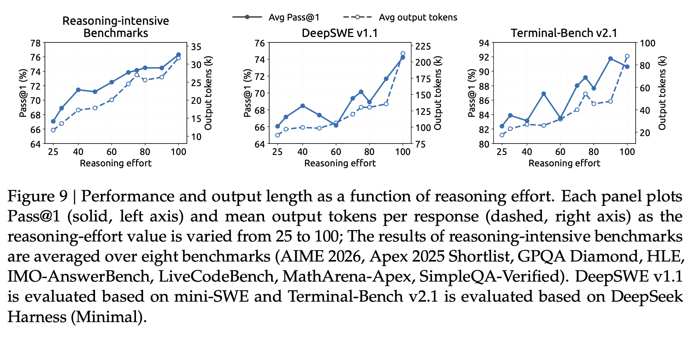
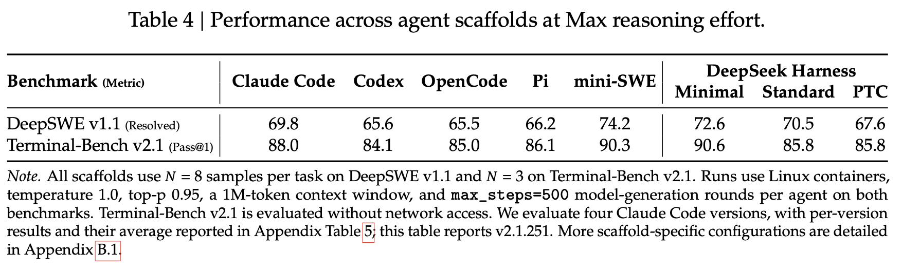
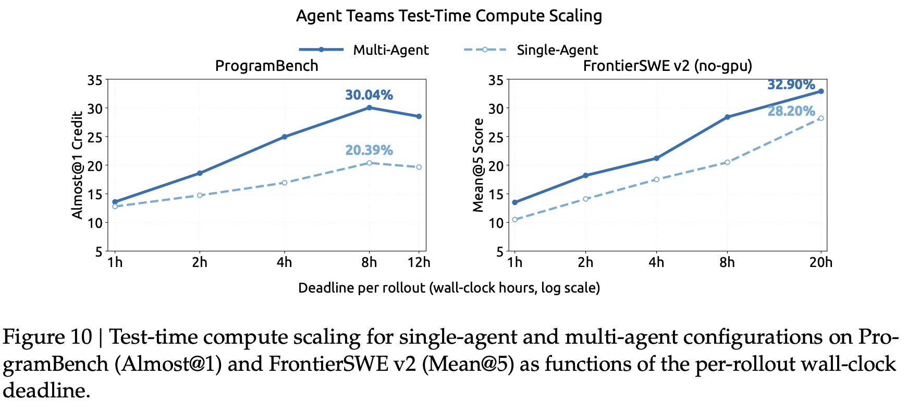
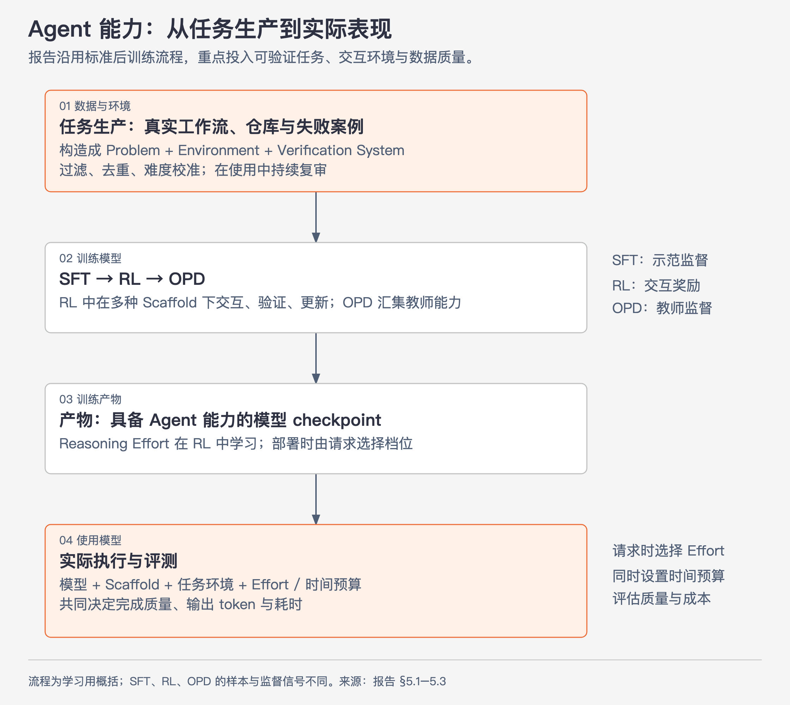

# 10 · Agent 能力从哪里来：任务、环境、后训练与运行框架

> 状态：已完成  
> 深度：关注 Agent 实践；训练算法与基础设施只了解  
> 来源：报告第 5 章，第 25–36 页；Figure 9、Table 4、Figure 10 使用用户提供的原文截图

## 1. 从架构效率走向任务能力

前面的架构降低了长输入计算、历史缓存和恢复状态的成本。本篇回答：**模型怎样学会在这些运行条件下使用工具、探索、修复错误、验证结果并完成任务？**

报告明确表示没有引入新的后训练算法，整体沿用 Supervised Fine-Tuning（SFT，监督微调）→ Reinforcement Learning（RL，强化学习）→ On-Policy Distillation（OPD，同策略蒸馏）。作者把主要投入放在任务与环境生产，包括可验证任务、参考解和奖励信号，以及筛选、去重、难度校准。

作者将其后训练观察到的收益主要归于数据与环境流水线的改进。这是报告对自身实验的总结，不能直接推广为“所有模型的数据工程收益都必然超过算法创新”。

本篇先展开任务生产和 RL，最后用一张总图串起训练与部署。SFT 学习示范行为；RL 从交互结果中优化策略；OPD 让学生在自身生成的轨迹上接受教师监督。三者的样本和监督信号不同，不能把整条链理解为“产生一次轨迹后，连续做三种更新”。

## 2. 为什么要先建设任务生产线

Agent RL 不能直接拿一段真实操作记录或一个 GitHub 仓库开始训练。Agent 任务包含多轮决策和工具操作；要让 RL 知道哪些行为值得奖励，任务必须能够反复启动、真实执行动作，并在结束后自动判断成败。

原始素材通常还有几个缺口：

- 真实系统可能无法为每次训练重置，或者调用成本和风险过高。
- 公开仓库可能缺少依赖、无法构建，也没有针对目标的自动化测试。
- 历史交互可以告诉我们“模型在哪里失败”，但未必能证明一次新尝试是否真正修复了问题。
- 如果没有可靠的验证系统，RL 就得不到可用的 reward，甚至可能奖励绕过目标的作弊行为。

因此，第 3、4 节的复杂流程在做一件事：**把真实工作流、失败案例和代码仓库，转换成可重置、可交互、可自动评分的 RL 任务。**

这条生产线先产生“任务包”，训练阶段再由正在训练的模型进入任务，产生行动轨迹和奖励：

$$
\begin{aligned}
&\text{真实工作流 / 失败案例 / 代码仓库} \\
&\quad\longrightarrow \text{任务构建与质检} \\
&\quad\longrightarrow \text{合格的任务包} \\
&\quad\longrightarrow \text{模型执行 rollout} \\
&\quad\longrightarrow \text{trajectory + reward} \\
&\quad\longrightarrow \text{RL 更新}
\end{aligned}
$$

### 2.1 一个可训练任务需要三个部分

报告将任务定义为三元组：

$$
\text{Task}=(\text{Problem},\ \text{Environment},\ \text{Verification System})
$$

| 部分 | 需要回答的问题 | Coding Agent 解释示例 |
|---|---|---|
| Problem：任务描述 | 要完成什么，边界是什么？ | 修复分页接口漏掉最后一页的问题 |
| Environment：交互环境 | 从什么状态开始，可以操作什么？ | 固定版本的仓库、依赖、容器和终端工具 |
| Verification System：验证系统 | 怎样判断真的完成？ | 新测试从失败变通过，已有功能测试继续通过 |

其中 **fail-to-pass** 检查新目标是否达成；**pass-to-pass** 检查原有功能是否被破坏。任务质量不仅取决于描述是否清晰，还取决于环境能否运行、验证是否忠实对应用户目标。

报告用“难度”和“正确性”评价任务构造：任务需要有挑战，同时三部分之间不能存在关键缺陷。每次 RL 使用任务产生的新轨迹，也会成为重新审查任务质量的证据。

### 2.2 哪些东西才是 RL 训练数据

| 阶段 | 产物 | 在 RL 中的作用 |
|---|---|---|
| 任务构建 | Problem、Environment、Verification System，以及参考解和 reward 规则 | 提供能产生训练数据的条件；本身还不是模型的完整行动轨迹 |
| 任务质检 | 试做轨迹、环境错误和漏洞报告 | 首先用于检验任务是否有效，不应默认当作正式 RL 样本 |
| RL rollout | 当前或近当前模型的 trajectory：推理、工具调用、环境反馈和最终结果 | 记录模型实际采取的行为 |
| 验证与评分 | Verification System 根据结果生成 reward | trajectory 与 reward 组成用于 RL 更新的主要经验数据 |

所以，可以说第 3、4 节在“生产 RL 训练数据”，但需要保留一层区分：**它们先建造能持续产生数据的任务与环境；真正的 trajectory 和 reward 在 RL rollout 时产生。**

## 3. General Agent：从真实工作流与失败案例构建环境

这条流程的目的，是把原本依赖真实业务系统、难以重复和自动评分的交互，改造成可以批量运行的 General Agent RL 任务。失败案例提供“需要学什么”，Mock Tool、初始状态和验证规则则让模型能够反复尝试，并为每条轨迹生成学习信号。

*中文整理图，依据 §5.1.1。箭头表示主要产物流转；虚线表示训练轨迹反馈给质量复审。*

真实工作流提供“用户实际要做什么、工具怎样工作、模型在哪里失败”。报告依据自愿提供的交互和反馈构建 Mock Tools（模拟工具），还原输入格式、输出结构、接口 schema 和行为约束，覆盖常见 SaaS、企业应用及专业后台。

**Mock Tool 的作用是让真实业务交互可重复执行、可评价。** 例如，原本只能在某企业系统中复现的错误，可以在还原了相关接口与状态的环境中再次出现，成为可针对性训练的任务。这个例子用于解释，不代表报告公布了该企业系统的具体实现。

图中“构建环境”与“质量筛选”不能省略：如果模拟行为与真实工具差异很大，或者验证器只检查了表面结果，模型可能在训练环境里得高分，却未掌握真实工作能力。

## 4. Coding Agent：环境经过构建、试做、质检与返修

这条流程的目的，是把“一个代码仓库里可能有价值的改动”，转换成一个能恢复到固定起点、能在容器中执行、能用隐藏测试判分的 Coding Agent RL 任务。试做和质检先确认“这道题能不能用来训练”；任务合格后，训练中的模型才会批量执行，产生正式 rollout 数据。

*中文整理图，依据 §5.1.1。图中的多个 Agent 是用于生产和审查训练任务的角色；与第 8 节面向任务求解的 Agent Team 实验不同。*

两类来源分别是复杂或表现不佳的 Coding Agent 会话，以及满足 star 数筛选条件的公开 GitHub 仓库。专职 Agent 分工判断可行性、定义任务、准备容器，再让多个求解 Agent 试做，独立质检 Agent 检查任务和求解轨迹。

读图时重点看三个产物：

- **设计之后**：确定任务起点、目标和评测点，保证目标可运行、可验证。
- **构建之后**：得到带依赖、工作目录、测试和描述的容器镜像层，并移除答案泄露痕迹。
- **质检之后**：确认环境、任务描述和测试相互一致，检查漏洞与难度；失败则修复并重新验证。

为什么要试做后再质检？只有 Agent 实际运行，才容易暴露依赖缺失、测试误判、描述歧义，以及绕过任务直接获得奖励的漏洞。因此，**训练环境本身也需要测试，验证器本身也需要验证。**

这条流水线还区分了两种失败：模型没有完成一个有效任务，可以成为学习信号；任务环境本身有缺陷，则首先需要修复任务，不能把它直接当成模型能力不足。

## 5. Scaffold 如何连接模型、工具和任务环境

*中文概念图，依据 §5.1.2、§5.3.4。两个方向分别画出请求和返回；每轮工具结果会重新进入下一次模型请求。*

Scaffold / Harness 是模型外部的 Agent 运行程序，负责系统提示、工具定义、上下文组织、轮次控制和终止条件。模型生成工具调用后，框架执行工具、接收结果，再组织下一次请求。

例如，同一个模型放到不同 Scaffold 中，可能遇到不同文件编辑工具、不同历史压缩策略和不同任务结束规则。这会改变模型实际看到的信息、能采取的动作以及重试方式。

报告从两个方向扩展 RL：增加训练计算，以及增加 Scaffold 多样性。训练既覆盖同一框架的多个版本，也覆盖不同框架。Figure 7、8 展示了随累计 RL 步数增加的总体收益；曲线断开的部分对应模型重新初始化后的后续训练，并非一条完全连续的训练运行。

对读者而言，需要理解的因果链是：**多样化工具与交互协议提供更广的训练覆盖，有助于模型迁移到不同 Agent 框架。** 报告的结果支持这种设计，但没有单独隔离每种框架或训练配置的贡献。

## 6. Reasoning Effort：用多少探索和验证换取质量

报告在 RL 中把 1–100 的 effort 标量作为条件信号。不同 effort 对推理长度施加不同强度的惩罚：较低 effort 更鼓励节制使用 token，较高 effort 允许更充分地探索与验证。不同 effort 的响应在各自子组内比较。

这个行为在训练阶段学习；部署时，同一 checkpoint 根据请求中的 effort 选择不同的成本与质量取舍。Effort 不是固定 token 上限，也不是“某个值保证达到某种成功率”。报告给出的 API 档位映射为 low = 50、high = 75、max = 100。

**怎样读 Figure 9：**

- 三列分别是推理类基准的平均结果、DeepSWE v1.1、Terminal-Bench v2.1。
- 横轴是 effort，范围 25–100。
- **实线、实心点看左轴**：Pass@1，越高表示任务成功表现越好。
- **虚线、空心点看右轴**：平均输出 token，单位 k，即千 token。
- 左右轴单位和刻度不同，不能用两条线的交点或垂直距离解释“成本追上收益”。

总体上，较高 effort 往往带来更多输出，并取得较好的任务表现，但 **图中并非逐点单调提升**：例如 Terminal-Bench 在 effort 90 的实线点高于 100，DeepSWE 中间也有回落。输出长度本身同样存在波动。报告没有在这张图中给出误差条，因此不能根据单个点断言哪个 effort 稳定最优。

报告正文概括，从 25 增至 100 时，推理基准平均 Pass@1 从 67.1% 升至 76.3%，DeepSWE 从 66.0% 升至 74.2%，Terminal-Bench 从 82.4% 升至 90.6%，代价是输出 token 大致增加到 2.5 倍。这个倍数是报告的概括，不是各子图都严格相同。

对 Agent 的实际含义是：effort 会影响多轮任务中投入多少探索、重试和验证。报告认为中等偏高 effort 通常具有较好的性价比；**具体应用仍应同时测成功率、token 和耗时**，不能由这张图推导一个通用最优档位。

## 7. 同一模型换 Scaffold，表现仍会变化

**怎样读 Table 4：**

- 每列是一种 Scaffold 配置；DeepSeek Harness 进一步分为 Minimal、Standard、PTC 三种模式。
- 每行是一项任务集：DeepSWE 用 Resolved 衡量解决情况；Terminal-Bench 用 Pass@1。
- 所有列使用同一模型 checkpoint、Max effort = 100 和相同任务集，改变的是框架及其系统提示、工具 schema、轮次逻辑等。
- 共用配置包括 Linux 容器、temperature 1.0、top-p 0.95、1M 上下文，以及最多 500 轮模型生成。DeepSWE 每任务采样 8 次，Terminal-Bench 采样 3 次；后者禁用网络。
- 表中 Claude Code 是 v2.1.251，其他版本见原文附录。不能把这一列泛化为所有版本。

DeepSWE 的分数范围为 **65.5–74.2，相差 8.7 个百分点**；Terminal-Bench 为 **84.1–90.6，相差 6.5 个百分点**。同一模型可以适应不同框架，但实际成绩并不相同。

这里比较的是“模型与框架的组合效果”，并没有逐个拆分系统提示、工具和历史管理的独立贡献。也不能因为某列在这两个任务集分数较高，就断言它在所有应用中都是最好的框架。

**应用推论：** 选 Agent 方案时，应把模型、工具接口和上下文管理一起放入自己的任务集评测。模型榜单提供起点，实际组合需要验证。

## 8. Multi-Agent：协作怎样训练，实验能说明什么

报告的 DeepSeek Harness Agent Team 模式允许 Lead Agent 异步创建长期存在的 Teammate，选择从空历史开始或获得 Lead 已完成历史的快照。成员共享仓库，通过持久消息邮箱和共享任务板协调；Lead 最后整合、检查和测试结果。

其 RL 奖励同时考虑任务表现、协作奖励和派生延迟惩罚。派生延迟把执行事件与依赖组织为 Directed Acyclic Graph（DAG，有向无环图），依据 token 计算成本和实测工具耗时计算关键路径长度，鼓励有效并行、减少不必要的串行与同步。

解释示例：两个互不依赖的检查可并行，最终整合必须等它们完成。总等待时间取决于较慢的分支与后续整合，而不是简单相加所有成员的耗时。报告用固定 Prefill / Decode 速率估算 token 时间，以减弱服务端排队和 batching 噪声对奖励的影响。

**怎样读 Figure 10：**

- 深蓝实线、实心点代表 Multi-Agent；浅蓝虚线、空心点代表 Single-Agent。
- 横轴是每次 rollout 的实际墙钟时间上限，采用对数刻度；到时以当时可用输出计分。
- 左图是 ProgramBench，Almost@1 表示单次 rollout 得分达到 0.95 的比例。
- 右图是 FrontierSWE v2 的 no-GPU 子集，使用 Mean@5 汇总五次 rollout 得分；它不是“尝试五次、只取最好一次”的 Pass@5。
- 两图指标不同，不能直接比较两边纵轴数值来判断哪个任务集更容易。

图中各个时间限制下，多 Agent 配置均高于对应单 Agent 基线。ProgramBench 在 8 小时处为 30.04% 对 20.39%；FrontierSWE 在 20 小时处为 32.90% 对 28.20%。但 ProgramBench 从 8 小时延长至 12 小时，两条曲线都有下降，不能概括成“给更久一定更好”。

**证据边界：** 作者明确将这些结果称为初步实验，比较的是观察到的最强多 Agent 配置与可用的最强单 Agent 基线。ProgramBench 筛选后有 172 个任务，参考解须在隐藏测试上达到至少 95% 通过率；每配置计划最多 516 次 rollout。FrontierSWE 使用当时公开任务中的 no-GPU 子集。

这张图支持“在这些任务和配置中，多 Agent 在给定时间限制下取得更好表现”。它没有固定相同总 token 或计算预算，**不能直接证明多 Agent 更省钱，也不是只改变 Agent 数量的严格单因素消融**。分工是否合适、通信与整合成本如何，仍影响实际收益。

## 9. 支撑规模化训练的系统，只掌握用途

| 系统能力 | 为什么需要 | 报告做了什么 |
|---|---|---|
| DeepSeek Elastic Compute（DSec） | 大量任务环境不同，执行时长不同，还可能被 Agent 破坏 | 支持百万级并发沙箱需求、分片与高密度部署、隔离、抢占恢复和轨迹记录 |
| 异步 RL | 同步等待最慢任务会浪费资源 | 持续补充并发样本，让长任务不阻塞整批进展 |
| 长度偏差与 off-policy 处理 | 短样本更早返回，旧 checkpoint 的样本也可能混入训练 | 调整数据集并发与样本调度，并屏蔽过度陈旧 token 的损失 |
| 中断与恢复 | rollout 期间需要切换训练或更新模型 | token 边界中断，保存 KV 与专家路由等状态，继续未完成样本 |
| 多教师 OPD | 不同领域最好的能力可能来自不同模型 | 最后阶段使用超过 40 个教师，支持异构架构及训练配置切换 |

这些属于报告的训练系统实现。特别是跨 checkpoint 的状态复用，要结合其异步训练和陈旧样本处理机制理解，不能直接套用为普通在线推理中随意换权重后仍能精确复用缓存的规则。

本轮不展开调度一致性、NUMA、损失公式与路由回放实现。

## 10. 将任务生产、训练和部署串起来

*中文总图，依据 §5.1–5.3。Effort 在 RL 中学习，在部署请求中选择；不同 Scaffold 既用于训练覆盖，也影响部署表现。*

读者需要保留四个判断：

1. **训练什么很重要。** 报告重点建设的是正确、有难度、可交互且可验证的任务。
2. **环境和验证器也是系统的一部分。** 环境缺陷与奖励漏洞会污染能力判断，需要持续复审。
3. **质量与成本共同看。** Effort 和多 Agent 都可能提高任务表现，也可能增加 token、计算和协调成本。
4. **最终表现属于组合系统。** 模型、Scaffold、环境和资源预算共同决定任务结果；Table 3 的总体提升不能单独归因于 CED、CSA2 或某个后训练环节。

对于 Agent 开发者，可迁移的做法是把真实失败整理成可复现用例，定义符合业务目标的验证标准，并用自己的任务集比较模型与框架组合。这是应用推论，不要求复现报告的大规模 RL。

## 自检

1. 一条任务描述为什么还不够成为高质量 RL 任务？
2. 如何区分求解失败与任务环境、验证器本身出错？
3. Figure 9 的两条线分别看哪条轴，为什么不能说 effort 越高每个点都越好？
4. Table 4 控制了什么、改变了什么，又没有隔离什么？
5. Figure 10 为什么支持时间限制下的表现收益，却不能证明多 Agent 更便宜？

---

[返回目录](./README.md) · [上一篇：09-其他架构与工程改进](09-其他架构与工程改进.md) · [下一篇：11-原生多模态（选读）](11-原生多模态.md) · [直接进入：12-综合复盘](12-架构复盘与Agent启示.md)
