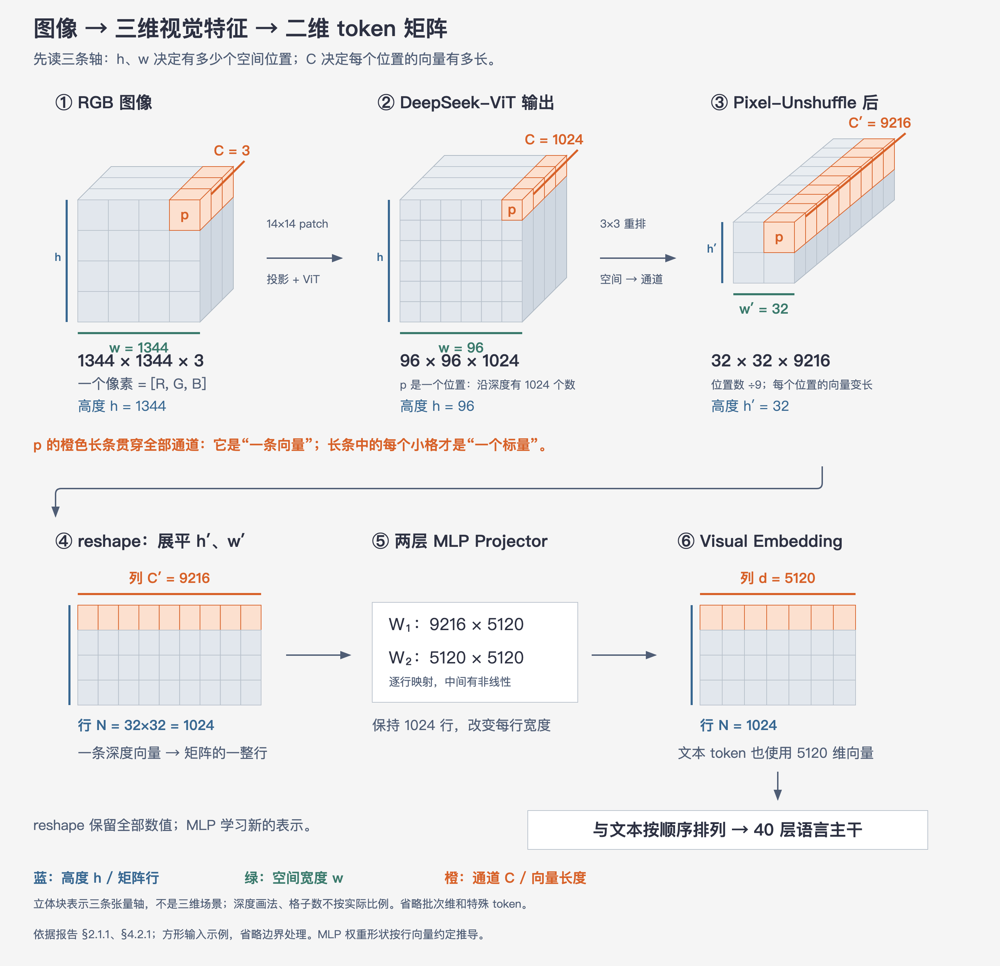
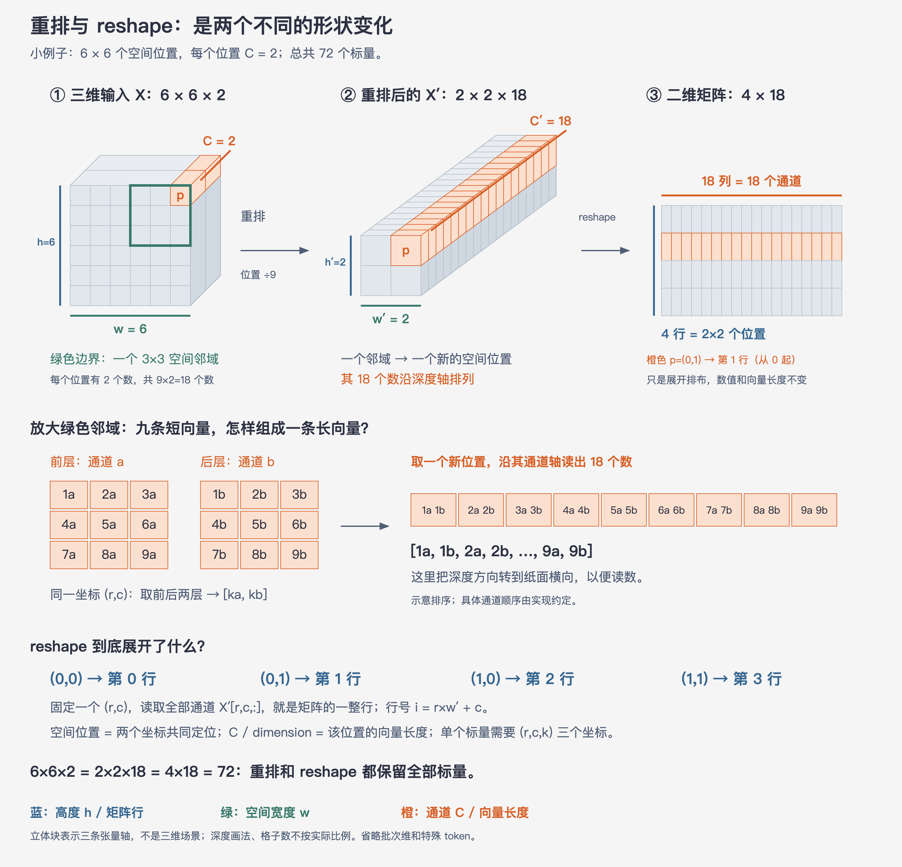

# 11 · 原生多模态：图像怎样成为语言模型的输入

> 状态：已完成  
> 深度：了解；视觉 Agent 场景可升为重点  
> 来源：报告 §2.1、§2.1.1、§3.1.1、§4.1、§4.2.1、§5.3

## 1. 本篇只回答一个问题

截图、图表等图像，怎样转换成语言主干可以和文字一起处理的 token？

DeepSeek-V4.1-Flash 是一个原生多模态模型：它可以同时接收图像和文本，并自回归生成文本。视觉信息不会以原始 RGB 像素直接进入 40 层语言主干，而是先经过 Vision Encoder（视觉编码器）和 MLP Projector（多层感知机投影器），成为与文本 embedding 宽度相同的一组向量。

需要先分清两个维度：

- **token 数**决定送入语言主干的序列有多少行；行越多，后续 Attention 计算和 KV Cache 存储通常越贵。
- **hidden dimension** 决定每个 token 向量有多少列。DeepSeek-V4.1-Flash 语言主干的 hidden dimension 为 5120。

下面用一张 `1344×1344` 的方形图像说明完整路径。报告支持不同宽高的图像；这里选择这个尺寸，是因为它能被 patch size 14 和 `3×3` 下采样整除，便于观察张量形状。

*中文解释图，依据报告 §2.1.1、§4.2.1。三维块分别画出空间高度、空间宽度和通道轴；格子数量与轴长为示意，标注的张量形状对应本例。省略批次维、特殊 token 和边界处理。*

**先读三条轴，再跟随箭头：** 蓝色为高度 `h`，绿色为宽度 `w`，橙色为通道 `C`。前面的 `h×w` 网格决定空间位置数；固定网格上的一个位置 `p=(r,c)`，沿深度方向取全部通道，就是该位置的 `C` 维向量。三维立体画法表示三个张量轴，并不表示图像是一幅三维场景。

例如，`96×96×1024` 表示 9216 个空间位置，每个位置各有 1024 个数。橙色长条是一整条向量，长条中的单个元素才是一个标量。后续二维矩阵的橙色行用于展示一条向量的排布，不表示原始像素经过各阶段仍保持相同数值。

这条路径可以分成七步：

1. 输入是一张 `1344×1344×3` 的 RGB 图像，每个 pixel（像素）包含 R、G、B 三个值。
2. DeepSeek-ViT（DeepSeek Vision Transformer）以 `14×14` pixel 为一个 patch，将图像变成 `96×96` 个 patch 位置，再经过 32 层视觉 Transformer，得到形状为 `96×96×1024` 的特征网格。
3. `3×3 Pixel-Unshuffle` 每次取九个相邻特征位置，把它们的通道拼入一个更长的向量，形状变成 `32×32×9216`。
4. 展平两个空间维后，得到 `1024×9216` 的矩阵：1024 行代表 1024 个视觉 token，每行暂时有 9216 个特征。
5. 两层 MLP Projector 逐行处理这些向量，将每行从 9216 维映射到语言主干的 5120 维；它不会重新增加 token 行数。
6. 得到 `1024×5120` 的 Visual Embedding（视觉嵌入）矩阵。此时每行已经可以作为语言模型序列中的一个 token 向量。
7. 视觉 embedding 被插入输入序列中对应的 image-token 位置，与 Text Embedding（文本嵌入）按输入顺序共同进入 40 层语言主干。图中的文字标签代表文本片段，实际分词后一个片段可能对应多个文本 token。

因此，Vision Encoder 负责把像素转为具有语义的视觉特征；Pixel-Unshuffle 负责减少空间位置；MLP Projector 负责对齐语言主干的向量宽度。三个环节解决的是不同问题。

## 2. Pixel-Unshuffle 到底做了什么

这里的 “pixel” 容易造成误解。`3×3 Pixel-Unshuffle` 接收的不是原始 RGB 图像，而是 DeepSeek-ViT 输出的**特征网格**。每个网格位置已经是一条 1024 维向量，包含该图像区域经过视觉编码后的特征。

为了看清重排，下面先把每个位置的通道数缩小为 `C=2`。九个位置一共包含 18 个数；重排后仍然是这 18 个数，只是它们从九条短向量变成一条长向量。

*教学示意图。实际通道数为 1024；这里用 2 个通道演示。图中展开的通道排序仅用于解释重排，不表示实现中的精确内存排列。*

图的上半部分把两个动作分开：

1. **Pixel-Unshuffle：`6×6×2 → 2×2×18`。** 每个 `3×3` 邻域包含九个空间位置，每个位置有两个数。这 18 个数变成新位置的一条 18 维向量。高度和宽度分别除以 3，通道数乘以 9。
2. **reshape：`2×2×18 → 4×18`。** 将四个空间位置依次排成四行，通道数仍为 18；每个位置的整条深度向量，成为矩阵的一整行。这一步没有进一步合并位置。

下半部分将邻域的两个通道切片展开，展示同一空间坐标的 `[ka,kb]` 怎样进入长向量。这里 `k` 是示例位置编号。按图中的行优先顺序展平时，`(0,0)、(0,1)、(1,0)、(1,1)` 分别对应第 `0、1、2、3` 行。

因此，**空间位置由两个坐标 `(r,c)` 确定；向量是该位置的全部通道；一个标量还需要指定通道编号。** 将三维张量画成二维矩阵时，原来的通道轴变成列轴，两个空间轴合并成行轴。

对于输入特征：

$$
X\in\mathbb{R}^{h\times w\times C}
$$

执行 `3×3 Pixel-Unshuffle` 后：

$$
X'\in\mathbb{R}^{\frac{h}{3}\times\frac{w}{3}\times 9C}
$$

再将空间维展平：

$$
X'_{\text{flat}}\in\mathbb{R}^{\frac{hw}{9}\times 9C}
$$

它没有对九个位置求平均，没有按分数挑选位置，也没有只保留中心位置。因此：

- 空间位置数缩小为原来的 `1/9`；
- 每个位置的通道数扩大为原来的 9 倍；
- 重排前后的元素总数保持不变。

DeepSeek-ViT 的输出通道数为 1024，所以重排后每个位置是：

$$
9\times1024=9216\text{ 维}
$$

随后 MLP Projector 才学习怎样把 9216 维信息压到 5120 维。Pixel-Unshuffle 自己只改变数据的组织方式。

### 为什么这能降低视觉 token 成本

语言主干看到的序列长度由展平后的空间位置数决定。没有 `3×3 Pixel-Unshuffle` 时，本例有：

$$
96\times96=9216\text{ 个视觉位置}
$$

重排后只剩：

$$
32\times32=1024\text{ 个视觉位置}
$$

语言主干因此少处理 8192 个视觉 token。长序列 Attention、MoE 和 KV Cache 的成本都随序列位置增加，减少视觉 token 可以显著降低后续语言主干的计算与缓存压力，并让模型以可承受的 token 数处理更高分辨率图像。

这里的 `÷9` 只描述**视觉 token 数**。Vision Encoder 自身仍要处理图像，视觉向量也变宽后才进入 MLP，所以不能由此推导“整个模型推理加速九倍”。

## 3. DeepSeek-ViT 做了哪些调整

DeepSeek-ViT 基于 ViT（Vision Transformer，视觉 Transformer）架构，从头训练。报告提到四项主要调整：

| 调整 | 作用 | 本轮深度 |
|---|---|---|
| 2D-RoPE（Two-Dimensional Rotary Position Embedding，二维旋转位置编码） | 表示 patch 的二维位置，适应不同宽高和分辨率 | 知道用途 |
| 线性 Patch Embedding | 用线性投影代替卷积，以适配 Muon 优化器 | 知道原因 |
| RMSNorm 与 SwiGLU | 让视觉编码器的归一化和激活设计更接近语言主干 | 知道采用了什么 |
| `3×3 Pixel-Unshuffle` | 将视觉 token 数减少九倍，支持约 `1344×1344` 的输入分辨率 | 理解机制 |

其中，真正需要在本篇掌握的是图像如何经过 patch、视觉编码、重排和投影，最终成为 5120 维视觉 embedding。ViT 内部 Attention、2D-RoPE 公式和 Muon 优化器可以在需要训练视觉模型时再单独学习。

## 4. “原生多模态”原生在哪里

报告称多模态数据从语言模型预训练一开始就被纳入训练。最终语言主干从预训练阶段便共同处理视觉 embedding 和文本 embedding，而不是先训练完纯文本语言模型，再在部署阶段外挂一个“看图后生成文字描述”的模块。

但这不表示 Vision Encoder 从第一步就与最终的 552B 主干一起训练。DeepSeek-ViT 在接入正式语言主干前，单独经历两个阶段：

| 阶段 | 数据与分辨率 | 训练目标 | 目的 |
|---|---|---|---|
| 对比预训练 | 约 470 亿图文对；最高 `224×224` | 使用 SigLIP 的 sigmoid 对比损失 | 学习图像与文本之间的语义对应 |
| 自回归微调 | 约 2360 亿 token；`544×544` 至 `1344×1344` | 接入临时 4B MoE LLM，执行 next-token prediction | 加强高分辨率、OCR、图表等细粒度视觉建模 |

第二阶段结束后，临时 4B MoE LLM 被丢弃，只保留优化后的 DeepSeek-ViT，再将它接入 DeepSeek-V4.1-Flash 的正式预训练流程。

所以这里的“原生”应准确理解为：**最终语言主干从预训练起就学习如何联合处理视觉 token 和文本 token；视觉编码器本身仍有独立的前期训练。**

## 5. 为多模态训练补了什么

原文还介绍了多模态数据和训练系统，本轮只保留它们解决的问题：

- 预训练数据包含图文对、图文交错网页与 PDF，以及视觉定位、OCR 等领域数据；最终文本与多模态 token 比例约为 `7:1`。
- 报告专门收集 image-code pairs（图像—代码对）和 computer-use trajectories（计算机操作轨迹），用于加强多模态 Agent 理解。
- 图像 token 和文本 token 的表示分布不同。模型为两种模态分别维护 MoE 专家负载修正偏置，避免合并统计后掩盖某一种模态的路由失衡。
- 超长多模态训练会带来图像加载、CPU、内存和通信压力。报告采用图像分片、增量传输和预处理缓存等工程优化。

这些内容说明，视觉输入路径只是能力的入口。模型还需要合适的数据、路由平衡和训练系统，才能真正学习 OCR、图表理解、视觉定位及工具操作。

## 6. 对视觉 Agent 意味着什么

对于视觉 Agent，这套路径允许截图、专业图表和界面画面直接成为模型上下文的一部分。模型可以把视觉区域与文字指令放在同一序列中推理，例如读取按钮文字、分析图表趋势、识别界面状态，再决定下一步工具调用。

报告在三个带工具的视觉 Agent 基准上给出结果：

| 基准 | 主要侧重 | DeepSeek-V4.1-Flash |
|---|---|---:|
| Chartography | 专业图表理解与推理 | 78.9 Pass@1 |
| BabyVision | 减少语言捷径的视觉推理 | 89.6 Pass@1 |
| ZeroBench-main | 困难视觉推理 | 49.0 Pass@5 |

报告据此认为模型具有较强的视觉 Agent 能力，并优于表中的开源对比模型，同时承认与领先闭源模型仍有差距。

视觉输入能力也不自动等于可靠的 GUI Agent：

- 看懂按钮含义，不代表能稳定输出精确点击坐标；
- 单张截图理解正确，不代表多轮操作中始终跟踪界面状态；
- 模型给出合理操作，不代表 Scaffold 能正确执行、处理异常并验证最终结果。

实际视觉 Agent 的完成率仍由视觉模型、操作工具、坐标或元素定位、上下文管理、环境反馈和验证机制共同决定。这里是从报告架构出发的应用推论。

## 7. 后续需要深入时读什么

本报告没有为 DeepSeek-ViT 提供独立论文。理解当前信息路径后，可以按需要阅读：

- [Vision Transformer：An Image is Worth 16×16 Words](https://openreview.net/forum?id=YicbFdNTTy)：理解图像如何切成 patch，并作为 token 交给 Transformer。报告直接引用。
- [SigLIP：Sigmoid Loss for Language Image Pre-Training](https://arxiv.org/abs/2303.15343)：理解 DeepSeek-ViT 第一阶段的图文对比学习目标。报告直接采用。
- [LLaVA：Visual Instruction Tuning](https://arxiv.org/abs/2304.08485)：理解 `Vision Encoder → Projector → LLM` 的典型连接方式。它不是本报告直接采用的方案，适合作为补充背景。

如果以后需要构建视觉 Agent，再单独学习 Visual Grounding（视觉定位）、GUI Grounding（界面元素定位）和 Computer Use。它们解决模型怎样把视觉理解落实为可靠操作，已经超出本篇的输入架构范围。

## 自检

1. 为什么原始 RGB 图像不能直接作为 40 层语言主干的输入？
2. `3×3 Pixel-Unshuffle` 改变了 token 数、通道数和元素总数中的哪些量？
3. Vision Encoder、Pixel-Unshuffle 和 MLP Projector 分别解决什么问题？
4. 为什么说 DeepSeek-V4.1-Flash 是原生多模态，同时又说 DeepSeek-ViT 有独立的前期训练？
5. 为什么模型能理解截图，仍不能保证视觉 Agent 能可靠完成 GUI 任务？

---

[返回目录](./README.md) · [上一篇：10-Agent能力与后训练](10-Agent能力与后训练.md) · [下一篇：12-架构复盘与Agent启示](12-架构复盘与Agent启示.md)
