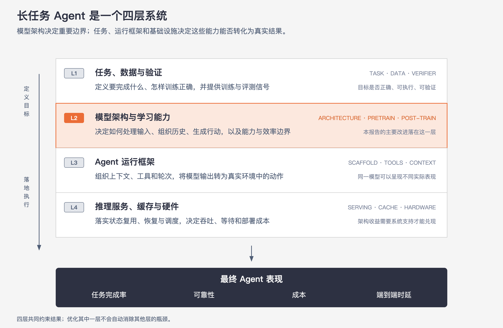

# 12 · 架构复盘：从新模型到 Agent 系统设计

> 状态：已完成  
> 定位：收束全篇，只保留架构思想、Agent 启示与判断边界。

## 1. 核心判断

DeepSeek-V4.1-Flash 针对长任务 Agent 的真实工作负载，重新组织了**计算、缓存、检索与状态恢复**。这是理解其“新架构”的主线。

长任务 Agent 会反复读取越来越长的历史，穿插工具调用，并在多轮模型调用之间暂停和恢复。系统既要容纳长上下文，也要控制同一前缀的重复计算、历史状态的保存与搬运、远处信息的检索，以及缓存缺失后的恢复成本。

## 2. 四个值得带走的架构思想

| 传统直觉 | V4.1 的转变 | 解决的问题 |
|---|---|---|
| 所有 token 走相同计算路径 | 按 Prefill 与 Decode 的负载特征分工 | 避免长 Prompt 在后半个模型中重复执行完整计算 |
| 每层独立保存和检索历史 | 在相邻层间共享 Main Key-Value（Main KV）、Indexer K 与部分索引 | 减少 KV 存储、搬运和重复检索 |
| 每次从完整历史中寻找信息 | 先选候选块，再在候选位置中细选 | 降低长上下文检索成本 |
| 为随时复用而长期保存全部状态 | 区分长期缓存与短期状态，缺失时按需回放 | 在存储成本与恢复计算之间取得平衡 |

对应到前文，分别是 [Causal Encoder-Decoder（CED）](04-CED.md)、[Compressed Sparse Attention 2（CSA2）](05-CSA2.md)、[Hierarchical Sparse Indexer](06-分层稀疏索引.md) 和 [Sliding Window Attention（SWA）Bounded Replay](08-SWA有界回放.md)。它们共同让模型以更低成本持续处理长历史。

## 3. 为什么 Prefill 与 Decode 要走不同路径

**Prefill** 一次接收大量已经确定的 Prompt token，位置之间可以并行计算，主要任务是理解输入并建立后续生成所需的历史状态。长任务中，Prompt 往往包含系统指令、代码、文档和多轮工具结果，因此它的主要压力是大批量计算与 KV Cache 构建。

**Decode** 每次只生成一个新 token；下一个 token 必须等待上一个 token 产生，天然沿时间串行。它更关心单步延迟，以及每一步读取历史 KV 的效率。

CED 因此将两条路径分开：

- Prefill 时，全部 Prompt 主要经过 20 层 Encoder；最终状态 `H20` 为 Decoder 投影全局历史 KV，只有最近的局部窗口经过 Decoder 以补齐逐层 SWA KV。
- Decode 时，每个新 token 仍依次经过 Encoder 和 Decoder 的完整生成路径，因为它需要逐层形成新的隐藏状态，才能预测下一个 token。

这解释了“Prefill 接近减半”的来源，也说明它没有把整个模型简单截成两半：输入处理被重构，逐 token 生成仍保留完整深度。详细数据路径见 [04 · CED](04-CED.md)。

## 4. 放到完整 Agent 系统中看

模型架构只决定系统能力与成本的一部分。一个可靠的 Agent 还依赖四层共同工作：底层推理与缓存决定能否高效运行，模型架构与训练决定能做什么，Scaffold 决定怎样调用工具和管理上下文，任务与验证决定最终结果是否可用。

| Agent 生命周期阶段 | 主要问题 | 对应设计思想 |
|---|---|---|
| 首次读取长输入 | Prefill 计算量大 | CED 按输入处理与输出生成分工 |
| 连续工具调用 | 相同前缀被反复读取 | 提高前缀稳定性，复用持久 Global KV |
| 从长历史找依据 | 完整扫描越来越昂贵 | CSA2 与分层索引缩小读取范围 |
| 活跃会话连续生成 | 每步 Decode 都要访问历史 | 共享、压缩 KV，并优化逐 token 推理 |
| 暂停后恢复任务 | 短期 SWA 状态可能已经释放 | Bounded Replay 按需恢复最近窗口 |
| 产生长输出 | 串行 Decode 累积延迟 | DSpark 等推理系统优化降低单步成本 |
| 提交最终结果 | “生成完”不等于“任务完成” | 环境、工具和 Verifier 共同验证结果 |

## 5. 对 Agent 开发者的直接启示

1. **把上下文当作资源预算。** 每段内容都会影响 Prefill、KV 存储、检索与传输，不能只看模型允许的最大长度。
2. **尽量保持可复用前缀稳定。** 固定系统指令和长期材料的顺序，减少无意义改写，才能提高跨轮缓存命中率。
3. **分开管理长期知识与近期工作状态。** 长期内容适合持久缓存或外部检索；最近的操作细节和生成状态具有更强时效性。
4. **长上下文容量不等于可靠记忆。** 稀疏注意力降低了成本，但模型仍可能漏掉远处的重要信息；关键约束应在当前上下文中显式重申。
5. **组合评测模型、Scaffold 和工具。** 同一模型更换上下文管理、工具协议或轮次控制后，任务表现可能明显变化。
6. **同时观察成功率与系统成本。** Token 数、Prefill、Decode、工具等待和恢复开销共同决定一次 Agent 任务的实际成本与时延。
7. **把验证器视为产品能力。** 可执行测试、结果校验和失败反馈不仅用于训练，也直接决定线上 Agent 是否可靠。

## 6. 如何判断一种“新架构”是否真有价值

| 判断问题 | 需要确认什么 |
|---|---|
| 它针对什么负载？ | 长输入、长输出、多轮调用还是离线吞吐 |
| 它减少了什么成本？ | 计算、显存、搬运、通信或恢复时间 |
| 成本被转移到哪里？ | 是否增加索引、投影、调度或系统复杂度 |
| 收益依赖什么条件？ | 上下文长度、缓存命中率、批量大小或专用硬件 |
| 是否引入近似？ | 稀疏选择、量化和有界回放可能影响哪些任务 |
| 证据测量了哪一层？ | 单模块、模型端到端，还是完整 Agent 系统 |
| 最终改善什么？ | 模型分数、单 token 成本，还是任务完成率 |

## 7. 证据边界

- 报告中的整体质量和效率提升由架构、训练、数据与推理系统共同产生，不能全部归因于某一个模块。
- 稀疏选择以更少的历史读取换取效率，仍存在遗漏远处关键信息的风险。
- SWA Bounded Replay 是受控的近似恢复；它用较小的质量影响换取显著的恢复成本下降。
- 最大上下文长度只代表可接收范围，不保证任意距离的信息都能被稳定找回和正确使用。
- Benchmark 验证的是特定任务、Scaffold 和预算下的表现，不能直接等同于生产 Agent 的可靠性。

## 8. 最后记住五句话

1. DeepSeek-V4.1-Flash 围绕长任务 Agent，重新设计了计算与状态的生命周期。
2. CED 利用 Prefill 可并行、Decode 串行的差异，为两者安排了不同路径。
3. CSA2 与分层索引通过共享和逐级筛选，降低长历史的保存与读取成本。
4. Bounded Replay 承认短期状态会被释放，并提供一种成本可控的恢复方式。
5. 模型架构只是 Agent 系统的一层；最终价值要用任务完成率、可靠性、成本和端到端时延共同判断。

## 自检

- 我能否解释为什么 CED 主要节省 Prefill，而不把 Decode 也直接减半？
- 我能否区分“上下文更长”“缓存更省”和“远处信息找得更准”？
- 面对一个 Agent 产品，我能否指出模型、Scaffold、缓存策略与验证器分别影响什么？

[返回目录](./README.md) · [上一篇：11-原生多模态](11-原生多模态.md)
